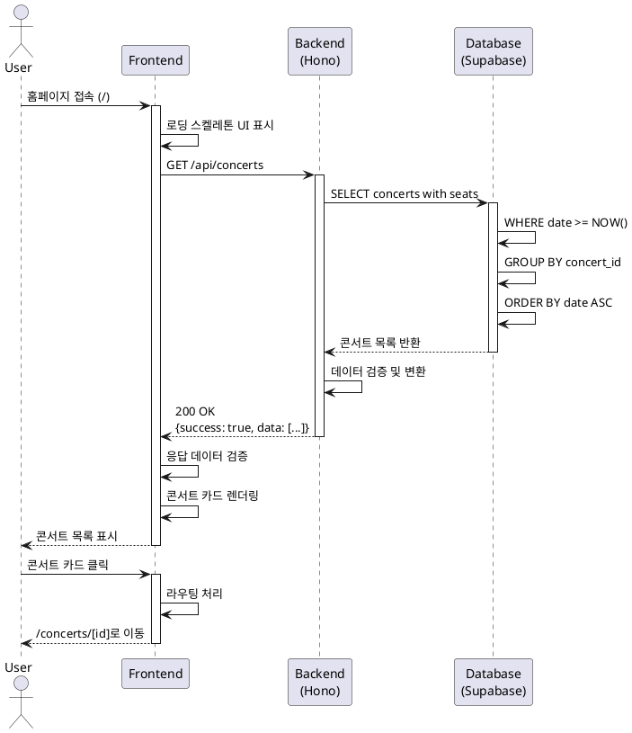
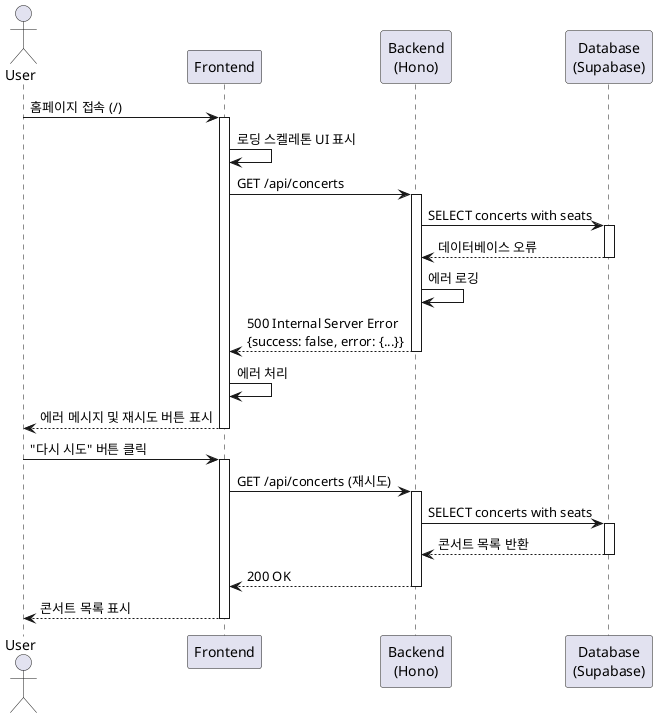

# 유스케이스: 콘서트 목록 조회

## 개요
사용자가 홈페이지에서 예약 가능한 콘서트 목록을 조회하는 기능입니다.

---

## Primary Actor
- **일반 사용자 (콘서트 관람객)**

---

## Precondition
- 사용자가 웹 브라우저를 통해 시스템에 접근 가능함
- 인터넷 연결이 정상적으로 동작함
- (선택) 데이터베이스에 1개 이상의 콘서트 정보가 등록되어 있음

---

## Trigger
- 사용자가 홈페이지(`/`)에 접속
- 사용자가 스크롤하여 추가 콘서트 목록 요청 (무한 스크롤)
- 사용자가 페이지를 새로고침

---

## Main Scenario

### 1. 사용자 접근
1. 사용자가 홈페이지(`/`)에 접속한다.
2. Frontend에서 로딩 스켈레톤 UI를 표시한다.

### 2. 데이터 요청
3. Frontend에서 `GET /api/concerts` API를 호출한다.
4. Backend에서 요청을 수신하고 데이터베이스 쿼리를 실행한다.

### 3. 데이터 처리
5. Database에서 다음 조건으로 콘서트 목록을 조회한다:
   - 공연 날짜가 현재 시각 이후인 콘서트만 필터링 (`date >= NOW()`)
   - 공연 날짜 기준 오름차순 정렬
   - 각 콘서트별 잔여 좌석 수 집계 (`seats` 테이블 JOIN)
6. Backend에서 응답 데이터를 구성한다:
   - 콘서트 기본 정보 (id, title, artist, venue, date, poster_image)
   - 전체 좌석 수 (total_seats)
   - 잔여 좌석 수 (available_seats)

### 4. 데이터 표시
7. Frontend에서 응답 데이터를 수신하고 검증한다.
8. 각 콘서트를 카드 형태로 렌더링한다:
   - 포스터 이미지 (썸네일)
   - 콘서트 제목
   - 아티스트명
   - 공연 날짜 및 시간
   - 공연 장소
   - 잔여 좌석 정보 (선택 사항)

### 5. 사용자 상호작용
9. 사용자가 특정 콘서트 카드를 클릭한다.
10. Frontend에서 해당 콘서트의 상세 페이지(`/concerts/[id]`)로 라우팅한다.

---

## Edge Cases

### 1. 콘서트 목록이 비어있는 경우
- **발생 상황**: 데이터베이스에 예약 가능한 콘서트가 없거나, 모든 콘서트가 과거 공연인 경우
- **처리 방법**:
  - 빈 상태 메시지 표시 ("현재 예약 가능한 콘서트가 없습니다")
  - 홈페이지 안내 문구 및 대체 액션 제공

### 2. 이미지 로딩 실패
- **발생 상황**: 포스터 이미지 URL이 유효하지 않거나 외부 서버 문제로 이미지 로드 실패
- **처리 방법**:
  - 기본 placeholder 이미지로 대체 (예: 브랜드 로고 또는 기본 콘서트 이미지)
  - 이미지 alt 텍스트로 콘서트 제목 표시

### 3. 네트워크 오류
- **발생 상황**: API 요청 중 네트워크 단절, 타임아웃, 서버 오류 (5xx)
- **처리 방법**:
  - 에러 메시지 표시 ("콘서트 목록을 불러오는 중 문제가 발생했습니다")
  - "다시 시도" 버튼 제공
  - React Query의 자동 재시도 메커니즘 활용

### 4. 데이터 로딩 중
- **발생 상황**: API 응답이 지연되는 경우
- **처리 방법**:
  - 스켈레톤 UI 표시 (콘서트 카드 형태의 placeholder)
  - 로딩 인디케이터 표시

### 5. 잘못된 날짜 형식
- **발생 상황**: 데이터베이스의 날짜 데이터가 잘못된 형식인 경우
- **처리 방법**:
  - Backend에서 날짜 형식 검증 및 변환
  - 변환 실패 시 해당 콘서트 제외 또는 기본값 표시

### 6. 권한 오류 (401/403)
- **발생 상황**: Backend API 설정 오류 또는 인증 문제 (MVP에서는 발생하지 않음)
- **처리 방법**:
  - 시스템 에러 메시지 표시
  - 관리자에게 오류 로그 전송

---

## Business Rules

### BR-001: 과거 공연 필터링
- 공연 날짜가 현재 시각 이후인 콘서트만 목록에 표시한다.
- 과거 공연은 자동으로 필터링되며, 별도의 아카이브 기능은 제공하지 않는다.

### BR-002: 콘서트 정렬
- 콘서트 목록은 공연 날짜 기준 오름차순으로 정렬한다.
- 가장 가까운 공연이 상단에 표시된다.

### BR-003: 잔여 좌석 집계
- 각 콘서트별 잔여 좌석 수는 `seats` 테이블에서 `status = 'available'`인 좌석을 집계한다.
- 잔여 좌석 정보는 실시간 반영되지 않으며, API 호출 시점의 스냅샷이다.

### BR-004: 이미지 처리
- 포스터 이미지는 외부 URL로 저장되며, Frontend에서 렌더링한다.
- 이미지가 없는 경우 기본 placeholder 이미지를 사용한다.
- 개발 중에는 `https://picsum.photos/400/600` 형식의 임시 이미지를 사용할 수 있다.

### BR-005: 페이지네이션 (향후 확장)
- MVP에서는 모든 콘서트를 한 번에 로드하지만, 향후 콘서트 수 증가 시 페이지네이션 또는 무한 스크롤을 적용할 수 있다.

### BR-006: 매진 콘서트 표시
- 매진된 콘서트(`available_seats = 0`)도 목록에 표시되지만, 시각적으로 구분된다.
- 매진 콘서트는 "매진" 배지를 표시하고, 클릭 시 상세 페이지로 이동할 수 있다 (예약 버튼은 비활성화).

---

## API Specification

### Endpoint
```
GET /api/concerts
```

### Request
- **Method**: GET
- **Headers**:
  - `Content-Type: application/json`
- **Query Parameters** (향후 확장):
  - `page`: 페이지 번호 (기본값: 1)
  - `limit`: 페이지당 항목 수 (기본값: 20)

### Response

#### Success (200 OK)
```json
{
  "success": true,
  "data": [
    {
      "id": "uuid",
      "title": "콘서트 제목",
      "artist": "아티스트명",
      "venue": "공연 장소",
      "date": "2025-11-15T19:00:00+09:00",
      "posterImage": "https://example.com/poster.jpg",
      "totalSeats": 320,
      "availableSeats": 280
    }
  ]
}
```

#### Error (500 Internal Server Error)
```json
{
  "success": false,
  "error": {
    "code": "DATABASE_ERROR",
    "message": "콘서트 목록을 불러올 수 없습니다."
  }
}
```

---

## Database Query

### SQL
```sql
SELECT
    c.id,
    c.title,
    c.artist,
    c.venue,
    c.date,
    c.poster_image,
    COUNT(s.id) as total_seats,
    COUNT(CASE WHEN s.status = 'available' THEN 1 END) as available_seats
FROM concerts c
LEFT JOIN seats s ON c.id = s.concert_id
WHERE c.date >= NOW()
GROUP BY c.id
ORDER BY c.date ASC;
```

### 설명
1. `concerts` 테이블과 `seats` 테이블을 LEFT JOIN
2. 공연 날짜가 현재 시각 이후인 콘서트만 필터링
3. 각 콘서트별 전체 좌석 수와 예약 가능 좌석 수를 집계
4. 공연 날짜 기준 오름차순 정렬

---

## Frontend Implementation

### Page Component
- **Path**: `/` (홈페이지)
- **Component**: `src/app/page.tsx`
- **Type**: Client Component (`"use client"`)

### Key Features
1. **Data Fetching**: `@tanstack/react-query`를 사용한 서버 상태 관리
2. **Loading State**: 스켈레톤 UI 또는 로딩 인디케이터
3. **Error Handling**: 에러 메시지 및 재시도 버튼
4. **Empty State**: 콘서트가 없을 때 안내 메시지
5. **Responsive Design**: 모바일/태블릿/데스크톱 대응

### Related Components
- `src/features/concerts/components/ConcertCard.tsx`: 콘서트 카드 컴포넌트
- `src/features/concerts/components/ConcertList.tsx`: 콘서트 목록 컨테이너
- `src/features/concerts/hooks/useConcerts.ts`: React Query hook

---

## Backend Implementation

### Hono Router
- **Path**: `src/features/concerts/backend/route.ts`
- **Handler**: `GET /api/concerts`

### Service Layer
- **Path**: `src/features/concerts/backend/service.ts`
- **Function**: `getConcerts(supabase: SupabaseClient)`
  - Supabase 클라이언트를 사용하여 데이터베이스 쿼리 실행
  - 데이터 변환 및 검증

### Schema Validation
- **Path**: `src/features/concerts/backend/schema.ts`
- **Schemas**:
  - `ConcertSchema`: 개별 콘서트 응답 스키마
  - `ConcertListResponseSchema`: 콘서트 목록 응답 스키마

### Error Codes
- **Path**: `src/features/concerts/backend/error.ts`
- **Codes**:
  - `DATABASE_ERROR`: 데이터베이스 조회 오류
  - `INVALID_DATE`: 잘못된 날짜 형식

---

## Sequence Diagram



---

## Sequence Diagram (Error Case)



---

## Testing Considerations

### Frontend Tests
1. **렌더링 테스트**
   - 콘서트 목록이 올바르게 렌더링되는지 확인
   - 스켈레톤 UI가 로딩 중에 표시되는지 확인
   - 에러 메시지가 올바르게 표시되는지 확인

2. **상호작용 테스트**
   - 콘서트 카드 클릭 시 올바른 URL로 이동하는지 확인
   - "다시 시도" 버튼이 API를 재호출하는지 확인

3. **엣지 케이스 테스트**
   - 빈 목록 처리 확인
   - 이미지 로딩 실패 시 placeholder 표시 확인

### Backend Tests
1. **API 테스트**
   - GET /api/concerts가 200 OK를 반환하는지 확인
   - 응답 데이터가 스키마에 맞는지 검증
   - 과거 공연이 필터링되는지 확인

2. **데이터베이스 테스트**
   - 쿼리가 올바른 결과를 반환하는지 확인
   - JOIN이 정상적으로 동작하는지 확인
   - 잔여 좌석 집계가 정확한지 확인

3. **에러 처리 테스트**
   - 데이터베이스 오류 시 500 에러 반환 확인
   - 에러 로깅이 정상적으로 동작하는지 확인

---

## 시간대 처리 정책

### 기본 원칙
- **기준 시간대**: 한국 표준시(KST, UTC+9)를 기본으로 처리
- **API 통신**: ISO 8601 형식 사용 (예: `2025-11-15T19:00:00+09:00`)
- **데이터베이스**: `TIMESTAMP WITH TIME ZONE` 타입으로 저장

### 구현 세부사항

#### Frontend
- date-fns 라이브러리로 날짜 포맷팅
- 사용자 로컬 시간대로 자동 변환하여 표시
- 날짜 표시 형식: "2025년 11월 15일 (토) 오후 7시"

#### Backend
- Node.js 서버 시간대: `TZ=Asia/Seoul`
- NOW() 함수 사용 시 KST 기준으로 동작
- API 응답 시 ISO 8601 형식 유지

#### Database Query
```sql
-- 현재 시각 이후 콘서트 조회 (KST 기준)
WHERE c.date >= NOW()

-- 한국 시간 기준 오늘 공연만 조회 (필요시)
WHERE c.date::date = (NOW() AT TIME ZONE 'Asia/Seoul')::date
```

### 주의사항
- 모든 시간 비교는 시간대를 고려하여 처리
- 클라이언트-서버 간 시간대 차이 고려
- 일광절약시간(DST)는 한국에서 미적용

---

## Version Information
- **작성일**: 2025-10-15
- **버전**: 1.0.0
- **기반 문서**: PRD v1.0, Userflow v1.1.0, Database v1.0.0
- **작성자**: System
