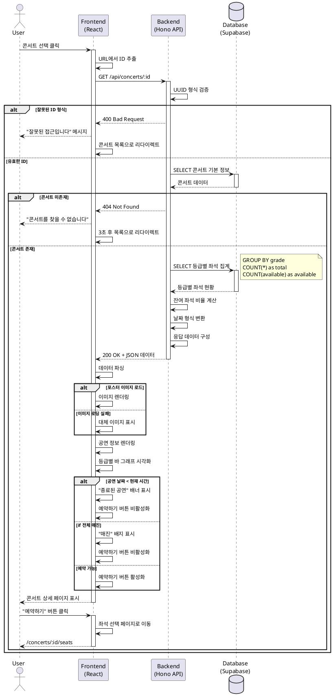

# Usecase 002: 콘서트 상세 정보 조회

## 기본 정보

- **Feature**: 콘서트 상세 정보 조회
- **Version**: 1.0.0
- **Created**: 2025-10-15
- **Based on**: PRD v1.0, Userflow v1.1.0 (유저플로우 2)

---

## Primary Actor

일반 콘서트 관람객 (비회원 사용자)

---

## Precondition

- 사용자가 콘서트 목록 페이지 또는 직접 URL로 접근
- 조회하려는 콘서트가 데이터베이스에 존재
- 네트워크 연결 상태 정상

---

## Trigger

다음 중 하나의 행동으로 시작:
1. 콘서트 목록에서 특정 콘서트 카드 클릭
2. URL 직접 입력 (`/concerts/:id`)
3. 브라우저 북마크 접근

---

## Main Scenario

### 1. 콘서트 상세 페이지 요청
1. 사용자가 콘서트 선택 또는 URL 접근
2. FE가 URL에서 콘서트 ID 추출
3. FE가 `GET /api/concerts/:id` API 호출

### 2. 데이터 검증 및 조회
1. BE가 UUID 형식 검증
2. BE가 `concerts` 테이블에서 콘서트 정보 조회
3. BE가 `seats` 테이블에서 등급별 좌석 현황 집계
   - Special (1-3열): 총 좌석 수 / 잔여 좌석 수
   - Premium (4-7열): 총 좌석 수 / 잔여 좌석 수
   - Advanced (8-15열): 총 좌석 수 / 잔여 좌석 수
   - Regular (16-20열): 총 좌석 수 / 잔여 좌석 수
4. BE가 각 등급별 가격 정보 포함
5. BE가 잔여 좌석 비율 계산 (백분율)

### 3. 데이터 가공 및 응답
1. BE가 날짜/시간을 사용자 친화적 형식으로 변환
2. BE가 등급별 집계 결과를 정렬 (Special → Regular 순)
3. BE가 JSON 형태로 응답:
   ```json
   {
     "id": "uuid",
     "title": "콘서트 제목",
     "artist": "아티스트명",
     "venue": "공연 장소",
     "date": "2025-12-31T19:00:00Z",
     "posterImage": "https://...",
     "description": "공연 설명",
     "grades": [
       {
         "grade": "Special",
         "price": 250000,
         "totalSeats": 48,
         "availableSeats": 20,
         "availabilityRate": 41.67
       },
       {
         "grade": "Premium",
         "price": 190000,
         "totalSeats": 64,
         "availableSeats": 45,
         "availabilityRate": 70.31
       },
       {
         "grade": "Advanced",
         "price": 170000,
         "totalSeats": 128,
         "availableSeats": 100,
         "availabilityRate": 78.13
       },
       {
         "grade": "Regular",
         "price": 140000,
         "totalSeats": 80,
         "availableSeats": 65,
         "availabilityRate": 81.25
       }
     ],
     "totalSeats": 320,
     "totalAvailableSeats": 230
   }
   ```

### 4. UI 렌더링
1. FE가 응답 데이터 수신
2. FE가 포스터 이미지 표시
3. FE가 공연 정보 렌더링:
   - 제목 (큰 글씨)
   - 아티스트
   - 일시 (날짜, 시간)
   - 장소
   - 설명
4. FE가 등급별 잔여 좌석 바 그래프 시각화:
   - 각 등급별로 컬러 바 표시
   - 잔여/전체 좌석 수 텍스트
   - 가격 표시
5. FE가 전체 잔여 좌석 정보 표시
6. FE가 "예약하기" 버튼 렌더링 (조건부 활성화)

### 5. 사용자 액션
1. 사용자가 정보 확인
2. "예약하기" 버튼 클릭 시 좌석 선택 페이지로 이동 (`/concerts/:id/seats`)

---

## Edge Cases

### 1. 존재하지 않는 콘서트 ID
- **상황**: 잘못된 ID 또는 삭제된 콘서트
- **처리**:
  - BE가 404 응답
  - FE가 "콘서트를 찾을 수 없습니다" 메시지 표시
  - 3초 후 콘서트 목록 페이지로 자동 리다이렉트

### 2. 이미지 로딩 실패
- **상황**: 포스터 이미지 URL 오류 또는 네트워크 문제
- **처리**:
  - FE가 대체 이미지 표시 (placeholder)
  - 이미지 영역에 콘서트 제목 텍스트 오버레이

### 3. 공연 날짜 지남
- **상황**: 현재 시간이 공연 일시를 초과
- **처리**:
  - FE가 "이미 종료된 공연입니다" 안내 배너 표시
  - "예약하기" 버튼 비활성화
  - 좌석 현황은 참고용으로 표시

### 4. 전체 매진
- **상황**: 모든 좌석의 status가 'reserved'
- **처리**:
  - FE가 "매진" 배지 표시
  - 각 등급별 바 그래프 회색으로 표시
  - "예약하기" 버튼 비활성화
  - "다른 콘서트 보기" 버튼 표시

### 5. 네트워크 오류
- **상황**: API 호출 실패, 타임아웃
- **처리**:
  - FE가 에러 메시지 표시
  - "다시 시도" 버튼 제공
  - 3회 재시도 실패 시 목록으로 복귀 안내

### 6. 잘못된 ID 형식
- **상황**: UUID가 아닌 형식의 ID
- **처리**:
  - BE가 400 Bad Request 응답
  - FE가 "잘못된 접근입니다" 메시지
  - 콘서트 목록으로 리다이렉트

### 7. 데이터 로딩 중
- **상황**: API 응답 대기 중
- **처리**:
  - FE가 스켈레톤 UI 표시
  - 주요 영역 (이미지, 제목, 바 그래프) placeholder 렌더링

### 8. 일부 등급 매진
- **상황**: 특정 등급의 좌석만 모두 예약됨
- **처리**:
  - 해당 등급 바 그래프 회색 처리
  - "매진" 텍스트 표시
  - 다른 등급은 정상 표시
  - "예약하기" 버튼은 활성화 유지

---

## Business Rules

### 1. 좌석 등급 및 가격 체계
- **Special (1-3열)**: 250,000원
  - 총 48석 (4구역 × 3열 × 4좌석)
- **Premium (4-7열)**: 190,000원
  - 총 64석 (4구역 × 4열 × 4좌석)
- **Advanced (8-15열)**: 170,000원
  - 총 128석 (4구역 × 8열 × 4좌석)
- **Regular (16-20열)**: 140,000원
  - 총 80석 (4구역 × 5열 × 4좌석)
- **전체**: 320석

### 2. 좌석 상태
- `available`: 예약 가능
- `reserved`: 예약 완료

### 3. 잔여 좌석 계산 로직
```sql
SELECT
    grade,
    price,
    COUNT(*) as total_seats,
    COUNT(CASE WHEN status = 'available' THEN 1 END) as available_seats,
    ROUND(
        COUNT(CASE WHEN status = 'available' THEN 1 END) * 100.0 / COUNT(*),
        2
    ) as availability_rate
FROM seats
WHERE concert_id = :concert_id
GROUP BY grade, price
ORDER BY
    CASE grade
        WHEN 'Special' THEN 1
        WHEN 'Premium' THEN 2
        WHEN 'Advanced' THEN 3
        WHEN 'Regular' THEN 4
    END;
```

### 4. 예약 버튼 활성화 조건
- 공연 날짜가 현재 시간보다 미래
- AND 최소 1개 이상의 좌석이 available 상태

### 5. 데이터 캐싱 전략 (선택)
- React Query 사용 시 staleTime: 30초
- 30초 이내 재접근 시 캐시 데이터 사용
- 좌석 선택 페이지에서 복귀 시 자동 갱신

### 6. 날짜 형식
- 사용자 표시: "2025년 12월 31일 (화) 오후 7시"
- ISO 8601 형식으로 저장: "2025-12-31T19:00:00Z"

---

## API Specification

### Endpoint
```
GET /api/concerts/:id
```

### Request
- **Path Parameter**:
  - `id` (UUID, required): 콘서트 고유 ID

### Response (Success - 200)
```typescript
{
  id: string;              // UUID
  title: string;           // 콘서트 제목
  artist: string;          // 아티스트명
  venue: string;           // 공연 장소
  date: string;            // ISO 8601 형식
  posterImage: string;     // 포스터 이미지 URL
  description: string;     // 공연 설명
  grades: Array<{
    grade: 'Special' | 'Premium' | 'Advanced' | 'Regular';
    price: number;         // 원 단위
    totalSeats: number;    // 해당 등급 전체 좌석 수
    availableSeats: number; // 잔여 좌석 수
    availabilityRate: number; // 잔여 비율 (백분율)
  }>;
  totalSeats: number;      // 전체 좌석 수 (320)
  totalAvailableSeats: number; // 전체 잔여 좌석 수
}
```

### Response (Error - 404)
```typescript
{
  error: "CONCERT_NOT_FOUND";
  message: "콘서트를 찾을 수 없습니다";
}
```

### Response (Error - 400)
```typescript
{
  error: "INVALID_CONCERT_ID";
  message: "잘못된 콘서트 ID 형식입니다";
}
```

---

## Sequence Diagram



---

## 관련 페이지

- **Previous**: 콘서트 목록 조회 (`/`)
- **Next**: 좌석 선택 (`/concerts/:id/seats`)
- **Related**: 예약 완료 후 재확인 시 본 페이지 재방문 가능

---

## 필요한 UI 컴포넌트

### 1. ConcertDetailHeader
- 포스터 이미지
- 콘서트 제목
- 아티스트명
- 공연 일시
- 장소

### 2. SeatGradeAvailability
- 등급별 잔여 좌석 바 그래프
- 각 등급명, 가격, 잔여/전체 좌석 수
- 시각적 비율 표시

### 3. BookingButton
- "예약하기" 버튼
- 조건부 활성화/비활성화
- 클릭 시 좌석 선택 페이지 이동

### 4. ConcertDescription
- 공연 설명 텍스트
- 확장/축소 기능 (긴 텍스트 시)

### 5. ErrorBoundary
- 에러 발생 시 fallback UI
- "다시 시도" 버튼

### 6. SkeletonLoader
- 데이터 로딩 중 표시
- 주요 영역 placeholder

---

## 외부 서비스 연동

본 기능에서는 외부 서비스 연동이 필요하지 않습니다.

---

## 성능 고려사항

### 1. 이미지 최적화
- 포스터 이미지 lazy loading
- placeholder 이미지 사용

### 2. 데이터 캐싱
- React Query 사용
- staleTime: 30초
- 동일 콘서트 재접근 시 캐시 활용

### 3. 쿼리 최적화
- 콘서트 정보 + 좌석 집계 단일 쿼리로 처리
- 불필요한 JOIN 최소화
- 적절한 인덱스 활용 (concert_id, grade)

### 4. 렌더링 최적화
- React.memo 사용 (등급별 바 그래프 컴포넌트)
- useMemo로 계산 결과 캐싱

---

## 보안 고려사항

### 1. UUID 검증
- BE에서 UUID 형식 엄격 검증
- SQL Injection 방지

### 2. 데이터 노출
- 민감한 정보 미포함 (모든 정보 공개 가능)

### 3. Rate Limiting (선택)
- 동일 IP에서 과도한 요청 방지

---

## 테스트 시나리오

### 1. 정상 케이스
- 유효한 콘서트 ID로 상세 정보 조회
- 모든 데이터 정상 표시

### 2. 엣지 케이스
- 존재하지 않는 ID → 404 처리
- 잘못된 ID 형식 → 400 처리
- 이미지 로딩 실패 → 대체 이미지
- 전체 매진 → 버튼 비활성화
- 공연 종료 → 안내 메시지

### 3. 성능 테스트
- 동시 접속 100명 시 응답 시간
- 이미지 로딩 시간

### 4. 반응형 테스트
- 모바일/태블릿/데스크톱 레이아웃

---

## 개발 우선순위

1. **High**: 기본 데이터 조회 및 표시
2. **High**: 등급별 좌석 현황 바 그래프
3. **Medium**: 이미지 로딩 fallback
4. **Medium**: 에러 처리
5. **Low**: 로딩 스켈레톤 UI
6. **Low**: 데이터 캐싱

---

## 향후 확장 가능성

1. 좌석 선택 미리보기 (3D 뷰)
2. 유사 콘서트 추천
3. SNS 공유 기능
4. 위시리스트 추가
5. 실시간 좌석 현황 업데이트 (WebSocket)

---

## 참고 문서

- PRD: `/docs/prd.md`
- Userflow: `/docs/userflow.md` (유저플로우 2)
- Database Schema: `/docs/database.md`
