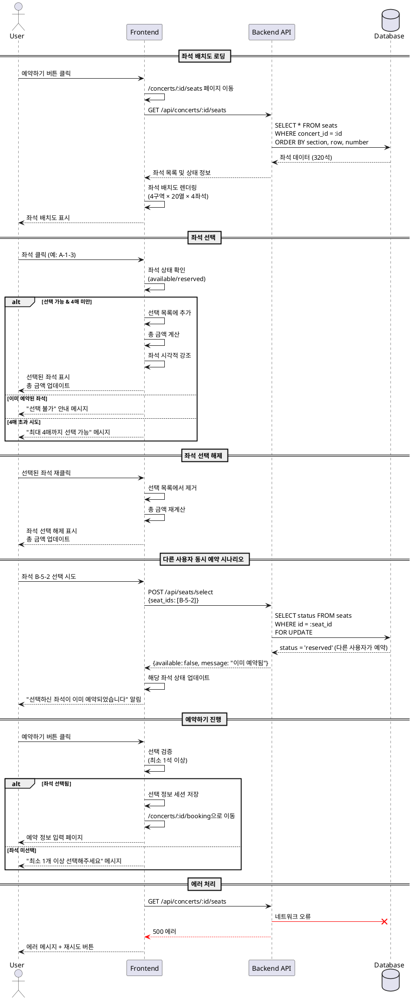

# Usecase 003: 좌석 선택

## 개요
콘서트 예약 과정에서 사용자가 좌석 배치도를 통해 원하는 좌석을 시각적으로 선택하고, 선택한 좌석의 가격을 확인하여 예약을 진행하는 기능입니다.

## Primary Actor
- 일반 사용자 (콘서트 관람객)

## Precondition
- 사용자가 콘서트 상세 페이지에서 예약하기 버튼을 클릭한 상태
- 선택한 콘서트에 예약 가능한 좌석이 1석 이상 존재
- 콘서트 공연 일시가 현재 시점보다 미래

## Trigger
- 콘서트 상세 페이지 (`/concerts/[id]`)에서 "예약하기" 버튼 클릭
- 좌석 선택 페이지 (`/concerts/[id]/seats`)로 직접 접근

## Main Scenario

### 1. 좌석 배치도 진입
1. 사용자가 콘서트 상세 페이지에서 "예약하기" 버튼 클릭
2. 시스템이 좌석 선택 페이지로 이동
3. 시스템이 해당 콘서트의 전체 좌석 정보 조회 (총 320석)
4. 좌석 배치도를 4개 구역(A, B, C, D) × 20열 × 4좌석 형태로 렌더링

### 2. 좌석 정보 표시
1. 시스템이 등급별 가격 정보를 화면 상단에 표시:
   - Special (1-3열): 250,000원
   - Premium (4-7열): 190,000원
   - Advanced (8-15열): 170,000원
   - Regular (16-20열): 140,000원
2. 각 좌석을 상태에 따라 시각적으로 구분:
   - 선택 가능: 등급별 색상으로 표시
   - 예약 완료: 회색으로 표시 (클릭 불가)
   - 선택됨: 강조 표시 (진한 색상)
3. 좌석 위치를 "구역-열-번호" 형식으로 표시 (예: A-1-3)

### 3. 좌석 선택
1. 사용자가 원하는 좌석 클릭
2. 시스템이 선택 가능 여부 검증:
   - 해당 좌석의 status가 'available'인지 확인
   - 현재 선택된 좌석 수가 4매 미만인지 확인
3. 검증 통과 시:
   - 해당 좌석을 선택 상태로 표시
   - 선택 좌석 목록에 추가
   - 총 금액 실시간 계산 및 업데이트
4. 검증 실패 시:
   - 이미 예약된 좌석: 선택 불가 안내 메시지
   - 4매 초과: "최대 4매까지 선택 가능합니다" 안내 메시지

### 4. 좌석 선택 해제
1. 사용자가 이미 선택한 좌석 재클릭
2. 시스템이 해당 좌석을 선택 목록에서 제거
3. 좌석을 선택 가능 상태로 표시
4. 총 금액 재계산 및 업데이트

### 5. 선택 완료 및 다음 단계
1. 사용자가 원하는 좌석 선택 완료 후 "예약하기" 버튼 클릭
2. 시스템이 최소 선택 조건 검증 (1석 이상 선택)
3. 검증 통과 시 선택 정보를 세션/상태에 저장
4. 예약 정보 입력 페이지 (`/concerts/[id]/booking`)로 이동

## Edge Cases

### 1. 모든 좌석 매진
- **상황**: 선택 가능한 좌석이 1석도 없음
- **처리**:
  - 좌석 배치도는 표시하되 모든 좌석 회색으로 표시
  - "현재 모든 좌석이 매진되었습니다" 안내 메시지
  - 예약하기 버튼 비활성화
  - 홈으로 돌아가기 버튼 제공

### 2. 동시 선택 충돌
- **상황**: 사용자가 좌석 선택 시도 시 다른 사용자가 먼저 해당 좌석 예약 완료
- **처리**:
  - 좌석 선택 시 실시간으로 status 재확인
  - 이미 예약된 경우 "선택하신 좌석이 이미 예약되었습니다" 알림
  - 해당 좌석을 예약 완료 상태로 시각적 업데이트
  - 다른 좌석 선택 유도

### 3. 좌석 미선택 상태로 예약 시도
- **상황**: 좌석을 하나도 선택하지 않고 "예약하기" 버튼 클릭
- **처리**:
  - "최소 1개 이상의 좌석을 선택해주세요" 안내 메시지
  - 페이지 이동하지 않음
  - 좌석 선택 영역 하이라이트

### 4. 최대 4매 초과 선택 시도
- **상황**: 이미 4매 선택 상태에서 추가 좌석 선택 시도
- **처리**:
  - 클릭 무시
  - "최대 4매까지 선택 가능합니다. 다른 좌석을 선택하려면 기존 선택을 해제해주세요" 토스트 메시지
  - 현재 선택된 좌석 하이라이트

### 5. 세션 타임아웃
- **상황**: 좌석 선택 페이지에서 장시간 머물러 세션 만료
- **처리**:
  - 선택 정보 초기화
  - "세션이 만료되었습니다. 처음부터 다시 진행해주세요" 안내
  - 콘서트 상세 페이지로 리다이렉트

### 6. 네트워크 오류
- **상황**: 좌석 정보 로딩 중 네트워크 오류 발생
- **처리**:
  - 에러 메시지 표시: "좌석 정보를 불러오는 중 문제가 발생했습니다"
  - 재시도 버튼 제공
  - 3회 재시도 실패 시 상세 페이지로 복귀 유도

### 7. 잘못된 콘서트 ID
- **상황**: URL에 존재하지 않는 콘서트 ID 입력
- **처리**:
  - 404 에러 페이지 표시 또는 홈으로 리다이렉트
  - "요청하신 콘서트를 찾을 수 없습니다" 안내 메시지

### 8. 브라우저 뒤로가기
- **상황**: 좌석 선택 중 브라우저 뒤로가기 버튼 클릭
- **처리**:
  - 콘서트 상세 페이지로 이동
  - 선택 정보 초기화
  - 다시 진입 시 새로 선택 필요

## Business Rules

### 좌석 구조 및 배치
1. **총 좌석 수**: 320석
2. **구역 구성**: A, B, C, D (4개 구역)
3. **각 구역 좌석 수**: 80석 (20열 × 4좌석)
4. **좌석 표기 형식**: 구역-열-번호 (예: A-1-3, B-10-4)

### 좌석 등급 및 가격
| 등급 | 열 범위 | 가격 |
|------|---------|------|
| Special | 1-3열 | 250,000원 |
| Premium | 4-7열 | 190,000원 |
| Advanced | 8-15열 | 170,000원 |
| Regular | 16-20열 | 140,000원 |

### 선택 제한
1. **최소 선택**: 1석
2. **최대 선택**: 4석
3. **선택 가능 조건**: status가 'available'인 좌석만

### 좌석 상태
1. **available**: 선택 가능
2. **reserved**: 예약 완료 (선택 불가)

### 금액 계산
- 선택한 각 좌석의 가격을 합산
- 실시간 계산 및 표시
- 예시: Special 2매 + Premium 1매 = (250,000 × 2) + 190,000 = 690,000원

### 데이터 검증
1. 좌석 선택 시 실시간 가용성 확인
2. 예약 진행 전 최종 가용성 재검증
3. 동시성 제어를 위한 트랜잭션 처리 (예약 단계)

## API Endpoints

### GET /api/concerts/:id/seats
전체 좌석 정보 조회

**Request**
- Path Parameter: `id` (콘서트 UUID)

**Response**
```json
{
  "concertId": "uuid",
  "seats": [
    {
      "id": "uuid",
      "section": "A",
      "row": 1,
      "number": 1,
      "grade": "Special",
      "price": 250000,
      "status": "available"
    }
  ]
}
```

### POST /api/seats/select (Optional)
좌석 선택 가능 여부 검증 (실시간 확인)

**Request**
```json
{
  "concertId": "uuid",
  "seatIds": ["uuid1", "uuid2"]
}
```

**Response**
```json
{
  "available": true,
  "unavailableSeats": [],
  "message": "선택 가능합니다"
}
```

## UI/UX 고려사항

### 좌석 배치도 시각화
1. 구역별 색상 구분 (A, B, C, D)
2. 등급별 색상 구분 (Special: 골드, Premium: 실버, Advanced: 브론즈, Regular: 그레이)
3. 선택된 좌석 강조 표시 (진한 색상 + 체크 아이콘)
4. 예약 완료 좌석 비활성화 (회색 + 잠금 아이콘)

### 선택 정보 패널
1. 선택한 좌석 목록 (구역-열-번호 형식)
2. 각 좌석의 등급 및 가격
3. 총 선택 좌석 수 / 최대 4매
4. 총 금액 (강조 표시)

### 반응형 디자인
1. 데스크톱: 좌석 배치도 좌측, 선택 정보 우측
2. 모바일: 좌석 배치도 상단, 선택 정보 하단 고정

### 접근성
1. 색맹 사용자를 위한 패턴/아이콘 추가
2. 키보드 네비게이션 지원
3. 스크린 리더 지원 (ARIA 레이블)

## Sequence Diagram



## 향후 확장 가능성

### 좌석 임시 선점 기능
현재 MVP에서는 예약 완료 시점에 트랜잭션과 Row Lock을 통해 데이터 정합성을 보장합니다.
향후 사용자 경험 개선을 위해 다음 기능을 고려할 수 있습니다:

#### 구현 방안
- **임시 선점 시간**: 좌석 선택 후 10분간 독점
- **자동 해제**: 10분 내 예약 미완료 시 자동 해제
- **실시간 업데이트**: WebSocket을 통한 좌석 상태 실시간 반영
- **선점 연장**: 추가 시간이 필요한 경우 1회 연장 가능 (5분)
- **시각적 표시**: 다른 사용자가 선점 중인 좌석은 별도 색상으로 표시

#### 기대 효과
- 사용자가 좌석을 선택하고 정보 입력까지 안심하고 진행 가능
- 마지막 단계에서 "이미 선택된 좌석입니다" 메시지로 인한 허탈감 방지
- 다른 사용자도 선점 중인 좌석을 피해 효율적인 선택 가능

### 기타 향후 개선 사항
- 3D 좌석 배치도 뷰어
- 무대 시야각 미리보기
- AI 기반 좌석 추천 시스템
- 그룹 좌석 자동 선택 기능
- 휠체어 접근 가능 좌석 표시

## 관련 문서
- PRD: `/docs/prd.md`
- 유저플로우: `/docs/userflow.md` (유저플로우 3)
- 데이터베이스 설계: `/docs/database.md`

## 버전 정보
- 작성일: 2025-10-15
- 버전: 1.0.0
- 작성자: Claude Code
