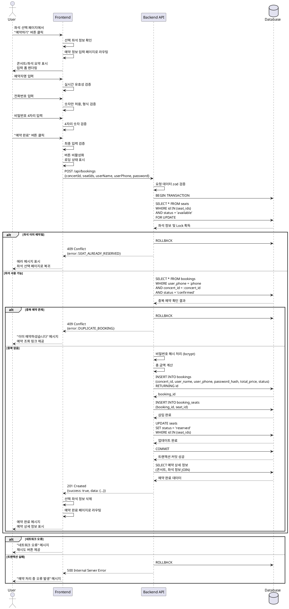

# 유스케이스 004: 예약 정보 입력 및 예약 완료

## 개요
사용자가 좌석 선택을 완료한 후 예약자 정보를 입력하여 콘서트 좌석 예약을 최종 완료하는 기능입니다.
예약자명, 전화번호, 비밀번호를 입력받아 트랜잭션 기반으로 예약을 처리하고 좌석 상태를 업데이트합니다.

---

## 기본 정보

### Primary Actor
- 콘서트 예약을 원하는 사용자 (비회원)

### Precondition
- 사용자가 좌석 선택 페이지에서 최소 1개 이상의 좌석을 선택한 상태
- 선택한 좌석이 세션/상태에 유지되고 있어야 함
- 선택한 좌석이 여전히 예약 가능한 상태여야 함

### Trigger
- 좌석 선택 페이지에서 "예약하기" 버튼 클릭
- 예약 정보 입력 페이지(`/concerts/[id]/booking`) 진입

---

## Main Scenario

### 1. 예약 정보 입력 페이지 진입
- **User**: 좌석 선택 페이지에서 예약하기 버튼 클릭
- **FE**: 선택된 좌석 정보 확인 (세션/상태)
- **FE**: 예약 정보 입력 페이지로 라우팅
- **FE**: 선택한 콘서트 및 좌석 정보 요약 표시
  - 콘서트 제목, 날짜, 장소
  - 선택한 좌석 목록 (구역-열-번호, 등급)
  - 총 금액 계산 및 표시

### 2. 예약자 정보 입력
- **User**: 예약자명 입력 (필수)
- **User**: 전화번호 입력 (필수, 숫자만)
- **User**: 비밀번호 4자리 입력 (필수, 조회용)
- **FE**: 각 필드 실시간 유효성 검증
  - 예약자명: 공백 제거, 길이 제한
  - 전화번호: 숫자만 허용, 형식 검증
  - 비밀번호: 4자리 숫자 검증

### 3. 예약 완료 요청
- **User**: "예약 완료" 버튼 클릭
- **FE**: 최종 입력 검증
- **FE**: 중복 제출 방지 (버튼 비활성화, 로딩 상태)
- **FE**: POST `/api/bookings` 요청
  ```json
  {
    "concertId": "uuid",
    "seatIds": ["uuid1", "uuid2", ...],
    "userName": "홍길동",
    "userPhone": "01012345678",
    "password": "1234"
  }
  ```

### 4. 백엔드 예약 처리
- **BE**: 요청 데이터 zod 스키마 검증
- **BE**: 트랜잭션 시작
- **BE**: 선택 좌석 유효성 재검증
  - Database: `SELECT * FROM seats WHERE id IN (seat_ids) AND status = 'available' FOR UPDATE`
  - 모든 좌석이 available 상태인지 확인
  - 동시성 제어를 위한 Row Lock
- **BE**: 중복 예약 확인
  - Database: 동일 전화번호로 같은 콘서트 예약 여부 확인
  - `SELECT * FROM bookings WHERE user_phone = :phone AND concert_id = :concert_id AND status = 'confirmed'`
- **BE**: 비밀번호 해시 처리 (bcrypt)
- **BE**: 총 금액 계산 (좌석별 가격 합산)
- **BE**: bookings 테이블 INSERT
  ```sql
  INSERT INTO bookings (id, concert_id, user_name, user_phone, password_hash, total_price, status)
  VALUES (gen_random_uuid(), :concert_id, :user_name, :user_phone, :password_hash, :total_price, 'confirmed')
  RETURNING id
  ```
- **BE**: booking_seats 테이블 INSERT (좌석별 매핑)
  ```sql
  INSERT INTO booking_seats (booking_id, seat_id)
  SELECT :booking_id, unnest(:seat_ids)
  ```
- **BE**: seats 테이블 상태 UPDATE
  ```sql
  UPDATE seats SET status = 'reserved', updated_at = NOW()
  WHERE id IN (:seat_ids)
  ```
- **BE**: 트랜잭션 커밋
- **BE**: 성공 응답 반환
  ```json
  {
    "success": true,
    "data": {
      "bookingId": "uuid",
      "concertTitle": "콘서트 제목",
      "seats": [...],
      "totalPrice": 500000,
      "userName": "홍길동",
      "userPhone": "01012345678"
    }
  }
  ```

### 5. 예약 완료 확인
- **FE**: 성공 응답 수신
- **FE**: 세션/상태에서 선택 좌석 정보 삭제
- **FE**: 예약 완료 페이지로 라우팅 (`/concerts/[id]/confirmation`)
- **FE**: 예약 완료 메시지 표시
- **FE**: 예약 상세 정보 렌더링
  - 예약 번호
  - 콘서트 정보
  - 좌석 정보 (구역-열-번호, 등급)
  - 예약자명, 전화번호
  - 총 금액
- **FE**: "예약 조회" 버튼 표시
- **FE**: "홈으로" 버튼 표시

---

## Edge Cases

### 1. 선택 좌석 세션 만료
- **상황**: 페이지 진입 시 선택 좌석 정보가 세션/상태에 없음
- **처리**:
  - 에러 메시지 표시: "좌석 선택 정보가 만료되었습니다"
  - 좌석 선택 페이지로 자동 리다이렉트

### 2. 좌석 이미 예약됨 (동시성 충돌)
- **상황**: 트랜잭션 중 일부 좌석이 이미 다른 사용자에게 예약됨
- **처리**:
  - Database: FOR UPDATE 시 해당 좌석 제외
  - 트랜잭션 롤백
  - 에러 응답: `{ "error": "SEAT_ALREADY_RESERVED", "unavailable_seats": [...] }`
  - FE: 에러 메시지 표시 및 좌석 선택 페이지로 복귀
  - "선택하신 좌석 중 일부가 이미 예약되었습니다. 다른 좌석을 선택해주세요."

### 3. 중복 예약 감지
- **상황**: 동일 전화번호로 같은 콘서트를 이미 예약한 경우
- **처리**:
  - Database: bookings 테이블 조회로 중복 확인
  - 트랜잭션 롤백
  - 에러 응답: `{ "error": "DUPLICATE_BOOKING" }`
  - FE: "이미 해당 공연을 예약하셨습니다. 예약 조회 페이지에서 확인해주세요." 메시지 표시
  - "예약 조회" 페이지 링크 제공

### 4. 필수 입력 누락
- **상황**: 예약자명, 전화번호, 비밀번호 중 하나라도 입력하지 않음
- **처리**:
  - FE: 필드별 에러 메시지 표시
  - "예약자명을 입력해주세요"
  - "전화번호를 입력해주세요"
  - "비밀번호 4자리를 입력해주세요"
  - 버튼 비활성화 또는 제출 차단

### 5. 잘못된 입력 형식
- **상황**: 전화번호에 문자 포함, 비밀번호가 4자리 아님 등
- **처리**:
  - FE 실시간 검증: 입력 시 즉시 피드백
  - 전화번호: "숫자만 입력 가능합니다"
  - 비밀번호: "4자리 숫자를 입력해주세요"
  - BE 추가 검증: 요청 시 zod 스키마로 재검증
  - 검증 실패 시 400 Bad Request 응답

### 6. 네트워크 오류
- **상황**: API 요청 중 네트워크 오류 발생
- **처리**:
  - FE: 에러 메시지 표시: "네트워크 오류가 발생했습니다. 다시 시도해주세요."
  - 로딩 상태 해제, 버튼 재활성화
  - 재시도 버튼 제공

### 7. 트랜잭션 실패
- **상황**: 데이터베이스 트랜잭션 중 오류 발생
- **처리**:
  - BE: 자동 롤백
  - 에러 로깅 (logger 사용)
  - 500 Internal Server Error 응답
  - FE: "예약 처리 중 오류가 발생했습니다. 잠시 후 다시 시도해주세요." 메시지 표시

### 8. 중복 제출 방지
- **상황**: 사용자가 예약 완료 버튼을 여러 번 클릭
- **처리**:
  - FE: 첫 클릭 후 즉시 버튼 비활성화
  - 로딩 인디케이터 표시
  - 중복 요청 방지 로직 (debounce 또는 상태 플래그)

### 9. 브라우저 뒤로가기
- **상황**: 예약 정보 입력 중 뒤로가기 버튼 클릭
- **처리**:
  - 입력 정보 세션에 임시 저장 (선택적)
  - 좌석 선택 페이지로 복귀
  - 선택 좌석 정보 유지

### 10. 예약 완료 후 뒤로가기
- **상황**: 예약 완료 후 뒤로가기로 예약 정보 입력 페이지 접근 시도
- **처리**:
  - 중복 예약 방지를 위해 홈으로 리다이렉트 또는
  - 경고 메시지 표시 후 예약 완료 페이지로 복귀

---

## Business Rules

### 1. 예약 정보 검증 규칙
- **예약자명**:
  - 필수 입력
  - 최소 2자, 최대 50자
  - 공백 제거 후 저장
- **전화번호**:
  - 필수 입력
  - 숫자만 허용 (하이픈 자동 제거)
  - 10자리 또는 11자리 (010-XXXX-XXXX 형식)
- **비밀번호**:
  - 필수 입력
  - 4자리 숫자만 허용
  - 예약 조회용으로 사용
  - bcrypt 해시 처리 후 저장

### 2. 좌석 선택 제한
- 최소 1개 이상 좌석 선택 필수
- 최대 4개까지 선택 가능
- 선택한 좌석은 트랜잭션 시작 전 재검증 필수

### 3. 중복 예약 방지
- 동일 전화번호로 같은 콘서트 중복 예약 불가
- 이미 예약이 있을 경우 에러 처리

### 4. 가격 계산
- 총 금액은 선택한 좌석의 등급별 가격 합산
- 등급별 가격:
  - Special (1-3열): 250,000원
  - Premium (4-7열): 190,000원
  - Advanced (8-15열): 170,000원
  - Regular (16-20열): 140,000원
- 백엔드에서 재계산하여 검증

### 5. 트랜잭션 처리
- 예약 생성은 반드시 트랜잭션으로 처리
- 다음 작업이 원자적으로 수행되어야 함:
  1. 좌석 가용성 확인 및 Lock
  2. bookings 테이블 INSERT
  3. booking_seats 테이블 INSERT
  4. seats 테이블 상태 UPDATE
- 실패 시 자동 롤백

### 6. 동시성 제어
- 좌석 선택 시 `SELECT ... FOR UPDATE` 사용
- Row-level Lock으로 동시 예약 방지
- 다른 트랜잭션이 같은 좌석 선택 시 대기 또는 실패

### 7. 예약 상태 관리
- 예약 완료 시 status는 'confirmed'
- 좌석 상태는 'reserved'로 업데이트
- 향후 취소 기능 추가 시 'cancelled' 상태 활용

### 8. 보안
- 비밀번호는 평문 저장 금지
- bcrypt 해시 처리 (salt rounds: 10 이상)
- SQL Injection 방지: Prepared Statement 사용
- 입력값 서버 측 재검증 필수

### 9. 세션 관리
- 선택 좌석 정보는 클라이언트 상태 또는 세션 스토리지에 유지
- 예약 완료 후 선택 정보 즉시 삭제
- 세션 만료 시 좌석 선택 페이지로 복귀

### 10. 에러 처리
- 모든 에러는 명확한 에러 코드와 메시지 반환
- 에러 코드 예시:
  - `SEAT_ALREADY_RESERVED`: 좌석 이미 예약됨
  - `DUPLICATE_BOOKING`: 중복 예약
  - `INVALID_SEAT_SELECTION`: 잘못된 좌석 선택
  - `SEAT_UNAVAILABLE`: 좌석 사용 불가
  - `TRANSACTION_FAILED`: 트랜잭션 실패

---

## API Specification

### Endpoint
```
POST /api/bookings
```

### Request Body
```typescript
{
  concertId: string (uuid, required)
  seatIds: string[] (uuid[], required, min: 1, max: 4)
  userName: string (required, min: 2, max: 50)
  userPhone: string (required, numeric only, 10-11 digits)
  password: string (required, 4 digits numeric)
}
```

### Success Response (201 Created)
```json
{
  "success": true,
  "data": {
    "bookingId": "550e8400-e29b-41d4-a716-446655440000",
    "concertId": "550e8400-e29b-41d4-a716-446655440001",
    "concertTitle": "2025 New Year Concert",
    "concertDate": "2025-12-31T19:00:00Z",
    "concertVenue": "Seoul Arts Center",
    "seats": [
      {
        "seatId": "550e8400-e29b-41d4-a716-446655440010",
        "section": "A",
        "row": 1,
        "number": 3,
        "grade": "Special",
        "price": 250000
      },
      {
        "seatId": "550e8400-e29b-41d4-a716-446655440011",
        "section": "A",
        "row": 1,
        "number": 4,
        "grade": "Special",
        "price": 250000
      }
    ],
    "userName": "홍길동",
    "userPhone": "01012345678",
    "totalPrice": 500000,
    "status": "confirmed",
    "createdAt": "2025-10-15T12:34:56Z"
  }
}
```

### Error Responses

#### 400 Bad Request (잘못된 입력)
```json
{
  "success": false,
  "error": {
    "code": "VALIDATION_ERROR",
    "message": "입력값이 올바르지 않습니다",
    "details": [
      {
        "field": "userPhone",
        "message": "전화번호는 10-11자리 숫자여야 합니다"
      }
    ]
  }
}
```

#### 409 Conflict (좌석 이미 예약됨)
```json
{
  "success": false,
  "error": {
    "code": "SEAT_ALREADY_RESERVED",
    "message": "선택하신 좌석 중 일부가 이미 예약되었습니다",
    "unavailableSeats": [
      "550e8400-e29b-41d4-a716-446655440010"
    ]
  }
}
```

#### 409 Conflict (중복 예약)
```json
{
  "success": false,
  "error": {
    "code": "DUPLICATE_BOOKING",
    "message": "이미 해당 공연을 예약하셨습니다",
    "existingBookingId": "550e8400-e29b-41d4-a716-446655440000"
  }
}
```

#### 500 Internal Server Error
```json
{
  "success": false,
  "error": {
    "code": "TRANSACTION_FAILED",
    "message": "예약 처리 중 오류가 발생했습니다. 잠시 후 다시 시도해주세요."
  }
}
```

---

## Database Operations

### 1. 좌석 가용성 확인 및 Lock
```sql
SELECT id, section, row, number, grade, price, status
FROM seats
WHERE id = ANY($1::uuid[])
  AND concert_id = $2
  AND status = 'available'
FOR UPDATE;
```

### 2. 중복 예약 확인
```sql
SELECT id
FROM bookings
WHERE user_phone = $1
  AND concert_id = $2
  AND status = 'confirmed'
LIMIT 1;
```

### 3. 예약 생성
```sql
INSERT INTO bookings (
  id,
  concert_id,
  user_name,
  user_phone,
  password_hash,
  total_price,
  status,
  created_at,
  updated_at
)
VALUES (
  gen_random_uuid(),
  $1,
  $2,
  $3,
  $4,
  $5,
  'confirmed',
  NOW(),
  NOW()
)
RETURNING id, created_at;
```

### 4. 예약-좌석 매핑 생성
```sql
INSERT INTO booking_seats (
  id,
  booking_id,
  seat_id,
  created_at,
  updated_at
)
SELECT
  gen_random_uuid(),
  $1,
  unnest($2::uuid[]),
  NOW(),
  NOW();
```

### 5. 좌석 상태 업데이트
```sql
UPDATE seats
SET status = 'reserved',
    updated_at = NOW()
WHERE id = ANY($1::uuid[]);
```

---

## Sequence Diagram



---

## 페이지 구성

### `/concerts/[id]/booking` - 예약 정보 입력 페이지

#### 주요 섹션
1. **콘서트 정보 요약**
   - 콘서트 제목
   - 날짜, 시간
   - 장소

2. **선택 좌석 정보**
   - 좌석 목록 (구역-열-번호, 등급)
   - 각 좌석별 가격
   - 총 금액

3. **예약자 정보 입력 폼**
   - 예약자명 (text input, required)
   - 전화번호 (tel input, required)
   - 비밀번호 4자리 (password input, pattern="[0-9]{4}", required)

4. **액션 버튼**
   - "예약 완료" 버튼 (primary)
   - "이전" 버튼 (좌석 선택 페이지로 복귀)

### `/concerts/[id]/confirmation` - 예약 완료 페이지

#### 주요 섹션
1. **예약 완료 메시지**
   - "예약이 완료되었습니다!"

2. **예약 정보**
   - 예약 번호
   - 콘서트 정보
   - 좌석 정보
   - 예약자명, 전화번호
   - 총 금액
   - 예약 일시

3. **액션 버튼**
   - "예약 조회" 버튼 (예약 조회 페이지로 이동)
   - "홈으로" 버튼 (콘서트 목록으로 이동)

---

## 외부 연동 서비스

### 1. Supabase
- **용도**: PostgreSQL 데이터베이스
- **테이블**: `bookings`, `booking_seats`, `seats`, `concerts`
- **트랜잭션**: Supabase 클라이언트를 통한 SQL 트랜잭션 처리
- **인증**: Service-role 키 사용 (백엔드)

### 2. bcrypt
- **용도**: 비밀번호 해시 처리
- **라이브러리**: `bcryptjs` 또는 `bcrypt`
- **Salt Rounds**: 10 이상 권장

---

## 기술 스택

### Frontend
- Next.js 14+ (App Router)
- React Hook Form + Zod (폼 검증)
- @tanstack/react-query (API 상태 관리)
- Zustand (좌석 선택 상태 관리)
- shadcn-ui (UI 컴포넌트)
- TailwindCSS (스타일링)

### Backend
- Hono (API 라우터)
- Next.js Route Handler (위임)
- Zod (스키마 검증)
- bcryptjs (비밀번호 해싱)

### Database
- Supabase (PostgreSQL)
- 트랜잭션 지원
- Row-level Locking

---

## 성능 고려사항

### 1. 동시성 제어
- `SELECT ... FOR UPDATE`로 Row Lock
- 트랜잭션 격리 수준: Read Committed 이상
- 데드락 방지: 좌석 ID 정렬 후 Lock

### 2. 트랜잭션 최적화
- 최소한의 Lock 시간 유지
- 불필요한 쿼리 제거
- 인덱스 활용 (seat_id, concert_id, user_phone)

### 3. 클라이언트 최적화
- 중복 제출 방지
- Debounce 적용
- 낙관적 UI 업데이트 (선택적)

---

## 테스트 시나리오

### 1. 정상 케이스
- 필수 정보 모두 입력 후 예약 완료
- 예약 완료 페이지로 정상 이동
- 데이터베이스에 예약 정보 저장 확인

### 2. 에러 케이스
- 필수 필드 누락 시 에러 메시지 표시
- 잘못된 전화번호 형식 입력 시 검증 실패
- 좌석 중복 예약 시도 시 에러 처리
- 중복 예약 시도 시 에러 처리

### 3. 동시성 테스트
- 여러 사용자가 동시에 같은 좌석 예약 시도
- 먼저 완료한 사용자만 성공
- 나머지는 "좌석 이미 예약됨" 에러

### 4. 보안 테스트
- 비밀번호 평문 저장 여부 확인
- SQL Injection 시도
- 입력값 검증 우회 시도

---

## 향후 확장 가능성

### 좌석 임시 선점 기능
현재 MVP에서는 예약 완료 시점에 트랜잭션과 `FOR UPDATE` Row Lock을 통해 데이터 정합성을 보장합니다.
이는 매우 올바른 설계이지만, 향후 사용자 경험 개선을 위해 다음 기능을 고려할 수 있습니다:

#### 구현 방안
- **좌석 선택 시 임시 선점**: 좌석 선택 단계에서 10분간 해당 좌석을 임시 보유
- **자동 해제**: 10분 내 예약 미완료 시 자동으로 선점 해제
- **카운트다운 표시**: 사용자에게 남은 시간 시각적으로 표시
- **연장 기능**: 필요 시 1회에 한해 5분 추가 연장 가능
- **Redis 활용**: 임시 선점 정보를 Redis에 TTL과 함께 저장

#### 기대 효과
- 사용자가 정보 입력 중 "이미 선택된 좌석입니다" 메시지를 받지 않음
- 예약 프로세스 진행 중 심리적 안정감 제공
- 좌석 선택 경쟁 상황에서의 공정성 향상
- 허수 예약 방지 (자동 해제 메커니즘)

### 예약 취소 및 환불 기능
- 예약 취소 가능 기한 설정 (예: 공연 3일 전까지)
- 단계별 환불 수수료 정책 적용
- 취소된 좌석 자동 재판매

### 결제 시스템 연동
- PG사 연동을 통한 실제 결제 처리
- 다양한 결제 수단 지원 (카드, 간편결제, 무통장입금)
- 부분 취소 및 환불 기능

### 알림 서비스
- 예약 완료 SMS/카카오톡 알림
- 공연 D-1 리마인더 발송
- 예약 취소 가능 기한 안내

---

## 버전 정보
- 작성일: 2025-10-15
- 버전: 1.0.0
- 기반 문서: PRD v1.0, 유저플로우 v1.1.0, 데이터베이스 설계 v1.0.0
- 작성자: Claude Code
