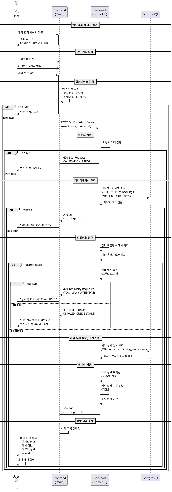

# 유스케이스 005: 예약 조회

## 개요
사용자가 전화번호와 비밀번호를 입력하여 자신이 예약한 콘서트 내역을 조회하는 기능입니다.

## Primary Actor
- 콘서트 관람객 (예약 완료 상태)

## Precondition
- 사용자가 이미 콘서트 예약을 완료한 상태
- 예약 시 입력한 전화번호와 비밀번호 4자리를 기억하고 있음

## Trigger
- 사용자가 헤더의 "예약 조회" 링크를 클릭
- 예약 완료 페이지에서 "예약 조회" 버튼을 클릭
- 직접 `/bookings` URL에 접근

## Main Scenario

### 1. 조회 폼 접근
1. 사용자가 예약 조회 페이지에 접근한다.
2. 시스템은 예약 조회 폼을 표시한다.
   - 전화번호 입력 필드
   - 비밀번호 4자리 입력 필드
   - 조회 버튼

### 2. 인증 정보 입력
1. 사용자가 전화번호를 입력한다.
2. 사용자가 비밀번호 4자리를 입력한다.
3. 사용자가 조회 버튼을 클릭한다.

### 3. 입력 검증 (클라이언트)
1. 시스템은 전화번호 형식을 검증한다.
   - 숫자만 포함 여부 확인
   - 빈 값 여부 확인
2. 시스템은 비밀번호 형식을 검증한다.
   - 4자리 숫자 형식 확인
   - 빈 값 여부 확인
3. 검증 실패 시, 해당 필드에 에러 메시지를 표시하고 중단한다.

### 4. 예약 조회 요청
1. 클라이언트는 `POST /api/bookings/search` 요청을 전송한다.
   - Body: `{ userPhone: string, password: string }`

### 5. 인증 및 조회 (백엔드)
1. 시스템은 전화번호로 예약 레코드를 조회한다.
   - `bookings` 테이블에서 `user_phone` 으로 검색
2. 시스템은 입력된 비밀번호를 해시 처리한다.
3. 시스템은 저장된 해시값과 비교하여 인증한다.
4. 인증 실패 시, 401 에러를 반환하고 중단한다.
5. 인증 성공 시, 예약 상세 정보를 JOIN 조회한다.
   - `bookings` ← `concerts` (공연 정보)
   - `bookings` ← `booking_seats` ← `seats` (좌석 정보)

### 6. 데이터 가공
1. 시스템은 조회된 예약 목록을 가공한다.
   - 예약 일시 기준 내림차순 정렬 (최신순)
   - 좌석 정보를 "구역-열-번호" 형식으로 포맷팅 (예: A-1-3)
   - 공연 날짜 형식 변환
2. 시스템은 가공된 데이터를 JSON 형식으로 응답한다.

### 7. 예약 내역 표시
1. 클라이언트는 응답 데이터를 받아 예약 목록을 렌더링한다.
2. 각 예약마다 다음 정보를 표시한다.
   - 콘서트 제목
   - 아티스트
   - 공연 날짜 및 시간
   - 공연 장소
   - 예약 좌석 목록 (구역-열-번호, 등급)
   - 예약자명
   - 총 금액
   - 예약 일시

### 8. 사용자 확인
1. 사용자는 자신의 예약 내역을 확인한다.
2. 필요 시 다른 전화번호로 재조회할 수 있다.

## Edge Cases

### 1. 예약 정보 없음
- **상황**: 입력한 전화번호로 예약된 내역이 없음
- **처리**: "예약 내역이 없습니다" 메시지 표시

### 2. 비밀번호 불일치
- **상황**: 전화번호는 일치하나 비밀번호가 틀림
- **처리**:
  - "전화번호 또는 비밀번호가 일치하지 않습니다" 메시지 표시
  - 재입력 유도
  - 실패 횟수 카운트 (브루트포스 방지)

### 3. 필수 입력 누락
- **상황**: 전화번호 또는 비밀번호 미입력
- **처리**: 해당 필드에 "필수 입력 항목입니다" 메시지 표시

### 4. 잘못된 전화번호 형식
- **상황**: 전화번호에 숫자 외 문자 포함
- **처리**: "올바른 전화번호 형식을 입력해주세요" 메시지 표시

### 5. 잘못된 비밀번호 형식
- **상황**: 4자리 숫자가 아닌 입력
- **처리**: "비밀번호는 4자리 숫자입니다" 메시지 표시

### 6. 다수 예약 존재
- **상황**: 동일 전화번호로 여러 예약이 있음
- **처리**:
  - 모든 예약 내역을 목록으로 표시
  - 최신순으로 정렬하여 보기 편하게 제공

### 7. 네트워크 오류
- **상황**: API 요청 실패 또는 타임아웃
- **처리**:
  - "일시적인 오류가 발생했습니다" 메시지 표시
  - "재시도" 버튼 제공

### 8. 연속 실패 시도 (브루트포스 공격)
- **상황**: 동일 IP 또는 전화번호로 짧은 시간 내 반복 실패
- **처리**:
  - 5회 연속 실패 시 5분간 일시적 제한
  - "잠시 후 다시 시도해주세요" 메시지 표시

### 9. 취소된 예약
- **상황**: 예약 상태가 'cancelled'
- **처리**:
  - 취소된 예약도 목록에 표시 (취소 표시 추가)
  - 또는 상태가 'confirmed'인 예약만 조회

### 10. 데이터베이스 오류
- **상황**: DB 연결 실패 또는 쿼리 오류
- **처리**:
  - 500 에러 반환
  - 사용자에게 "서비스 이용에 불편을 드려 죄송합니다" 메시지 표시

## Business Rules

### BR-005-001: 인증 방식
- 예약 조회는 전화번호 + 비밀번호 4자리 조합으로만 인증한다.
- 회원가입/로그인 없이 간편 조회를 제공한다.

### BR-005-002: 비밀번호 보안
- 비밀번호는 반드시 해시 처리 후 저장한다.
- 비교 시에도 해시값을 비교한다.
- 평문 비밀번호는 절대 저장하지 않는다.

### BR-005-003: 에러 메시지
- 비밀번호 불일치 시 "전화번호 또는 비밀번호가 일치하지 않습니다"로 표시한다.
- 전화번호 존재 여부를 노출하지 않는다. (보안)

### BR-005-004: 브루트포스 방지
- 동일 IP에서 5회 연속 인증 실패 시 5분간 요청 제한한다.
- 또는 동일 전화번호로 5회 연속 실패 시 5분간 제한한다.
- 제한 시간 경과 후 자동으로 해제한다.

### BR-005-005: 예약 목록 정렬
- 예약 목록은 예약 생성 일시(created_at) 기준 내림차순으로 정렬한다.
- 최신 예약이 상단에 표시된다.

### BR-005-006: 좌석 정보 포맷
- 좌석 정보는 "구역-열-번호" 형식으로 표시한다.
- 예: A-1-3, B-5-2, C-10-4
- 여러 좌석은 쉼표로 구분하여 나열한다.

### BR-005-007: 예약 상태 필터링
- 기본적으로 'confirmed' 상태의 예약만 조회한다.
- 향후 확장: 'cancelled' 상태 예약도 표시 옵션 제공 가능

### BR-005-008: 복수 예약 처리
- 동일 전화번호로 여러 콘서트 예약이 가능하다.
- 모든 예약 내역을 목록으로 표시한다.

### BR-005-009: 데이터 조회 범위
- 전화번호로 조회되는 모든 예약을 반환한다.
- 과거/미래 공연 구분 없이 전체 예약 내역을 표시한다.

### BR-005-010: API 응답 형식
- 성공 시: 200 OK, 예약 목록 배열 반환
- 인증 실패 시: 401 Unauthorized
- 형식 오류 시: 400 Bad Request
- 서버 오류 시: 500 Internal Server Error

## API 명세

### Endpoint
```
POST /api/bookings/search
```

### Request Body
```typescript
{
  userPhone: string;    // 전화번호 (숫자만)
  password: string;     // 비밀번호 4자리
}
```

### Response (200 OK)
```typescript
{
  success: true;
  data: {
    bookings: [
      {
        id: string;                    // 예약 ID (UUID)
        concertId: string;             // 콘서트 ID
        concertTitle: string;          // 콘서트 제목
        concertArtist: string;         // 아티스트
        concertDate: string;           // 공연 일시 (ISO 8601)
        concertVenue: string;          // 공연 장소
        userName: string;              // 예약자명
        totalPrice: number;            // 총 금액
        status: 'confirmed' | 'cancelled';  // 예약 상태
        createdAt: string;             // 예약 일시
        seats: [
          {
            section: string;           // 구역 (A/B/C/D)
            row: number;               // 열 (1-20)
            number: number;            // 좌석번호 (1-4)
            grade: string;             // 등급
            price: number;             // 좌석 가격
            formatted: string;         // 포맷된 좌석 정보 (예: A-1-3)
          }
        ]
      }
    ]
  }
}
```

### Response (401 Unauthorized)
```typescript
{
  success: false;
  error: {
    code: 'INVALID_CREDENTIALS';
    message: '전화번호 또는 비밀번호가 일치하지 않습니다';
  }
}
```

### Response (400 Bad Request)
```typescript
{
  success: false;
  error: {
    code: 'VALIDATION_ERROR';
    message: '입력 형식이 올바르지 않습니다';
    details: [
      {
        field: 'userPhone' | 'password';
        message: string;
      }
    ]
  }
}
```

### Response (429 Too Many Requests)
```typescript
{
  success: false;
  error: {
    code: 'TOO_MANY_ATTEMPTS';
    message: '잠시 후 다시 시도해주세요';
    retryAfter: number;  // 재시도 가능 시간 (초)
  }
}
```

## Database Query

### 예약 조회 쿼리
```sql
-- 1단계: 전화번호로 예약 조회 (비밀번호 검증은 애플리케이션 레벨에서 수행)
SELECT
    b.id,
    b.concert_id,
    b.user_name,
    b.total_price,
    b.status,
    b.created_at,
    b.password_hash,  -- 애플리케이션에서 bcrypt.compare() 수행용
    c.title as concert_title,
    c.artist as concert_artist,
    c.date as concert_date,
    c.venue as concert_venue,
    json_agg(
        json_build_object(
            'section', s.section,
            'row', s.row,
            'number', s.number,
            'grade', s.grade,
            'price', s.price
        ) ORDER BY s.section, s.row, s.number
    ) as seats
FROM bookings b
INNER JOIN concerts c ON b.concert_id = c.id
INNER JOIN booking_seats bs ON b.id = bs.booking_id
INNER JOIN seats s ON bs.seat_id = s.id
WHERE b.user_phone = $1
    AND b.status = 'confirmed'
GROUP BY b.id, b.password_hash, c.title, c.artist, c.date, c.venue
ORDER BY b.created_at DESC;

-- 주의: 비밀번호 검증은 절대 SQL WHERE 절에서 수행하지 않습니다.
-- 애플리케이션 코드에서 bcrypt.compare(inputPassword, passwordHash) 사용
```

## Sequence Diagram



## 페이지 구조

### `/bookings` (예약 조회 페이지)

#### 레이아웃
```
┌─────────────────────────────────────┐
│ Header: BigConcert | 예약 조회      │
├─────────────────────────────────────┤
│                                     │
│   예약 조회                          │
│                                     │
│   ┌───────────────────────────┐    │
│   │ 전화번호                   │    │
│   │ [________________]        │    │
│   │                           │    │
│   │ 비밀번호 (4자리)           │    │
│   │ [____]                    │    │
│   │                           │    │
│   │      [ 조회하기 ]          │    │
│   └───────────────────────────┘    │
│                                     │
│   조회 결과:                        │
│   ┌───────────────────────────┐    │
│   │ 콘서트: OOO 콘서트         │    │
│   │ 아티스트: XXX              │    │
│   │ 일시: 2025-12-25 19:00    │    │
│   │ 장소: XX아레나             │    │
│   │ 좌석: A-1-3, A-1-4        │    │
│   │ 예약자: 홍길동             │    │
│   │ 금액: 500,000원           │    │
│   │ 예약일: 2025-10-15        │    │
│   └───────────────────────────┘    │
│                                     │
└─────────────────────────────────────┘
```

## 기술 스택 및 구현 위치

### Frontend
- **페이지**: `src/app/bookings/page.tsx`
- **컴포넌트**:
  - `src/features/booking/components/BookingSearchForm.tsx`
  - `src/features/booking/components/BookingList.tsx`
  - `src/features/booking/components/BookingCard.tsx`
- **Hook**:
  - `src/features/booking/hooks/useBookingSearch.ts` (React Query)
- **Validation**:
  - `react-hook-form` + `zod`

### Backend
- **라우터**: `src/features/booking/backend/route.ts`
- **서비스**: `src/features/booking/backend/service.ts`
- **스키마**: `src/features/booking/backend/schema.ts`
- **에러**: `src/features/booking/backend/error.ts`

### Database
- **테이블**: `bookings`, `concerts`, `booking_seats`, `seats`
- **인덱스**: `idx_bookings_user_phone`, `idx_bookings_phone_status`

### 외부 서비스
- **인증**: bcrypt (비밀번호 해시)
- **레이트 리밋**: 메모리 기반 카운터 (향후 Redis 고려)

## 관련 유스케이스
- UC-004: 예약 정보 입력 및 예약 완료 (예약 생성)
- UC-006: 예약 완료 후 행동 (예약 조회 이동)

## 버전 정보
- 작성일: 2025-10-15
- 버전: 1.0.0
- 작성자: Claude Code
- 기반 문서:
  - PRD v1.0
  - 유저플로우 v1.1.0 (유저플로우 5)
  - 데이터베이스 설계 v1.0.0
