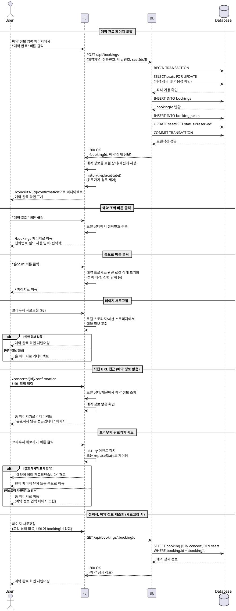

# 유스케이스 006: 예약 완료 후 행동

## 개요
예약 완료 페이지에서 사용자가 다음 행동을 선택하거나, 직접 URL 접근, 뒤로가기 등의 엣지 케이스를 처리하는 기능입니다.

---

## Primary Actor
- 콘서트 예약을 완료한 사용자

---

## Precondition
- 사용자가 예약 정보 입력을 완료하고 예약이 성공적으로 처리됨
- 예약 정보가 데이터베이스에 정상적으로 저장됨
- 좌석 상태가 'reserved'로 업데이트됨
- 세션 또는 클라이언트 상태에 예약 완료 정보가 존재함

---

## Trigger
- 예약 완료 트랜잭션 성공 후 자동으로 예약 완료 페이지(`/concerts/[id]/confirmation`)로 리다이렉트
- 사용자가 예약 완료 페이지에서 다음 행동 선택:
  - "예약 조회" 버튼 클릭
  - "홈으로" 버튼 클릭
- 사용자가 브라우저 뒤로가기 시도
- 사용자가 예약 완료 페이지 URL을 직접 입력하거나 북마크로 접근

---

## Main Scenario

### 1. 예약 완료 페이지 도달
1. 사용자가 예약 정보 입력 페이지에서 "예약 완료" 버튼 클릭
2. BE는 예약 트랜잭션 처리 후 성공 응답 반환
3. FE는 예약 ID 및 상세 정보를 로컬 상태 또는 세션에 저장
4. FE는 예약 완료 페이지(`/concerts/[id]/confirmation`)로 리다이렉트
5. FE는 저장된 예약 정보를 기반으로 예약 완료 화면 렌더링:
   - 예약 완료 확인 메시지
   - 콘서트 정보 (제목, 날짜, 장소)
   - 선택한 좌석 정보 (구역-열-번호, 등급)
   - 예약자명
   - 전화번호
   - 총 금액
   - 예약 일시

### 2. 예약 조회 버튼 클릭
1. 사용자가 "예약 조회" 버튼 클릭
2. FE는 예약 조회 페이지(`/bookings`)로 이동
3. FE는 예약 시 입력한 전화번호를 자동으로 입력 필드에 채움 (선택적 UX 개선)
4. 사용자는 비밀번호만 입력하여 예약 조회 가능

### 3. 홈으로 버튼 클릭
1. 사용자가 "홈으로" 버튼 클릭
2. FE는 예약 프로세스 관련 로컬 상태 초기화:
   - 선택 좌석 정보 삭제
   - 예약 프로세스 진행 상태 초기화
   - 임시 저장된 예약 정보 삭제 (선택적)
3. FE는 홈 페이지(`/`)로 이동
4. 사용자는 콘서트 목록 화면에서 새로운 예약 프로세스 시작 가능

### 4. 세션 관리
1. 예약 완료 시점에 FE는 다음 정보를 정리:
   - 좌석 선택 페이지에서 저장한 선택 좌석 정보 삭제
   - 예약 프로세스 진행 단계 상태 초기화
   - 예약 완료 정보는 일시적으로 유지 (페이지 새로고침 대응)
2. 필요 시 예약 완료 정보를 로컬 스토리지에 저장하여 새로고침 시 정보 유지

---

## Edge Cases

### 1. 직접 URL 접근 (예약 정보 없음)
- **상황**: 사용자가 예약 프로세스를 거치지 않고 `/concerts/[id]/confirmation` URL을 직접 입력
- **처리**:
  - FE는 로컬 상태 또는 세션에서 예약 완료 정보 조회
  - 예약 정보가 없는 경우 홈 페이지(`/`)로 리다이렉트
  - 안내 메시지 표시: "유효하지 않은 접근입니다"

### 2. 브라우저 뒤로가기 시도
- **상황**: 사용자가 예약 완료 페이지에서 브라우저 뒤로가기 버튼 클릭
- **처리**:
  - 예약 정보 입력 페이지로 이동하지 않도록 히스토리 관리
  - 뒤로가기 시도 시 경고 메시지 표시: "예약이 이미 완료되었습니다. 중복 예약을 방지하기 위해 이전 페이지로 이동할 수 없습니다"
  - 또는 홈 페이지로 리다이렉트 (히스토리 리플레이스)

### 3. 페이지 새로고침
- **상황**: 사용자가 예약 완료 페이지에서 브라우저 새로고침 (F5)
- **처리**:
  - 로컬 스토리지 또는 세션 스토리지에 저장된 예약 정보 확인
  - 예약 정보가 있으면 동일한 예약 완료 화면 재렌더링
  - 예약 정보가 없으면 홈 페이지로 리다이렉트
  - 또는 예약 ID를 URL 파라미터 또는 쿼리 스트링에 포함하여 BE에서 예약 정보 재조회

### 4. 세션 만료
- **상황**: 사용자가 오랜 시간 경과 후 예약 완료 페이지 접근
- **처리**:
  - 로컬 저장된 예약 정보가 없거나 만료된 경우
  - 안내 메시지 표시: "세션이 만료되었습니다. 예약 조회 페이지에서 예약 정보를 확인하실 수 있습니다"
  - 예약 조회 페이지로 이동할 수 있는 링크 제공

### 5. 네트워크 오류
- **상황**: 예약 트랜잭션 후 네트워크 연결 문제로 예약 완료 페이지 로딩 실패
- **처리**:
  - 에러 메시지 표시: "예약이 완료되었지만 정보를 불러올 수 없습니다"
  - 예약 조회 페이지 링크 제공
  - 예약 완료 상태는 데이터베이스에 정상 저장됨 (트랜잭션 커밋 완료)

### 6. 동일 콘서트 중복 예약 시도
- **상황**: 사용자가 예약 완료 후 뒤로가기로 프로세스를 재진행하려 시도
- **처리**:
  - 좌석 선택 페이지에서 이미 예약된 좌석은 'reserved' 상태로 표시
  - 예약 정보 입력 시 동일 전화번호 + 동일 콘서트 조합 검증
  - 중복 예약 방지 로직 작동 (유저플로우 4 참조)

---

## Business Rules

### BR-1: 예약 완료 정보 유지
- 예약 완료 정보는 사용자가 페이지를 벗어나기 전까지 로컬 상태 또는 세션 스토리지에 유지
- 새로고침 시에도 정보를 유지하여 사용자 경험 개선
- 로컬 스토리지 사용 시 일정 시간(예: 30분) 후 자동 삭제 고려

### BR-2: 뒤로가기 방지
- 예약 완료 후 예약 정보 입력 페이지로 뒤로가기를 방지하여 중복 예약 시도 차단
- 히스토리 API (`history.replaceState()`) 활용하여 뒤로가기 경로 제어
- 또는 뒤로가기 시 경고 메시지 및 홈으로 리다이렉트

#### 구체적 구현 방법
1. **history.replaceState() 방식**
   ```javascript
   // 예약 완료 페이지 진입 시
   history.replaceState(null, '', '/concerts/[id]/confirmation');
   ```
   - 브라우저 히스토리 스택에서 예약 정보 입력 페이지를 제거
   - 뒤로가기 시 좌석 선택 페이지나 홈으로 이동

2. **React Router navigate replace 방식**
   ```javascript
   // React Router v6
   navigate('/concerts/[id]/confirmation', { replace: true });
   ```
   - 현재 히스토리 항목을 교체하여 중간 단계 제거

3. **beforeunload 이벤트 활용**
   ```javascript
   useEffect(() => {
     const handleBeforeUnload = (e) => {
       if (hasUnsavedChanges) {
         e.preventDefault();
         e.returnValue = '';
       }
     };
     window.addEventListener('beforeunload', handleBeforeUnload);
     return () => window.removeEventListener('beforeunload', handleBeforeUnload);
   }, [hasUnsavedChanges]);
   ```
   - 페이지 이탈 시 경고 메시지 표시

### BR-3: 세션 정리
- 예약 완료 시점에 예약 프로세스 중 누적된 임시 데이터 정리:
  - 좌석 선택 정보
  - 예약 진행 단계
  - 임시 저장된 콘서트 정보
- 불필요한 데이터를 정리하여 클라이언트 상태 관리 효율화

### BR-4: 예약 조회 편의성
- 예약 완료 페이지에서 예약 조회로 이동 시 전화번호 자동 입력
- 사용자는 비밀번호만 입력하여 빠르게 예약 확인 가능
- 로컬 스토리지 또는 세션 스토리지 활용 (보안 고려)

### BR-5: 직접 접근 차단
- 예약 프로세스를 거치지 않은 직접 URL 접근 차단
- 유효한 예약 정보가 없으면 홈 페이지로 리다이렉트
- 안내 메시지로 사용자에게 상황 설명

### BR-6: 예약 완료 상태 불변성
- 예약 완료 페이지는 예약 정보를 조회만 하며 수정하지 않음
- 예약 취소/변경 기능은 MVP 범위 외이므로 제공하지 않음
- 예약 정보는 읽기 전용으로 표시

---

## API 요구사항

### 1. 예약 완료 정보 조회 (선택적)
- **Endpoint**: `GET /api/bookings/:id`
- **목적**: 예약 ID로 예약 상세 정보 재조회 (새로고침 대응)
- **요청**:
  - Path Parameter: `id` (예약 ID, UUID)
- **응답**:
  - 200 OK: 예약 상세 정보 (콘서트, 좌석, 예약자명, 전화번호, 총 금액)
  - 404 Not Found: 존재하지 않는 예약 ID
- **참고**: 로컬 상태 관리로도 구현 가능하여 선택적 API

---

## 페이지 구성 요소

### 예약 완료 페이지 (`/concerts/[id]/confirmation`)

#### 표시 정보
1. **예약 완료 확인 메시지**
   - 긍정적인 메시지: "예약이 완료되었습니다!"
   - 아이콘 또는 체크마크 애니메이션 (선택적)

2. **콘서트 정보**
   - 공연 제목
   - 아티스트
   - 공연 일시 (날짜, 시간)
   - 공연 장소

3. **좌석 정보**
   - 선택한 좌석 목록 (구역-열-번호 형식)
   - 각 좌석의 등급
   - 좌석별 가격
   - 예시: "A-1-3 (Special) - 250,000원"

4. **예약자 정보**
   - 예약자명
   - 전화번호 (마스킹 선택적: 010-****-1234)

5. **금액 정보**
   - 총 금액
   - 좌석별 금액 세부 내역 (선택적)

6. **예약 메타 정보**
   - 예약 일시
   - 예약 번호 (UUID 또는 단축 ID)

#### 액션 버튼
1. **예약 조회 버튼**
   - 예약 조회 페이지로 이동
   - 전화번호 자동 입력 (선택적)

2. **홈으로 버튼**
   - 홈 페이지로 이동
   - 세션 정리

---

## 클라이언트 상태 관리

### 로컬 상태 구조 (예시)
```typescript
interface BookingCompletionState {
  bookingId: string;
  concert: {
    id: string;
    title: string;
    artist: string;
    date: string;
    venue: string;
  };
  seats: Array<{
    id: string;
    section: string;
    row: number;
    number: number;
    grade: string;
    price: number;
  }>;
  user: {
    name: string;
    phone: string;
  };
  totalPrice: number;
  createdAt: string;
}
```

### 상태 저장 전략
1. **통일된 저장 전략**
   - **예약 완료 정보**: sessionStorage + URL param 조합
   - sessionStorage에 예약 상세 정보 저장 (30분 TTL)
   - URL에는 bookingId만 포함 (`?id=[bookingId]`)
   - 새로고침 시: sessionStorage 우선, 없으면 URL의 bookingId로 재조회

2. **저장 형식**
   ```typescript
   {
     bookingId: string,
     concertInfo: {...},
     seats: [...],
     userInfo: {...},
     totalPrice: number,
     createdAt: string,
     expiresAt: number // timestamp
   }
   ```

---

## 네비게이션 흐름

### 정상 플로우
```
예약 정보 입력 페이지
    ↓ (예약 완료 버튼 클릭)
예약 완료 페이지
    ├─→ [예약 조회 버튼] → 예약 조회 페이지
    └─→ [홈으로 버튼] → 홈 페이지
```

### 뒤로가기 처리
```
예약 완료 페이지
    ↓ (브라우저 뒤로가기)
경고 메시지 표시 또는 홈 페이지로 리다이렉트
```

### 직접 접근 처리
```
URL 직접 입력 (/concerts/[id]/confirmation)
    ↓ (예약 정보 없음)
홈 페이지로 리다이렉트 + 안내 메시지
```

---

## Sequence Diagram



---

## 구현 참고사항

### Frontend (React Query + Zustand)

1. **Zustand Store (예약 프로세스 상태)**
```typescript
// src/features/booking/store/bookingStore.ts
interface BookingProcessState {
  selectedSeats: Seat[];
  completedBooking: BookingCompletionState | null;
  clearSelectedSeats: () => void;
  setCompletedBooking: (booking: BookingCompletionState) => void;
  clearCompletedBooking: () => void;
}
```

2. **세션 스토리지 유틸**
```typescript
// src/features/booking/lib/storage.ts
const BOOKING_KEY = 'completed_booking';
const EXPIRY_MINUTES = 30;

export const saveBookingToStorage = (booking: BookingCompletionState) => {
  const data = {
    booking,
    expiresAt: Date.now() + EXPIRY_MINUTES * 60 * 1000
  };
  sessionStorage.setItem(BOOKING_KEY, JSON.stringify(data));
};

export const loadBookingFromStorage = (): BookingCompletionState | null => {
  const stored = sessionStorage.getItem(BOOKING_KEY);
  if (!stored) return null;

  const { booking, expiresAt } = JSON.parse(stored);
  if (Date.now() > expiresAt) {
    sessionStorage.removeItem(BOOKING_KEY);
    return null;
  }

  return booking;
};
```

3. **히스토리 관리**
```typescript
// src/features/booking/hooks/useBlockBack.ts
import { useRouter } from 'next/navigation';
import { useEffect } from 'react';

export const useBlockBack = () => {
  const router = useRouter();

  useEffect(() => {
    // 현재 상태를 히스토리에 푸시 (뒤로가기 트랩 생성)
    window.history.pushState(null, '', window.location.href);

    const handlePopState = (event: PopStateEvent) => {
      // 뒤로가기 감지 시 처리
      event.preventDefault();

      // 옵션 1: 홈으로 즉시 리다이렉트
      router.replace('/');

      // 옵션 2: 경고 후 리다이렉트
      // if (confirm('예약이 완료되었습니다. 홈으로 돌아가시겠습니까?')) {
      //   router.replace('/');
      // } else {
      //   // 현재 페이지 유지
      //   window.history.pushState(null, '', window.location.href);
      // }
    };

    window.addEventListener('popstate', handlePopState);

    return () => {
      window.removeEventListener('popstate', handlePopState);
    };
  }, [router]);
};

// 컴포넌트에서 사용
export default function BookingConfirmationPage() {
  useBlockBack(); // 뒤로가기 방지 훅 적용
  // ... 나머지 컴포넌트 로직
}
```

### Backend (Hono + Supabase)

1. **예약 정보 재조회 API (선택적)**
```typescript
// src/features/booking/backend/route.ts
app.get('/api/bookings/:id', async (c) => {
  const { id } = c.req.param();
  const supabase = c.get('supabase');

  const result = await getBookingById(supabase, id);
  return respond(result);
});
```

2. **Service Layer**
```typescript
// src/features/booking/backend/service.ts
export const getBookingById = async (
  supabase: SupabaseClient,
  bookingId: string
): Promise<Result<BookingDetail>> => {
  const { data, error } = await supabase
    .from('bookings')
    .select(`
      *,
      concerts(*),
      booking_seats(
        seats(*)
      )
    `)
    .eq('id', bookingId)
    .eq('status', 'confirmed')
    .single();

  if (error || !data) {
    return failure(BookingErrors.NOT_FOUND);
  }

  return success(data);
};
```

---

## 테스트 시나리오

### 1. 정상 플로우 테스트
- 예약 완료 후 예약 완료 페이지 정상 표시 확인
- 예약 조회 버튼 클릭 시 예약 조회 페이지로 이동 확인
- 전화번호 자동 입력 기능 확인 (선택적)
- 홈으로 버튼 클릭 시 홈 페이지로 이동 및 상태 초기화 확인

### 2. 엣지 케이스 테스트
- 직접 URL 접근 시 홈으로 리다이렉트 확인
- 브라우저 뒤로가기 시 경고 또는 홈 리다이렉트 확인
- 페이지 새로고침 시 예약 정보 유지 확인
- 세션 만료 후 접근 시 안내 메시지 확인
- 로컬 스토리지 없이 접근 시 처리 확인

### 3. 보안 테스트
- 타인의 예약 ID로 직접 접근 시도 (권한 검증)
- 만료된 세션으로 접근 시도
- 잘못된 형식의 예약 ID로 접근 시도

---

## 관련 문서
- [PRD: 콘서트 예약 시스템](/docs/prd.md)
- [유저플로우 6: 예약 완료 후 행동](/docs/userflow.md#유저플로우-6-예약-완료-후-행동)
- [유저플로우 4: 예약 정보 입력 및 예약 완료](/docs/userflow.md#유저플로우-4-예약-정보-입력-및-예약-완료)
- [유저플로우 5: 예약 조회](/docs/userflow.md#유저플로우-5-예약-조회)
- [데이터베이스 설계](/docs/database.md)

---

## 버전 정보
- 작성일: 2025-10-15
- 버전: 1.0.0
- 작성자: Claude Code
- 기반 문서: PRD v1.0, 유저플로우 v1.1.0
