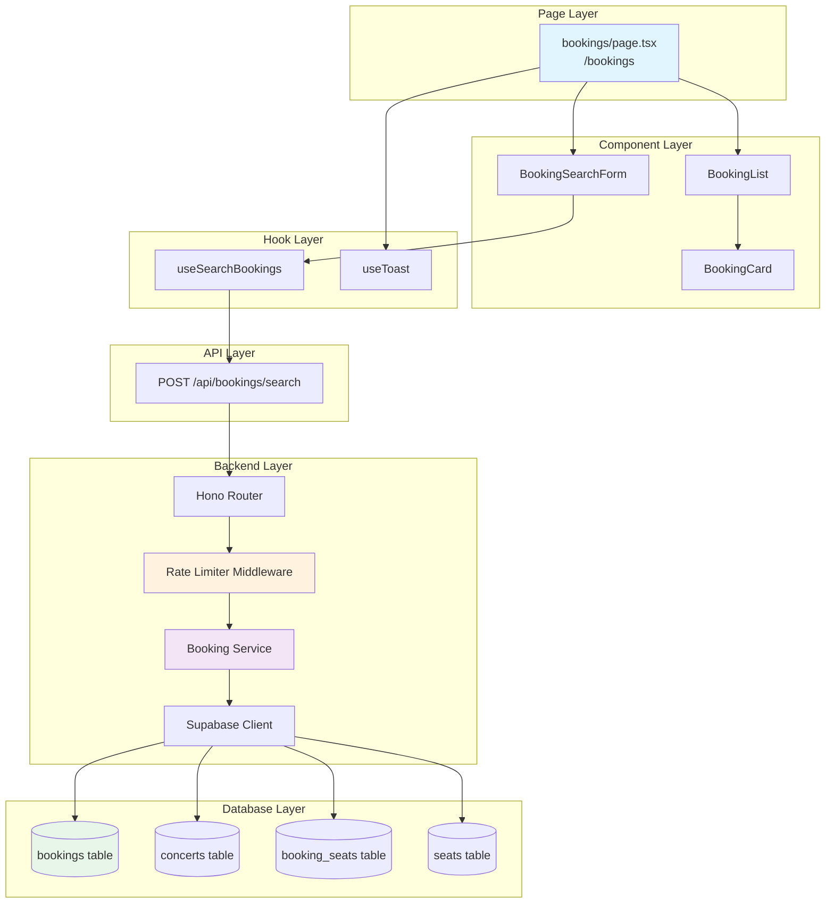
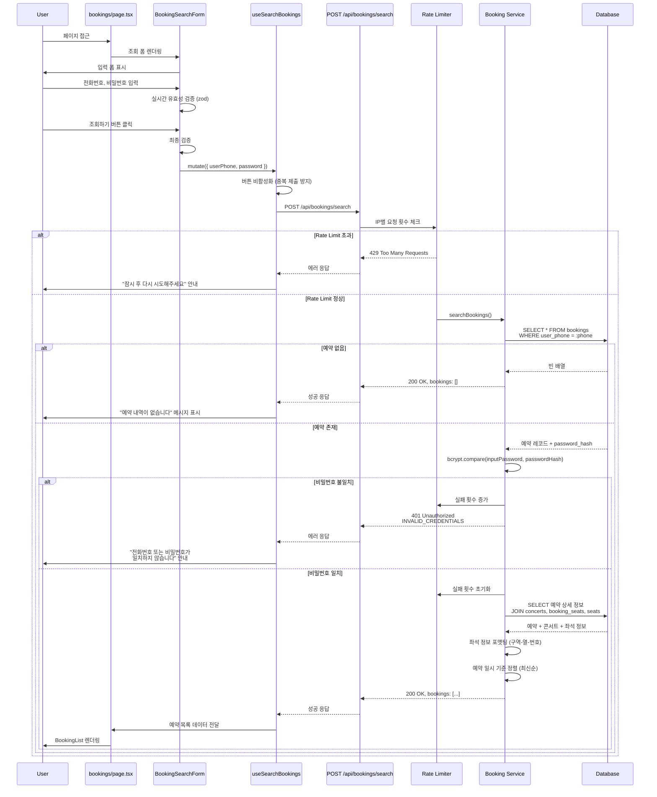

# 예약 조회 페이지 구현 계획서

## 개요

콘서트 예약 시스템의 예약 조회 페이지(`/bookings`) 구현 계획서입니다.
사용자가 전화번호와 비밀번호 4자리를 입력하여 자신의 예약 내역을 조회할 수 있는 기능을 제공합니다.

### 핵심 기능

- **예약 조회 폼**: 전화번호, 비밀번호 4자리 입력 및 실시간 검증
- **인증 기반 조회**: bcrypt 해시 비밀번호 검증
- **예약 내역 표시**: 콘서트 정보, 좌석 정보, 예약자 정보, 총 금액 등
- **브루트포스 방지**: 5회 연속 실패 시 5분간 요청 제한
- **에러 처리**: 예약 없음, 비밀번호 불일치, 형식 오류, 네트워크 오류 등

### 상태 관리 전략

**React Hook Form + TanStack Query 패턴**
- 폼 상태: React Hook Form으로 입력 검증 및 제출 관리
- 서버 상태: TanStack Query로 API 호출 및 캐싱
- 인증 상태: 메모리 기반 Rate Limiting (IP별 실패 횟수 추적)

---

## 모듈 목록

### 백엔드 모듈

| 모듈 | 파일 경로 | 설명 | 상태 |
|------|----------|------|------|
| **예약 조회 스키마 추가** | `src/features/bookings/backend/schema.ts` | 예약 조회 요청/응답 Zod 스키마 정의 | 🆕 확장 필요 |
| **예약 조회 서비스** | `src/features/bookings/backend/service.ts` | 예약 조회 비즈니스 로직 | 🆕 신규 함수 추가 |
| **예약 조회 라우터** | `src/features/bookings/backend/route.ts` | Hono 라우터 정의 (POST /api/bookings/search) | 🆕 라우트 추가 |
| **예약 에러 코드 추가** | `src/features/bookings/backend/error.ts` | 인증 실패, Rate Limit 에러 코드 | 🆕 확장 필요 |
| **Rate Limiter** | `src/backend/middleware/rate-limiter.ts` | 브루트포스 방지 메모리 기반 Rate Limiter | 🆕 신규 |

### 프론트엔드 모듈

| 모듈 | 파일 경로 | 설명 | 상태 |
|------|----------|------|------|
| **DTO 재노출** | `src/features/bookings/lib/dto.ts` | 백엔드 스키마 재노출 | ✅ 기존 활용 |
| **예약 조회 훅** | `src/features/bookings/hooks/useSearchBookings.ts` | TanStack Query 기반 예약 조회 | 🆕 신규 |
| **예약 조회 폼** | `src/features/bookings/components/BookingSearchForm.tsx` | React Hook Form 기반 입력 폼 | 🆕 신규 |
| **예약 목록** | `src/features/bookings/components/BookingList.tsx` | 예약 내역 목록 표시 | 🆕 신규 |
| **예약 카드** | `src/features/bookings/components/BookingCard.tsx` | 개별 예약 정보 카드 | 🆕 신규 |
| **예약 조회 페이지** | `src/app/bookings/page.tsx` | 예약 조회 페이지 진입점 | 🆕 신규 |

### 공통 모듈 (기존 활용)

| 모듈 | 파일 경로 | 설명 |
|------|----------|------|
| **HTTP 응답 패턴** | `src/backend/http/response.ts` | success, failure, respond 헬퍼 |
| **Supabase 클라이언트** | `src/backend/middleware/supabase.ts` | Supabase 서버 클라이언트 |
| **API 클라이언트** | `src/lib/remote/api-client.ts` | Axios 기반 API 클라이언트 |
| **shadcn-ui** | `src/components/ui/*` | Button, Input, Label, Card, Badge 등 |

### 외부 라이브러리

| 라이브러리 | 용도 | 설치 여부 |
|-----------|------|----------|
| **bcryptjs** | 비밀번호 해싱 및 검증 | ✅ 설치됨 (예약 생성에서 사용) |

---

## 아키텍처 다이어그램

### 전체 시스템 구조



### 예약 조회 플로우



---

## Implementation Plan

### Phase 1: 백엔드 API 구현

#### 1.1 예약 조회 스키마 정의 (기존 파일 확장)

**파일**: `src/features/bookings/backend/schema.ts`

```typescript
// 기존 스키마에 추가

// 예약 조회 요청 스키마
export const SearchBookingsRequestSchema = z.object({
  userPhone: z.string().regex(/^01[016789]\d{7,8}$/, '올바른 휴대전화 번호를 입력해주세요'),
  password: z.string().regex(/^[0-9]{4}$/, '비밀번호는 4자리 숫자여야 합니다'),
});

export type SearchBookingsRequest = z.infer<typeof SearchBookingsRequestSchema>;

// 예약 조회 응답 스키마 (BookingDetail 재사용, 배열로 감싸기)
export const SearchBookingsResponseSchema = z.object({
  bookings: z.array(BookingDetailSchema),
});

export type SearchBookingsResponse = z.infer<typeof SearchBookingsResponseSchema>;

// 포맷된 좌석 정보 추가 (기존 BookingDetailSeatSchema 확장)
export const BookingDetailSeatWithFormattedSchema = BookingDetailSeatSchema.extend({
  formatted: z.string(), // 예: A-1-3
});

export type BookingDetailSeatWithFormatted = z.infer<typeof BookingDetailSeatWithFormattedSchema>;

// BookingDetail에 formatted 좌석 정보 적용
export const BookingDetailWithFormattedSeatsSchema = BookingDetailSchema.extend({
  seats: z.array(BookingDetailSeatWithFormattedSchema),
});

export type BookingDetailWithFormattedSeats = z.infer<typeof BookingDetailWithFormattedSeatsSchema>;

// 최종 응답 스키마
export const FinalSearchBookingsResponseSchema = z.object({
  bookings: z.array(BookingDetailWithFormattedSeatsSchema),
});

export type FinalSearchBookingsResponse = z.infer<typeof FinalSearchBookingsResponseSchema>;
```

**주요 검증 규칙**:
- `userPhone`: 한국 휴대전화 번호 (010, 011, 016, 017, 018, 019로 시작, 10-11자리)
- `password`: 숫자 4자리
- 응답: 예약 목록 배열 (빈 배열 가능)

#### 1.2 예약 에러 코드 추가 (기존 파일 확장)

**파일**: `src/features/bookings/backend/error.ts`

```typescript
// 기존 에러 코드에 추가
export const bookingErrorCodes = {
  // ... 기존 코드 ...

  // 인증 관련 (신규)
  invalidCredentials: 'INVALID_CREDENTIALS',
  tooManyAttempts: 'TOO_MANY_ATTEMPTS',

  // 예약 조회 관련 (신규)
  noBookingsFound: 'NO_BOOKINGS_FOUND', // 선택적: 빈 배열 대신 에러로 처리 시
} as const;

// 에러 메시지 맵에 추가
export const bookingErrorMessages: Record<BookingServiceError, string> = {
  // ... 기존 메시지 ...

  [bookingErrorCodes.invalidCredentials]: '전화번호 또는 비밀번호가 일치하지 않습니다',
  [bookingErrorCodes.tooManyAttempts]: '잠시 후 다시 시도해주세요',
  [bookingErrorCodes.noBookingsFound]: '예약 내역이 없습니다', // 선택적
};
```

#### 1.3 Rate Limiter 미들웨어 구현 (신규)

**파일**: `src/backend/middleware/rate-limiter.ts`

```typescript
import type { Context, Next } from 'hono';
import type { AppEnv } from '@/backend/hono/context';

interface RateLimitEntry {
  count: number;
  resetAt: number; // Unix timestamp (밀리초)
}

// 메모리 기반 Rate Limit 저장소
const rateLimitStore = new Map<string, RateLimitEntry>();

// 주기적으로 만료된 항목 정리 (5분마다)
setInterval(() => {
  const now = Date.now();
  for (const [key, entry] of rateLimitStore.entries()) {
    if (now > entry.resetAt) {
      rateLimitStore.delete(key);
    }
  }
}, 5 * 60 * 1000);

export interface RateLimitOptions {
  maxAttempts: number; // 최대 시도 횟수
  windowMs: number; // 제한 시간 (밀리초)
  keyGenerator?: (c: Context) => string; // 키 생성 함수 (기본: IP)
}

/**
 * Rate Limiter 미들웨어
 * - IP별 요청 횟수 제한
 * - 5회 연속 실패 시 5분간 요청 제한
 */
export const rateLimiter = (options: RateLimitOptions) => {
  const { maxAttempts, windowMs, keyGenerator } = options;

  return async (c: Context, next: Next) => {
    const key = keyGenerator ? keyGenerator(c) : getClientIp(c);
    const now = Date.now();

    const entry = rateLimitStore.get(key);

    if (entry) {
      // 제한 시간이 지나지 않은 경우
      if (now < entry.resetAt) {
        if (entry.count >= maxAttempts) {
          const retryAfter = Math.ceil((entry.resetAt - now) / 1000);
          return c.json(
            {
              error: {
                code: 'TOO_MANY_ATTEMPTS',
                message: '잠시 후 다시 시도해주세요',
                retryAfter,
              },
            },
            429,
          );
        }
      } else {
        // 제한 시간이 지난 경우 초기화
        rateLimitStore.delete(key);
      }
    }

    // 요청 통과, next() 후 응답 상태 확인
    await next();

    // 응답이 401 Unauthorized인 경우 실패 횟수 증가
    if (c.res.status === 401) {
      const currentEntry = rateLimitStore.get(key);
      if (currentEntry && now < currentEntry.resetAt) {
        currentEntry.count += 1;
      } else {
        rateLimitStore.set(key, {
          count: 1,
          resetAt: now + windowMs,
        });
      }
    }

    // 응답이 200 OK인 경우 성공으로 간주하여 초기화
    if (c.res.status === 200) {
      rateLimitStore.delete(key);
    }
  };
};

/**
 * 클라이언트 IP 주소 추출
 * - X-Forwarded-For 헤더 우선
 * - X-Real-IP 헤더 차선
 * - 직접 연결 IP 최종
 */
const getClientIp = (c: Context): string => {
  const forwardedFor = c.req.header('X-Forwarded-For');
  if (forwardedFor) {
    return forwardedFor.split(',')[0].trim();
  }

  const realIp = c.req.header('X-Real-IP');
  if (realIp) {
    return realIp.trim();
  }

  // Hono에서 직접 IP를 가져오는 방법 (환경에 따라 다를 수 있음)
  return c.env?.REMOTE_ADDR || 'unknown';
};

/**
 * Rate Limit 상태 초기화 (성공 시 호출)
 */
export const resetRateLimit = (key: string) => {
  rateLimitStore.delete(key);
};

/**
 * Rate Limit 상태 증가 (실패 시 호출)
 */
export const incrementRateLimit = (key: string, windowMs: number) => {
  const now = Date.now();
  const entry = rateLimitStore.get(key);

  if (entry && now < entry.resetAt) {
    entry.count += 1;
  } else {
    rateLimitStore.set(key, {
      count: 1,
      resetAt: now + windowMs,
    });
  }
};
```

**주요 특징**:
- 메모리 기반 (단일 서버 환경)
- IP별 요청 횟수 추적
- 5회 연속 실패 시 5분간 제한
- 성공 시 자동 초기화
- 주기적 만료 항목 정리

**향후 확장**:
- Redis 기반 분산 Rate Limiting (다중 서버 환경)
- 전화번호별 Rate Limiting 추가

#### 1.4 예약 조회 서비스 구현 (기존 파일 확장)

**파일**: `src/features/bookings/backend/service.ts`

```typescript
// 기존 서비스 함수에 추가

import type { SupabaseClient } from '@supabase/supabase-js';
import bcrypt from 'bcryptjs';
import type { HandlerResult } from '@/backend/http/response';
import { success, failure } from '@/backend/http/response';
import type {
  SearchBookingsRequest,
  FinalSearchBookingsResponse,
  BookingDetailWithFormattedSeats,
  BookingDetailSeatWithFormatted,
} from './schema';
import { bookingErrorCodes } from './error';
import type { BookingServiceError } from './error';

/**
 * 예약 조회 서비스
 * - 전화번호로 예약 조회
 * - 비밀번호 해시 검증
 * - 예약 상세 정보 JOIN 조회
 * - 좌석 정보 포맷팅
 * - 최신순 정렬
 */
export const searchBookings = async (
  client: SupabaseClient,
  request: SearchBookingsRequest,
): Promise<HandlerResult<FinalSearchBookingsResponse, BookingServiceError, unknown>> => {
  const { userPhone, password } = request;

  // 1. 전화번호로 예약 조회
  const { data: bookings, error: bookingsError } = await client
    .from('bookings')
    .select('id, password_hash')
    .eq('user_phone', userPhone)
    .eq('status', 'confirmed');

  if (bookingsError) {
    return failure(500, bookingErrorCodes.databaseError, '데이터베이스 오류가 발생했습니다');
  }

  // 2. 예약이 없는 경우
  if (!bookings || bookings.length === 0) {
    // 옵션 1: 빈 배열 반환 (추천)
    return success({ bookings: [] }, 200);

    // 옵션 2: 에러로 처리
    // return failure(404, bookingErrorCodes.noBookingsFound, '예약 내역이 없습니다');
  }

  // 3. 비밀번호 검증 (첫 번째 예약의 비밀번호 해시 사용)
  // 주의: 동일 전화번호의 모든 예약은 동일한 비밀번호를 사용한다고 가정
  const firstBooking = bookings[0];
  const isPasswordValid = await bcrypt.compare(password, firstBooking.password_hash);

  if (!isPasswordValid) {
    return failure(401, bookingErrorCodes.invalidCredentials, '전화번호 또는 비밀번호가 일치하지 않습니다');
  }

  // 4. 예약 상세 정보 조회 (JOIN)
  const bookingIds = bookings.map(b => b.id);

  const { data: bookingDetails, error: detailsError } = await client
    .from('bookings')
    .select(`
      id,
      concert_id,
      user_name,
      user_phone,
      total_price,
      status,
      created_at,
      concerts (
        id,
        title,
        artist,
        date,
        venue
      ),
      booking_seats (
        seats (
          id,
          section,
          row,
          number,
          grade,
          price
        )
      )
    `)
    .in('id', bookingIds)
    .eq('status', 'confirmed')
    .order('created_at', { ascending: false });

  if (detailsError || !bookingDetails) {
    return failure(500, bookingErrorCodes.fetchError, '예약 정보를 불러올 수 없습니다');
  }

  // 5. 데이터 가공
  const formattedBookings: BookingDetailWithFormattedSeats[] = bookingDetails.map(booking => {
    const concert = Array.isArray(booking.concerts) ? booking.concerts[0] : booking.concerts;

    if (!concert) {
      throw new Error('Concert data is missing');
    }

    // 좌석 정보 포맷팅
    const seats: BookingDetailSeatWithFormatted[] = booking.booking_seats
      .map(bs => {
        const seat = Array.isArray(bs.seats) ? bs.seats[0] : bs.seats;
        if (!seat) return null;

        return {
          seatId: seat.id,
          section: seat.section,
          row: seat.row,
          number: seat.number,
          grade: seat.grade,
          price: seat.price,
          formatted: `${seat.section}-${seat.row}-${seat.number}`, // 구역-열-번호
        };
      })
      .filter((seat): seat is BookingDetailSeatWithFormatted => seat !== null)
      .sort((a, b) => {
        // 구역 → 열 → 번호 순 정렬
        if (a.section !== b.section) return a.section.localeCompare(b.section);
        if (a.row !== b.row) return a.row - b.row;
        return a.number - b.number;
      });

    return {
      bookingId: booking.id,
      concertId: concert.id,
      concertTitle: concert.title,
      concertDate: concert.date,
      concertVenue: concert.venue,
      concertArtist: concert.artist,
      seats,
      userName: booking.user_name,
      userPhone: booking.user_phone,
      totalPrice: booking.total_price,
      status: booking.status,
      createdAt: booking.created_at,
    };
  });

  return success({ bookings: formattedBookings }, 200);
};
```

**주요 로직**:
1. 전화번호로 예약 조회
2. 예약 없으면 빈 배열 반환 (또는 404 에러)
3. 비밀번호 해시 검증 (bcrypt.compare)
4. 인증 성공 시 예약 상세 정보 JOIN 조회
5. 좌석 정보 포맷팅 (구역-열-번호)
6. 예약 일시 기준 내림차순 정렬

**보안 고려사항**:
- 비밀번호는 평문으로 저장하지 않음
- 에러 메시지는 전화번호 존재 여부를 노출하지 않음
- Rate Limiter로 브루트포스 공격 방지

#### 1.5 예약 조회 라우터 추가 (기존 파일 확장)

**파일**: `src/features/bookings/backend/route.ts`

```typescript
// 기존 라우터에 추가

import { searchBookings } from './service';
import { SearchBookingsRequestSchema } from './schema';

export const registerBookingsRoutes = (app: Hono<AppEnv>) => {
  // ... 기존 라우트 (POST /api/bookings, GET /api/bookings/:id) ...

  // POST /api/bookings/search - 예약 조회 (신규)
  app.post('/api/bookings/search', async (c) => {
    const supabase = getSupabase(c);
    const logger = getLogger(c);

    let body;
    try {
      body = await c.req.json();
    } catch (error) {
      logger.warn('Invalid JSON in request body', { error });
      return c.json(
        {
          error: {
            code: bookingErrorCodes.validationError,
            message: '잘못된 요청 형식입니다',
          },
        },
        400,
      );
    }

    // 요청 본문 파싱 및 검증
    const parsed = SearchBookingsRequestSchema.safeParse(body);

    if (!parsed.success) {
      logger.warn('Invalid search request', { errors: parsed.error.format() });
      return c.json(
        {
          error: {
            code: bookingErrorCodes.validationError,
            message: bookingErrorMessages[bookingErrorCodes.validationError],
            details: parsed.error.format(),
          },
        },
        400,
      );
    }

    logger.info('Searching bookings', {
      userPhone: parsed.data.userPhone.substring(0, 7) + '****', // 개인정보 마스킹
    });

    const result = await searchBookings(supabase, parsed.data);

    if (!result.ok) {
      const errorResult = result as ErrorResult<BookingServiceError, unknown>;

      if (errorResult.error.code === bookingErrorCodes.invalidCredentials) {
        logger.warn('Invalid credentials', {
          userPhone: parsed.data.userPhone.substring(0, 7) + '****',
        });
      } else {
        logger.error('Booking search failed', {
          error: errorResult.error,
        });
      }

      return respond(c, result);
    }

    logger.info('Booking search successful', {
      userPhone: parsed.data.userPhone.substring(0, 7) + '****',
      bookingCount: result.data.bookings.length,
    });

    return respond(c, result);
  });
};
```

**주요 특징**:
- Rate Limiter는 미들웨어로 적용하지 않고 서비스 레이어에서 처리
- 개인정보 마스킹 (전화번호 뒷자리)
- 성공 시 예약 개수 로깅

**Rate Limiter 적용 (선택적)**:

라우터에 미들웨어로 적용하려면:

```typescript
import { rateLimiter } from '@/backend/middleware/rate-limiter';

// 예약 조회 라우트에만 적용
app.post(
  '/api/bookings/search',
  rateLimiter({
    maxAttempts: 5,
    windowMs: 5 * 60 * 1000, // 5분
  }),
  async (c) => {
    // ... 핸들러 로직
  }
);
```

---

### Phase 2: 프론트엔드 구현

#### 2.1 DTO 재노출 (기존 파일 확장)

**파일**: `src/features/bookings/lib/dto.ts`

```typescript
// 기존 export에 추가

export type {
  SearchBookingsRequest,
  SearchBookingsResponse,
  FinalSearchBookingsResponse,
  BookingDetailWithFormattedSeats,
  BookingDetailSeatWithFormatted,
} from '@/features/bookings/backend/schema';

export {
  SearchBookingsRequestSchema,
  SearchBookingsResponseSchema,
  FinalSearchBookingsResponseSchema,
  BookingDetailWithFormattedSeatsSchema,
  BookingDetailSeatWithFormattedSchema,
} from '@/features/bookings/backend/schema';
```

#### 2.2 예약 조회 훅 (신규)

**파일**: `src/features/bookings/hooks/useSearchBookings.ts`

```typescript
'use client';

import { useMutation, type UseMutationResult } from '@tanstack/react-query';
import { apiClient, extractApiErrorMessage } from '@/lib/remote/api-client';
import type { SearchBookingsRequest, FinalSearchBookingsResponse } from '../lib/dto';
import { FinalSearchBookingsResponseSchema } from '../lib/dto';

export const useSearchBookings = (): UseMutationResult<
  FinalSearchBookingsResponse,
  Error,
  SearchBookingsRequest
> => {
  return useMutation({
    mutationFn: async (data: SearchBookingsRequest) => {
      const response = await apiClient.post<FinalSearchBookingsResponse>(
        '/api/bookings/search',
        data,
      );

      // 응답 검증
      const parsed = FinalSearchBookingsResponseSchema.safeParse(response.data);

      if (!parsed.success) {
        throw new Error('Invalid response format');
      }

      return parsed.data;
    },
    onError: (error) => {
      console.error('Booking search failed:', extractApiErrorMessage(error));
    },
  });
};
```

**주요 특징**:
- TanStack Query의 `useMutation` 사용
- 응답 검증 (Zod 스키마)
- 에러 핸들링

#### 2.3 예약 조회 폼 컴포넌트 (신규)

**파일**: `src/features/bookings/components/BookingSearchForm.tsx`

```typescript
'use client';

import { useForm } from 'react-hook-form';
import { zodResolver } from '@hookform/resolvers/zod';
import { z } from 'zod';
import { Button } from '@/components/ui/button';
import { Input } from '@/components/ui/input';
import { Label } from '@/components/ui/label';
import { Card, CardContent, CardHeader, CardTitle, CardDescription } from '@/components/ui/card';
import { Loader2, Search } from 'lucide-react';

const BookingSearchFormSchema = z.object({
  userPhone: z
    .string()
    .regex(/^01[016789]\d{7,8}$/, '올바른 휴대전화 번호를 입력해주세요 (예: 01012345678)'),
  password: z.string().regex(/^[0-9]{4}$/, '비밀번호는 4자리 숫자여야 합니다'),
});

type BookingSearchFormData = z.infer<typeof BookingSearchFormSchema>;

interface BookingSearchFormProps {
  onSubmit: (data: BookingSearchFormData) => void;
  isLoading: boolean;
}

export function BookingSearchForm({ onSubmit, isLoading }: BookingSearchFormProps) {
  const {
    register,
    handleSubmit,
    formState: { errors },
  } = useForm<BookingSearchFormData>({
    resolver: zodResolver(BookingSearchFormSchema),
  });

  return (
    <Card>
      <CardHeader>
        <CardTitle className="text-lg">예약 조회</CardTitle>
        <CardDescription>
          예약 시 입력하신 전화번호와 비밀번호를 입력해주세요
        </CardDescription>
      </CardHeader>
      <CardContent>
        <form onSubmit={handleSubmit(onSubmit)} className="space-y-4">
          {/* 전화번호 */}
          <div className="space-y-2">
            <Label htmlFor="userPhone">전화번호 *</Label>
            <Input
              id="userPhone"
              {...register('userPhone')}
              placeholder="01012345678"
              maxLength={11}
              disabled={isLoading}
              autoComplete="tel"
            />
            {errors.userPhone && (
              <p className="text-sm text-destructive">{errors.userPhone.message}</p>
            )}
            <p className="text-xs text-muted-foreground">
              숫자만 입력 (하이픈 제외)
            </p>
          </div>

          {/* 비밀번호 */}
          <div className="space-y-2">
            <Label htmlFor="password">비밀번호 (4자리) *</Label>
            <Input
              id="password"
              type="password"
              {...register('password')}
              placeholder="1234"
              maxLength={4}
              disabled={isLoading}
              autoComplete="off"
            />
            {errors.password && (
              <p className="text-sm text-destructive">{errors.password.message}</p>
            )}
            <p className="text-xs text-muted-foreground">
              예약 시 입력한 4자리 숫자
            </p>
          </div>

          {/* 제출 버튼 */}
          <Button type="submit" className="w-full" disabled={isLoading}>
            {isLoading ? (
              <>
                <Loader2 className="mr-2 h-4 w-4 animate-spin" />
                조회 중...
              </>
            ) : (
              <>
                <Search className="mr-2 h-4 w-4" />
                조회하기
              </>
            )}
          </Button>
        </form>
      </CardContent>
    </Card>
  );
}
```

**주요 특징**:
- React Hook Form 기반
- 실시간 유효성 검증
- 로딩 상태 표시
- 접근성 고려 (Label, autoComplete)

#### 2.4 예약 카드 컴포넌트 (신규)

**파일**: `src/features/bookings/components/BookingCard.tsx`

```typescript
'use client';

import { format } from 'date-fns';
import { ko } from 'date-fns/locale';
import { Calendar, MapPin, User, Ticket } from 'lucide-react';
import { Card, CardContent, CardHeader, CardTitle } from '@/components/ui/card';
import { Badge } from '@/components/ui/badge';
import { Separator } from '@/components/ui/separator';
import type { BookingDetailWithFormattedSeats } from '../lib/dto';

interface BookingCardProps {
  booking: BookingDetailWithFormattedSeats;
}

const gradeColors: Record<string, string> = {
  Special: 'bg-purple-100 text-purple-800',
  Premium: 'bg-blue-100 text-blue-800',
  Advanced: 'bg-green-100 text-green-800',
  Regular: 'bg-gray-100 text-gray-800',
};

export function BookingCard({ booking }: BookingCardProps) {
  const formattedConcertDate = format(
    new Date(booking.concertDate),
    'yyyy년 M월 d일 (E) HH:mm',
    { locale: ko }
  );

  const formattedBookingDate = format(
    new Date(booking.createdAt),
    'yyyy년 M월 d일 HH:mm',
    { locale: ko }
  );

  return (
    <Card>
      <CardHeader>
        <div className="flex items-start justify-between">
          <div>
            <CardTitle className="text-lg">{booking.concertTitle}</CardTitle>
            <p className="text-sm text-muted-foreground mt-1">
              {booking.concertArtist}
            </p>
          </div>
          <Badge variant="outline" className="ml-2">
            {booking.status === 'confirmed' ? '예약 확정' : '취소됨'}
          </Badge>
        </div>
      </CardHeader>

      <CardContent className="space-y-4">
        {/* 공연 정보 */}
        <div className="space-y-2 text-sm">
          <div className="flex items-center gap-2">
            <Calendar className="h-4 w-4 text-muted-foreground" />
            <span>{formattedConcertDate}</span>
          </div>

          <div className="flex items-center gap-2">
            <MapPin className="h-4 w-4 text-muted-foreground" />
            <span>{booking.concertVenue}</span>
          </div>
        </div>

        <Separator />

        {/* 좌석 정보 */}
        <div>
          <p className="text-sm font-medium mb-2 flex items-center gap-2">
            <Ticket className="h-4 w-4 text-muted-foreground" />
            선택 좌석
          </p>
          <div className="space-y-1">
            {booking.seats.map((seat) => (
              <div key={seat.seatId} className="flex justify-between items-center text-sm">
                <div className="flex items-center gap-2">
                  <span className="font-medium">{seat.formatted}</span>
                  <Badge className={gradeColors[seat.grade] || gradeColors.Regular}>
                    {seat.grade}
                  </Badge>
                </div>
                <span className="text-muted-foreground">
                  {seat.price.toLocaleString()}원
                </span>
              </div>
            ))}
          </div>
        </div>

        <Separator />

        {/* 예약자 정보 */}
        <div className="space-y-1 text-sm">
          <div className="flex items-center gap-2">
            <User className="h-4 w-4 text-muted-foreground" />
            <span>{booking.userName}</span>
          </div>
          <div className="text-muted-foreground">
            예약 일시: {formattedBookingDate}
          </div>
        </div>

        <Separator />

        {/* 총 금액 */}
        <div className="flex justify-between items-center font-bold text-lg">
          <span>총 금액</span>
          <span className="text-primary">{booking.totalPrice.toLocaleString()}원</span>
        </div>
      </CardContent>
    </Card>
  );
}
```

**주요 특징**:
- 콘서트 정보, 좌석 정보, 예약자 정보, 총 금액 표시
- 좌석 등급별 색상 구분 (Badge)
- 날짜 포맷팅 (date-fns)
- 아이콘 활용 (lucide-react)

#### 2.5 예약 목록 컴포넌트 (신규)

**파일**: `src/features/bookings/components/BookingList.tsx`

```typescript
'use client';

import { BookingCard } from './BookingCard';
import type { BookingDetailWithFormattedSeats } from '../lib/dto';

interface BookingListProps {
  bookings: BookingDetailWithFormattedSeats[];
}

export function BookingList({ bookings }: BookingListProps) {
  if (bookings.length === 0) {
    return (
      <div className="text-center py-12">
        <p className="text-muted-foreground">예약 내역이 없습니다</p>
      </div>
    );
  }

  return (
    <div className="space-y-4">
      <p className="text-sm text-muted-foreground">
        총 {bookings.length}건의 예약이 있습니다
      </p>
      {bookings.map((booking) => (
        <BookingCard key={booking.bookingId} booking={booking} />
      ))}
    </div>
  );
}
```

**주요 특징**:
- 예약 목록이 비어있을 때 안내 메시지
- 예약 개수 표시
- BookingCard 컴포넌트 반복 렌더링

#### 2.6 예약 조회 페이지 (신규)

**파일**: `src/app/bookings/page.tsx`

```typescript
'use client';

import { useState } from 'react';
import Link from 'next/link';
import { Ticket } from 'lucide-react';
import { Button } from '@/components/ui/button';
import { useToast } from '@/hooks/use-toast';
import { useSearchBookings } from '@/features/bookings/hooks/useSearchBookings';
import { BookingSearchForm } from '@/features/bookings/components/BookingSearchForm';
import { BookingList } from '@/features/bookings/components/BookingList';
import type { BookingDetailWithFormattedSeats } from '@/features/bookings/lib/dto';

export default function BookingsPage() {
  const { toast } = useToast();
  const [bookings, setBookings] = useState<BookingDetailWithFormattedSeats[]>([]);
  const [hasSearched, setHasSearched] = useState(false);

  const searchMutation = useSearchBookings();

  const handleSearch = async (formData: { userPhone: string; password: string }) => {
    searchMutation.mutate(formData, {
      onSuccess: (data) => {
        setBookings(data.bookings);
        setHasSearched(true);

        if (data.bookings.length === 0) {
          toast({
            title: '예약 내역이 없습니다',
            description: '입력하신 전화번호로 예약된 내역을 찾을 수 없습니다.',
          });
        } else {
          toast({
            title: '조회 완료',
            description: `${data.bookings.length}건의 예약을 찾았습니다.`,
          });
        }
      },
      onError: (error) => {
        const message = error.message || '예약 조회 중 오류가 발생했습니다';

        toast({
          title: '조회 실패',
          description: message,
          variant: 'destructive',
        });

        setBookings([]);
        setHasSearched(false);
      },
    });
  };

  return (
    <div className="min-h-screen bg-background">
      {/* 헤더 */}
      <header className="border-b sticky top-0 bg-background/95 backdrop-blur supports-[backdrop-filter]:bg-background/60 z-50">
        <div className="container mx-auto px-4 py-4 flex items-center justify-between">
          <Link href="/" className="flex items-center gap-2">
            <Ticket className="h-6 w-6" />
            <h1 className="text-2xl font-bold">BigConcert</h1>
          </Link>

          <Link href="/">
            <Button variant="outline">홈으로</Button>
          </Link>
        </div>
      </header>

      {/* 메인 콘텐츠 */}
      <main className="container mx-auto px-4 py-8">
        <div className="max-w-3xl mx-auto space-y-8">
          {/* 페이지 제목 */}
          <div>
            <h2 className="text-2xl font-bold">예약 조회</h2>
            <p className="text-muted-foreground mt-1">
              예약 시 입력한 전화번호와 비밀번호로 예약 내역을 확인하세요
            </p>
          </div>

          {/* 조회 폼 */}
          <BookingSearchForm
            onSubmit={handleSearch}
            isLoading={searchMutation.isPending}
          />

          {/* 예약 목록 */}
          {hasSearched && (
            <div>
              <h3 className="text-lg font-semibold mb-4">예약 내역</h3>
              <BookingList bookings={bookings} />
            </div>
          )}
        </div>
      </main>
    </div>
  );
}
```

**주요 특징**:
- 조회 폼과 결과를 한 페이지에 표시
- 조회 전/후 상태 관리 (`hasSearched`)
- Toast 메시지로 사용자 피드백
- 에러 처리

---

### Phase 3: 테스트 시나리오

#### 3.1 백엔드 API 테스트

**1. 정상 조회 테스트**
```bash
POST /api/bookings/search
{
  "userPhone": "01012345678",
  "password": "1234"
}

Expected: 200 OK
{
  "bookings": [
    {
      "bookingId": "uuid",
      "concertTitle": "콘서트 제목",
      "concertDate": "2025-12-25T19:00:00Z",
      "concertVenue": "XX아레나",
      "concertArtist": "아티스트명",
      "seats": [
        {
          "seatId": "uuid",
          "section": "A",
          "row": 1,
          "number": 3,
          "grade": "Special",
          "price": 250000,
          "formatted": "A-1-3"
        }
      ],
      "userName": "홍길동",
      "userPhone": "01012345678",
      "totalPrice": 500000,
      "status": "confirmed",
      "createdAt": "2025-10-15T14:27:59.266163+00:00"
    }
  ]
}
```

**2. 예약 없음 테스트**
```bash
POST /api/bookings/search
{
  "userPhone": "01099999999",
  "password": "1234"
}

Expected: 200 OK
{
  "bookings": []
}
```

**3. 비밀번호 불일치 테스트**
```bash
POST /api/bookings/search
{
  "userPhone": "01012345678",
  "password": "9999"  # 잘못된 비밀번호
}

Expected: 401 Unauthorized
{
  "error": {
    "code": "INVALID_CREDENTIALS",
    "message": "전화번호 또는 비밀번호가 일치하지 않습니다"
  }
}
```

**4. 입력 검증 실패 테스트**
```bash
POST /api/bookings/search
{
  "userPhone": "010-1234-5678",  # 하이픈 포함
  "password": "12345"  # 5자리
}

Expected: 400 Bad Request
{
  "error": {
    "code": "VALIDATION_ERROR",
    "message": "입력값이 올바르지 않습니다",
    "details": { ... }
  }
}
```

**5. Rate Limit 초과 테스트**
```bash
# 5회 연속 비밀번호 불일치 요청
POST /api/bookings/search (5회)

Expected (6번째 요청): 429 Too Many Requests
{
  "error": {
    "code": "TOO_MANY_ATTEMPTS",
    "message": "잠시 후 다시 시도해주세요",
    "retryAfter": 300  # 초 단위
  }
}
```

#### 3.2 프론트엔드 테스트

**1. 폼 유효성 검증 테스트**
```
시나리오:
1. 전화번호에 문자 입력 → 에러 메시지
2. 전화번호에 하이픈 포함 → 에러 메시지
3. 비밀번호 3자리 입력 → 에러 메시지
4. 모든 필드 올바르게 입력 → 제출 가능

Expected:
- 각 필드별 실시간 에러 메시지
- 에러가 있으면 제출 버튼 비활성화
```

**2. 중복 제출 방지 테스트**
```
시나리오:
1. 조회하기 버튼 클릭
2. 로딩 중 다시 클릭 시도

Expected:
- 버튼 비활성화 (isPending 상태)
- 로딩 스피너 표시
- 중복 제출 차단
```

**3. 예약 없음 처리 테스트**
```
시나리오:
1. 예약이 없는 전화번호로 조회
2. 빈 배열 응답 수신

Expected:
- "예약 내역이 없습니다" 메시지 표시
- Toast 알림 표시
```

**4. 비밀번호 불일치 처리 테스트**
```
시나리오:
1. 올바른 전화번호, 잘못된 비밀번호 입력
2. 401 에러 수신

Expected:
- "전화번호 또는 비밀번호가 일치하지 않습니다" Toast 표시
- 예약 목록 비우기
```

**5. Rate Limit 처리 테스트**
```
시나리오:
1. 5회 연속 잘못된 비밀번호 입력
2. 6번째 요청 시 429 에러 수신

Expected:
- "잠시 후 다시 시도해주세요" Toast 표시
- 재시도 시간 안내 (선택적)
```

---

## 추가 구현 요구사항

### 1. shadcn-ui 컴포넌트 설치

이미 설치된 컴포넌트 외에 추가로 필요한 경우:

```bash
# Badge 컴포넌트 (좌석 등급 표시용)
npx shadcn@latest add badge

# Separator 컴포넌트 (구분선용)
npx shadcn@latest add separator
```

### 2. 데이터베이스 인덱스 확인

예약 조회 성능 향상을 위해 다음 인덱스가 필요합니다:

```sql
-- user_phone 인덱스 (이미 존재하는지 확인)
CREATE INDEX IF NOT EXISTS idx_bookings_user_phone ON bookings(user_phone);

-- user_phone + status 복합 인덱스 (선택적)
CREATE INDEX IF NOT EXISTS idx_bookings_phone_status ON bookings(user_phone, status);
```

---

## 구현 순서 요약

1. **백엔드 구현** (Phase 1)
   - schema.ts 확장 (SearchBookingsRequest/Response)
   - error.ts 확장 (invalidCredentials, tooManyAttempts)
   - rate-limiter.ts 신규 생성
   - service.ts 확장 (searchBookings 함수)
   - route.ts 확장 (POST /api/bookings/search)

2. **프론트엔드 구현** (Phase 2)
   - dto.ts 확장 (스키마 재노출)
   - useSearchBookings.ts 신규 생성
   - BookingSearchForm.tsx 신규 생성
   - BookingCard.tsx 신규 생성
   - BookingList.tsx 신규 생성
   - bookings/page.tsx 신규 생성

3. **테스트 및 검증** (Phase 3)
   - 백엔드 API 테스트 (Postman/Thunder Client)
   - 프론트엔드 시나리오 테스트
   - 엣지 케이스 검증

---

## 주요 고려사항

### 보안
- 비밀번호는 bcrypt로 해싱 후 저장
- 에러 메시지는 전화번호 존재 여부를 노출하지 않음
- Rate Limiter로 브루트포스 공격 방지 (5회 실패 시 5분 제한)
- 개인정보 마스킹 (로그에서 전화번호 뒷자리)

### 동시성
- 예약 조회는 읽기 전용 작업이므로 트랜잭션 불필요
- Rate Limiter는 메모리 기반 (단일 서버 환경)
- 향후 Redis 기반으로 확장 가능 (다중 서버 환경)

### 에러 처리
- 모든 에러 케이스에 대한 명확한 메시지
- 사용자 친화적인 에러 안내 (Toast)
- 에러 발생 시 상태 복구 (예약 목록 비우기)

### 성능
- 인덱스 활용 (user_phone, user_phone + status)
- 불필요한 쿼리 제거
- JOIN 쿼리 최적화

### 사용자 경험
- 로딩 상태 표시 (스피너)
- 실시간 폼 검증
- Toast 메시지로 피드백
- 예약 개수 표시

---

## 엣지 케이스 처리

### 1. 예약 없음
- **처리**: 빈 배열 반환 (200 OK)
- **UI**: "예약 내역이 없습니다" 메시지 표시

### 2. 비밀번호 불일치
- **처리**: 401 Unauthorized
- **UI**: "전화번호 또는 비밀번호가 일치하지 않습니다" Toast
- **보안**: 전화번호 존재 여부 노출하지 않음

### 3. 브루트포스 공격
- **처리**: 5회 연속 실패 시 5분간 429 Too Many Requests
- **UI**: "잠시 후 다시 시도해주세요" Toast

### 4. 형식 오류
- **처리**: 400 Bad Request
- **UI**: 각 필드별 에러 메시지 표시

### 5. 네트워크 오류
- **처리**: 에러 핸들링 (extractApiErrorMessage)
- **UI**: "일시적인 오류가 발생했습니다" Toast

### 6. 다수 예약 존재
- **처리**: 모든 예약 배열로 반환
- **UI**: 최신순 정렬하여 목록 표시

### 7. 취소된 예약
- **처리**: status='confirmed'만 조회 (cancelled 제외)
- **향후**: 취소된 예약도 표시 옵션 추가 가능

---

## 버전 정보

- 작성일: 2025-10-16
- 버전: 1.0.0
- 기반 문서: 유스케이스 005 v1.0.0, database.md v1.0.0, userflow.md v1.1.0
