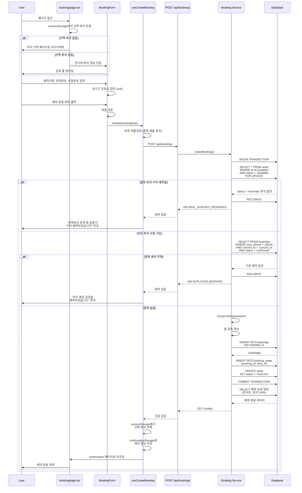

# 예약 정보 입력 페이지 구현 계획서

## 개요

콘서트 예약 시스템의 예약 정보 입력 페이지(`/concerts/[id]/booking`) 및 예약 완료 페이지(`/concerts/[id]/confirmation`) 구현 계획서입니다.
사용자가 좌석 선택 후 예약자 정보를 입력하고, 트랜잭션 기반으로 안전하게 예약을 완료하는 핵심 기능을 제공합니다.

### 핵심 기능

- **예약 정보 입력 폼**: 예약자명, 전화번호, 비밀번호 4자리 입력 및 실시간 검증
- **트랜잭션 기반 예약**: SELECT ... FOR UPDATE를 사용한 동시성 제어
- **중복 예약 방지**: 전화번호 + 콘서트 조합으로 중복 체크
- **비밀번호 해싱**: bcrypt를 사용한 안전한 비밀번호 저장
- **에러 처리**: 좌석 충돌, 중복 예약, 세션 만료, 네트워크 오류 등
- **예약 완료 화면**: 예약 정보 표시 및 다음 단계 안내

### 상태 관리 전략

**React Hook Form + TanStack Query 패턴**
- 폼 상태: React Hook Form으로 입력 검증 및 제출 관리
- 서버 상태: TanStack Query로 API 호출 및 캐싱
- 세션 저장: sessionStorage로 선택 좌석 정보 관리
- 페이지 이동: Next.js router로 라우팅 제어

---

## 모듈 목록

### 백엔드 모듈

| 모듈 | 파일 경로 | 설명 |
|------|----------|------|
| **예약 스키마** | `src/features/bookings/backend/schema.ts` | 예약 요청/응답 Zod 스키마 정의 |
| **예약 서비스** | `src/features/bookings/backend/service.ts` | 예약 생성 트랜잭션 비즈니스 로직 |
| **예약 라우터** | `src/features/bookings/backend/route.ts` | Hono 라우터 정의 (POST /api/bookings) |
| **예약 에러 코드** | `src/features/bookings/backend/error.ts` | 예약 관련 에러 코드 정의 |

### 프론트엔드 모듈 - 예약 정보 입력

| 모듈 | 파일 경로 | 설명 |
|------|----------|------|
| **DTO 재노출** | `src/features/bookings/lib/dto.ts` | 백엔드 스키마 재노출 |
| **세션 스토리지 유틸** | `src/features/bookings/lib/storage.ts` | 선택 좌석 저장/조회/삭제 |
| **예약 생성 훅** | `src/features/bookings/hooks/useCreateBooking.ts` | TanStack Query 기반 예약 생성 |
| **예약 폼 컴포넌트** | `src/features/bookings/components/BookingForm.tsx` | React Hook Form 기반 입력 폼 |
| **콘서트 요약 컴포넌트** | `src/features/bookings/components/ConcertSummary.tsx` | 콘서트 정보 표시 |
| **좌석 요약 컴포넌트** | `src/features/bookings/components/SeatsSummary.tsx` | 선택 좌석 및 총 금액 표시 |
| **예약 정보 페이지** | `src/app/concerts/[id]/booking/page.tsx` | 예약 정보 입력 페이지 진입점 |

### 프론트엔드 모듈 - 예약 완료

| 모듈 | 파일 경로 | 설명 |
|------|----------|------|
| **예약 완료 세션 유틸** | `src/features/bookings/lib/confirmationStorage.ts` | 예약 완료 정보 저장/조회 |
| **뒤로가기 방지 훅** | `src/features/bookings/hooks/useBlockBack.ts` | 중복 예약 방지를 위한 히스토리 관리 |
| **예약 완료 컴포넌트** | `src/features/bookings/components/BookingConfirmation.tsx` | 예약 완료 정보 표시 |
| **예약 완료 페이지** | `src/app/concerts/[id]/confirmation/page.tsx` | 예약 완료 페이지 진입점 |

### 공통 모듈 (기존 활용)

| 모듈 | 파일 경로 | 설명 |
|------|----------|------|
| **HTTP 응답 패턴** | `src/backend/http/response.ts` | success, failure, respond 헬퍼 |
| **Supabase 클라이언트** | `src/backend/middleware/supabase.ts` | Supabase 서버 클라이언트 |
| **API 클라이언트** | `src/lib/remote/api-client.ts` | Axios 기반 API 클라이언트 |
| **shadcn-ui** | `src/components/ui/*` | Button, Input, Label, Card 등 |

### 외부 라이브러리 추가

| 라이브러리 | 용도 |
|-----------|------|
| **bcryptjs** | 비밀번호 해싱 (salt rounds: 10) |

---

## 아키텍처 다이어그램

### 전체 시스템 구조

```mermaid
graph TB
    subgraph "Page Layer"
        BOOKING_PAGE[booking/page.tsx<br>/concerts/[id]/booking]
        CONFIRM_PAGE[confirmation/page.tsx<br>/concerts/[id]/confirmation]
    end

    subgraph "Component Layer - Booking"
        CONCERT_SUMMARY[ConcertSummary]
        SEATS_SUMMARY[SeatsSummary]
        BOOKING_FORM[BookingForm]
    end

    subgraph "Component Layer - Confirmation"
        BOOKING_CONFIRM[BookingConfirmation]
    end

    subgraph "Hook Layer"
        CREATE_BOOKING[useCreateBooking]
        BLOCK_BACK[useBlockBack]
    end

    subgraph "Storage Layer"
        SEAT_STORAGE[storage.ts<br>선택 좌석]
        CONFIRM_STORAGE[confirmationStorage.ts<br>예약 완료 정보]
    end

    subgraph "API Layer"
        API_CREATE[POST /api/bookings]
    end

    subgraph "Backend Layer"
        BOOKING_ROUTE[Hono Router]
        BOOKING_SERVICE[Booking Service]
        SUPABASE[Supabase Client]
    end

    subgraph "Database Layer"
        DB_BOOKINGS[(bookings table)]
        DB_BOOKING_SEATS[(booking_seats table)]
        DB_SEATS[(seats table)]
        DB_CONCERTS[(concerts table)]
    end

    BOOKING_PAGE --> CONCERT_SUMMARY
    BOOKING_PAGE --> SEATS_SUMMARY
    BOOKING_PAGE --> BOOKING_FORM
    BOOKING_PAGE --> SEAT_STORAGE

    BOOKING_FORM --> CREATE_BOOKING
    CREATE_BOOKING --> API_CREATE
    CREATE_BOOKING --> CONFIRM_STORAGE

    CONFIRM_PAGE --> BOOKING_CONFIRM
    CONFIRM_PAGE --> BLOCK_BACK
    CONFIRM_PAGE --> CONFIRM_STORAGE

    API_CREATE --> BOOKING_ROUTE
    BOOKING_ROUTE --> BOOKING_SERVICE
    BOOKING_SERVICE --> SUPABASE

    SUPABASE --> DB_BOOKINGS
    SUPABASE --> DB_BOOKING_SEATS
    SUPABASE --> DB_SEATS
    SUPABASE --> DB_CONCERTS

    style BOOKING_PAGE fill:#e1f5ff
    style CONFIRM_PAGE fill:#e1f5ff
    style BOOKING_SERVICE fill:#f3e5f5
    style DB_BOOKINGS fill:#e8f5e9
    style DB_BOOKING_SEATS fill:#e8f5e9
```

### 예약 트랜잭션 흐름



---

## Implementation Plan

### Phase 1: 백엔드 API 구현

#### 1.1 예약 스키마 정의

**파일**: `src/features/bookings/backend/schema.ts`

```typescript
// 데이터베이스 Row 스키마
export const BookingTableRowSchema = z.object({
  id: z.string().uuid(),
  concert_id: z.string().uuid(),
  user_name: z.string(),
  user_phone: z.string(),
  password_hash: z.string(),
  total_price: z.number().int().positive(),
  status: z.enum(['confirmed', 'cancelled']),
  created_at: z.string().optional(),
  updated_at: z.string().optional(),
});

// 예약 생성 요청
export const CreateBookingRequestSchema = z.object({
  concertId: z.string().uuid(),
  seatIds: z.array(z.string().uuid()).min(1).max(4),
  userName: z.string().min(2).max(50).transform(s => s.trim()),
  userPhone: z.string().regex(/^01[016789]\d{7,8}$/, '올바른 휴대전화 번호를 입력해주세요'),
  password: z.string().regex(/^[0-9]{4}$/, '비밀번호는 4자리 숫자여야 합니다'),
});

// 좌석 정보 응답
export const BookingDetailSeatSchema = z.object({
  seatId: z.string().uuid(),
  section: z.enum(['A', 'B', 'C', 'D']),
  row: z.number().int().min(1).max(20),
  number: z.number().int().min(1).max(4),
  grade: z.enum(['Special', 'Premium', 'Advanced', 'Regular']),
  price: z.number().int().positive(),
});

// 예약 생성 응답
export const CreateBookingResponseSchema = z.object({
  bookingId: z.string().uuid(),
  concertId: z.string().uuid(),
  concertTitle: z.string(),
  concertDate: z.string(),
  concertVenue: z.string(),
  seats: z.array(BookingDetailSeatSchema),
  userName: z.string(),
  userPhone: z.string(),
  totalPrice: z.number().int().positive(),
  status: z.enum(['confirmed', 'cancelled']),
  createdAt: z.string(),
});
```

**주요 검증 규칙**:
- `userName`: 2-50자, 공백 제거
- `userPhone`: 한국 휴대전화 번호 (010, 011, 016, 017, 018, 019로 시작, 10-11자리)
- `password`: 숫자 4자리
- `seatIds`: 최소 1개, 최대 4개

#### 1.2 예약 에러 코드 정의

**파일**: `src/features/bookings/backend/error.ts`

```typescript
export const bookingErrorCodes = {
  // 좌석 관련
  seatAlreadyReserved: 'SEAT_ALREADY_RESERVED',
  seatNotFound: 'SEAT_NOT_FOUND',
  invalidSeatSelection: 'INVALID_SEAT_SELECTION',

  // 중복 예약
  duplicateBooking: 'DUPLICATE_BOOKING',

  // 콘서트 관련
  concertNotFound: 'CONCERT_NOT_FOUND',

  // 트랜잭션 및 시스템
  transactionFailed: 'TRANSACTION_FAILED',
  validationError: 'VALIDATION_ERROR',
  fetchError: 'BOOKING_FETCH_ERROR',
} as const;

type BookingErrorValue = (typeof bookingErrorCodes)[keyof typeof bookingErrorCodes];

export type BookingServiceError = BookingErrorValue;
```

#### 1.3 예약 서비스 구현

**파일**: `src/features/bookings/backend/service.ts`

**주요 함수**:

```typescript
/**
 * 예약 생성 트랜잭션
 * - SELECT ... FOR UPDATE로 좌석 잠금
 * - 중복 예약 확인
 * - bcrypt 비밀번호 해싱
 * - bookings, booking_seats 생성
 * - seats 상태 업데이트
 */
export const createBooking = async (
  client: SupabaseClient,
  request: CreateBookingRequest,
): Promise<HandlerResult<CreateBookingResponse, BookingServiceError, unknown>>;

/**
 * 좌석 가용성 확인 및 Lock
 */
const lockAndValidateSeats = async (
  client: SupabaseClient,
  concertId: string,
  seatIds: string[],
): Promise<HandlerResult<SeatRow[], BookingServiceError, unknown>>;

/**
 * 중복 예약 확인
 */
const checkDuplicateBooking = async (
  client: SupabaseClient,
  concertId: string,
  userPhone: string,
): Promise<HandlerResult<boolean, BookingServiceError, unknown>>;

/**
 * 총 금액 계산
 */
const calculateTotalPrice = (seats: SeatRow[]): number;
```

**트랜잭션 처리 로직**:

```typescript
export const createBooking = async (
  client: SupabaseClient,
  request: CreateBookingRequest,
): Promise<HandlerResult<CreateBookingResponse, BookingServiceError, unknown>> => {
  const { concertId, seatIds, userName, userPhone, password } = request;

  // 1. 콘서트 존재 여부 확인
  const { data: concert, error: concertError } = await client
    .from('concerts')
    .select('id, title, date, venue')
    .eq('id', concertId)
    .single();

  if (concertError || !concert) {
    return failure(404, bookingErrorCodes.concertNotFound, '콘서트를 찾을 수 없습니다');
  }

  // 2. 트랜잭션 시작 (Supabase에서는 RPC 함수 사용)
  // 주의: Supabase는 클라이언트에서 직접 트랜잭션을 지원하지 않으므로
  // Database Function을 사용하거나 직접 SQL 쿼리 실행

  // 2-1. 좌석 잠금 및 가용성 확인
  const { data: seats, error: seatsError } = await client
    .rpc('lock_seats_for_booking', {
      p_seat_ids: seatIds,
      p_concert_id: concertId,
    });

  if (seatsError || !seats || seats.length !== seatIds.length) {
    // 일부 좌석이 이미 예약됨
    const unavailableSeats = seatIds.filter(
      id => !seats?.find(s => s.id === id)
    );

    return failure(
      409,
      bookingErrorCodes.seatAlreadyReserved,
      '선택하신 좌석 중 일부가 이미 예약되었습니다',
      { unavailableSeats }
    );
  }

  // 2-2. 중복 예약 확인
  const { data: existingBooking, error: duplicateError } = await client
    .from('bookings')
    .select('id')
    .eq('user_phone', userPhone)
    .eq('concert_id', concertId)
    .eq('status', 'confirmed')
    .limit(1)
    .single();

  if (existingBooking) {
    return failure(
      409,
      bookingErrorCodes.duplicateBooking,
      '이미 해당 공연을 예약하셨습니다',
      { existingBookingId: existingBooking.id }
    );
  }

  // 2-3. 비밀번호 해싱
  const bcrypt = await import('bcryptjs');
  const passwordHash = await bcrypt.hash(password, 10);

  // 2-4. 총 금액 계산
  const totalPrice = seats.reduce((sum, seat) => sum + seat.price, 0);

  // 2-5. 예약 생성
  const { data: booking, error: bookingError } = await client
    .from('bookings')
    .insert({
      concert_id: concertId,
      user_name: userName,
      user_phone: userPhone,
      password_hash: passwordHash,
      total_price: totalPrice,
      status: 'confirmed',
    })
    .select('id, created_at')
    .single();

  if (bookingError || !booking) {
    return failure(500, bookingErrorCodes.transactionFailed, '예약 생성 실패');
  }

  // 2-6. 예약-좌석 매핑 생성
  const bookingSeats = seatIds.map(seatId => ({
    booking_id: booking.id,
    seat_id: seatId,
  }));

  const { error: mappingError } = await client
    .from('booking_seats')
    .insert(bookingSeats);

  if (mappingError) {
    // 롤백 필요 (수동 처리 또는 Database Function 사용)
    return failure(500, bookingErrorCodes.transactionFailed, '좌석 매핑 실패');
  }

  // 2-7. 좌석 상태 업데이트
  const { error: updateError } = await client
    .from('seats')
    .update({ status: 'reserved' })
    .in('id', seatIds);

  if (updateError) {
    return failure(500, bookingErrorCodes.transactionFailed, '좌석 상태 업데이트 실패');
  }

  // 3. 응답 데이터 구성
  const response: CreateBookingResponse = {
    bookingId: booking.id,
    concertId: concert.id,
    concertTitle: concert.title,
    concertDate: concert.date,
    concertVenue: concert.venue,
    seats: seats.map(seat => ({
      seatId: seat.id,
      section: seat.section,
      row: seat.row,
      number: seat.number,
      grade: seat.grade,
      price: seat.price,
    })),
    userName,
    userPhone,
    totalPrice,
    status: 'confirmed',
    createdAt: booking.created_at,
  };

  return success(response, 201);
};
```

**Database Function 필요** (Supabase 트랜잭션 처리):

**파일**: `supabase/migrations/0008_create_booking_transaction.sql`

```sql
-- 예약 트랜잭션을 처리하는 Database Function
CREATE OR REPLACE FUNCTION create_booking_transaction(
  p_concert_id UUID,
  p_seat_ids UUID[],
  p_user_name TEXT,
  p_user_phone TEXT,
  p_password_hash TEXT,
  p_total_price INTEGER
)
RETURNS TABLE (
  booking_id UUID,
  created_at TIMESTAMP WITH TIME ZONE
)
LANGUAGE plpgsql
AS $$
DECLARE
  v_booking_id UUID;
  v_created_at TIMESTAMP WITH TIME ZONE;
  v_available_count INTEGER;
  v_duplicate_count INTEGER;
BEGIN
  -- 1. 좌석 가용성 확인 및 Lock
  SELECT COUNT(*)
  INTO v_available_count
  FROM seats
  WHERE id = ANY(p_seat_ids)
    AND concert_id = p_concert_id
    AND status = 'available'
  FOR UPDATE;

  IF v_available_count != array_length(p_seat_ids, 1) THEN
    RAISE EXCEPTION 'SEAT_ALREADY_RESERVED';
  END IF;

  -- 2. 중복 예약 확인
  SELECT COUNT(*)
  INTO v_duplicate_count
  FROM bookings
  WHERE user_phone = p_user_phone
    AND concert_id = p_concert_id
    AND status = 'confirmed';

  IF v_duplicate_count > 0 THEN
    RAISE EXCEPTION 'DUPLICATE_BOOKING';
  END IF;

  -- 3. 예약 생성
  INSERT INTO bookings (
    concert_id,
    user_name,
    user_phone,
    password_hash,
    total_price,
    status
  )
  VALUES (
    p_concert_id,
    p_user_name,
    p_user_phone,
    p_password_hash,
    p_total_price,
    'confirmed'
  )
  RETURNING id, bookings.created_at INTO v_booking_id, v_created_at;

  -- 4. 예약-좌석 매핑
  INSERT INTO booking_seats (booking_id, seat_id)
  SELECT v_booking_id, unnest(p_seat_ids);

  -- 5. 좌석 상태 업데이트
  UPDATE seats
  SET status = 'reserved'
  WHERE id = ANY(p_seat_ids);

  -- 6. 결과 반환
  RETURN QUERY SELECT v_booking_id, v_created_at;

EXCEPTION
  WHEN OTHERS THEN
    RAISE;
END;
$$;
```

#### 1.4 예약 라우터 구현

**파일**: `src/features/bookings/backend/route.ts`

```typescript
import type { Hono } from 'hono';
import { respond } from '@/backend/http/response';
import { getLogger, getSupabase, type AppEnv } from '@/backend/hono/context';
import { createBooking } from './service';
import { CreateBookingRequestSchema } from './schema';
import { bookingErrorCodes } from './error';

export const registerBookingsRoutes = (app: Hono<AppEnv>) => {
  // POST /api/bookings - 예약 생성
  app.post('/api/bookings', async (c) => {
    const supabase = getSupabase(c);
    const logger = getLogger(c);

    // 요청 본문 파싱 및 검증
    const body = await c.req.json();
    const parsed = CreateBookingRequestSchema.safeParse(body);

    if (!parsed.success) {
      logger.warn('Invalid booking request', { errors: parsed.error.format() });
      return c.json(
        {
          error: {
            code: bookingErrorCodes.validationError,
            message: '입력값이 올바르지 않습니다',
            details: parsed.error.format(),
          },
        },
        400,
      );
    }

    logger.info('Creating booking', {
      concertId: parsed.data.concertId,
      seatCount: parsed.data.seatIds.length,
      userPhone: parsed.data.userPhone,
    });

    const result = await createBooking(supabase, parsed.data);

    if (!result.ok) {
      const errorResult = result as ErrorResult<BookingServiceError, unknown>;

      if (errorResult.error.code === bookingErrorCodes.seatAlreadyReserved) {
        logger.warn('Seats already reserved', errorResult.error.details);
      } else if (errorResult.error.code === bookingErrorCodes.duplicateBooking) {
        logger.warn('Duplicate booking attempt', {
          userPhone: parsed.data.userPhone,
          concertId: parsed.data.concertId,
        });
      } else {
        logger.error('Booking creation failed', errorResult.error);
      }

      return respond(c, result);
    }

    logger.info('Booking created successfully', {
      bookingId: result.data.bookingId,
    });

    return respond(c, result);
  });
};
```

#### 1.5 Hono 앱에 라우터 등록

**파일**: `src/backend/hono/app.ts`

```typescript
import { registerBookingsRoutes } from '@/features/bookings/backend/route';

export const createHonoApp = () => {
  // ... 기존 코드 ...

  registerExampleRoutes(app);
  registerConcertsRoutes(app);
  registerSeatsRoutes(app);
  registerBookingsRoutes(app); // 추가

  singletonApp = app;
  return app;
};
```

### Phase 2: 프론트엔드 - 공통 모듈

#### 2.1 DTO 재노출

**파일**: `src/features/bookings/lib/dto.ts`

```typescript
export type {
  CreateBookingRequest,
  CreateBookingResponse,
  BookingDetailSeat,
} from '@/features/bookings/backend/schema';

export {
  CreateBookingRequestSchema,
  CreateBookingResponseSchema,
  BookingDetailSeatSchema,
} from '@/features/bookings/backend/schema';
```

#### 2.2 선택 좌석 세션 스토리지

**파일**: `src/features/bookings/lib/storage.ts`

```typescript
import type { SeatResponse } from '@/features/seats/lib/dto';

const SELECTED_SEATS_KEY = 'selected_seats';
const EXPIRY_MINUTES = 30;

export interface SelectedSeatsData {
  concertId: string;
  seats: SeatResponse[];
  expiresAt: number;
}

/**
 * 선택 좌석 정보 저장
 */
export const saveSelectedSeats = (concertId: string, seats: SeatResponse[]) => {
  const data: SelectedSeatsData = {
    concertId,
    seats,
    expiresAt: Date.now() + EXPIRY_MINUTES * 60 * 1000,
  };

  sessionStorage.setItem(SELECTED_SEATS_KEY, JSON.stringify(data));
};

/**
 * 선택 좌석 정보 조회
 * - 만료된 경우 자동 삭제
 */
export const loadSelectedSeats = (): SelectedSeatsData | null => {
  const stored = sessionStorage.getItem(SELECTED_SEATS_KEY);
  if (!stored) return null;

  try {
    const data: SelectedSeatsData = JSON.parse(stored);

    if (Date.now() > data.expiresAt) {
      sessionStorage.removeItem(SELECTED_SEATS_KEY);
      return null;
    }

    return data;
  } catch {
    sessionStorage.removeItem(SELECTED_SEATS_KEY);
    return null;
  }
};

/**
 * 선택 좌석 정보 삭제
 */
export const clearSelectedSeats = () => {
  sessionStorage.removeItem(SELECTED_SEATS_KEY);
};
```

#### 2.3 예약 완료 정보 세션 스토리지

**파일**: `src/features/bookings/lib/confirmationStorage.ts`

```typescript
import type { CreateBookingResponse } from './dto';

const BOOKING_CONFIRMATION_KEY = 'booking_confirmation';
const EXPIRY_MINUTES = 30;

export interface BookingConfirmationData {
  booking: CreateBookingResponse;
  expiresAt: number;
}

/**
 * 예약 완료 정보 저장
 */
export const saveBookingConfirmation = (booking: CreateBookingResponse) => {
  const data: BookingConfirmationData = {
    booking,
    expiresAt: Date.now() + EXPIRY_MINUTES * 60 * 1000,
  };

  sessionStorage.setItem(BOOKING_CONFIRMATION_KEY, JSON.stringify(data));
};

/**
 * 예약 완료 정보 조회
 */
export const loadBookingConfirmation = (): CreateBookingResponse | null => {
  const stored = sessionStorage.getItem(BOOKING_CONFIRMATION_KEY);
  if (!stored) return null;

  try {
    const data: BookingConfirmationData = JSON.parse(stored);

    if (Date.now() > data.expiresAt) {
      sessionStorage.removeItem(BOOKING_CONFIRMATION_KEY);
      return null;
    }

    return data.booking;
  } catch {
    sessionStorage.removeItem(BOOKING_CONFIRMATION_KEY);
    return null;
  }
};

/**
 * 예약 완료 정보 삭제
 */
export const clearBookingConfirmation = () => {
  sessionStorage.removeItem(BOOKING_CONFIRMATION_KEY);
};
```

### Phase 3: 프론트엔드 - 예약 정보 입력

#### 3.1 예약 생성 훅

**파일**: `src/features/bookings/hooks/useCreateBooking.ts`

```typescript
import { useMutation, type UseMutationResult } from '@tanstack/react-query';
import { apiClient, extractApiErrorMessage } from '@/lib/remote/api-client';
import type { CreateBookingRequest, CreateBookingResponse } from '../lib/dto';
import { CreateBookingResponseSchema } from '../lib/dto';

export const useCreateBooking = (): UseMutationResult<
  CreateBookingResponse,
  Error,
  CreateBookingRequest
> => {
  return useMutation({
    mutationFn: async (data: CreateBookingRequest) => {
      const response = await apiClient.post<CreateBookingResponse>(
        '/api/bookings',
        data,
      );

      // 응답 검증
      const parsed = CreateBookingResponseSchema.safeParse(response.data);

      if (!parsed.success) {
        throw new Error('Invalid response format');
      }

      return parsed.data;
    },
    onError: (error) => {
      console.error('Booking creation failed:', extractApiErrorMessage(error));
    },
  });
};
```

#### 3.2 콘서트 요약 컴포넌트

**파일**: `src/features/bookings/components/ConcertSummary.tsx`

```typescript
'use client';

import { format } from 'date-fns';
import { ko } from 'date-fns/locale';
import { Calendar, MapPin } from 'lucide-react';
import { Card, CardContent, CardHeader, CardTitle } from '@/components/ui/card';

interface ConcertSummaryProps {
  title: string;
  artist: string;
  date: string;
  venue: string;
}

export function ConcertSummary({ title, artist, date, venue }: ConcertSummaryProps) {
  const formattedDate = format(new Date(date), 'yyyy년 M월 d일 (E) HH:mm', {
    locale: ko,
  });

  return (
    <Card>
      <CardHeader>
        <CardTitle className="text-lg">공연 정보</CardTitle>
      </CardHeader>
      <CardContent className="space-y-3">
        <div>
          <h3 className="font-bold text-xl">{title}</h3>
          <p className="text-muted-foreground">{artist}</p>
        </div>

        <div className="flex items-center gap-2 text-sm">
          <Calendar className="h-4 w-4 text-muted-foreground" />
          <span>{formattedDate}</span>
        </div>

        <div className="flex items-center gap-2 text-sm">
          <MapPin className="h-4 w-4 text-muted-foreground" />
          <span>{venue}</span>
        </div>
      </CardContent>
    </Card>
  );
}
```

#### 3.3 좌석 요약 컴포넌트

**파일**: `src/features/bookings/components/SeatsSummary.tsx`

```typescript
'use client';

import { Card, CardContent, CardHeader, CardTitle } from '@/components/ui/card';
import { Separator } from '@/components/ui/separator';
import type { SeatResponse } from '@/features/seats/lib/dto';

interface SeatsSummaryProps {
  seats: SeatResponse[];
}

export function SeatsSummary({ seats }: SeatsSummaryProps) {
  const totalPrice = seats.reduce((sum, seat) => sum + seat.price, 0);

  return (
    <Card>
      <CardHeader>
        <CardTitle className="text-lg">선택 좌석</CardTitle>
      </CardHeader>
      <CardContent className="space-y-3">
        <div className="space-y-2">
          {seats.map((seat) => (
            <div key={seat.id} className="flex justify-between items-center text-sm">
              <div>
                <span className="font-medium">
                  {seat.section}-{seat.row}-{seat.number}
                </span>
                <span className="text-muted-foreground ml-2">({seat.grade})</span>
              </div>
              <span className="font-medium">
                {seat.price.toLocaleString()}원
              </span>
            </div>
          ))}
        </div>

        <Separator />

        <div className="flex justify-between items-center font-bold text-lg">
          <span>총 금액</span>
          <span className="text-primary">{totalPrice.toLocaleString()}원</span>
        </div>
      </CardContent>
    </Card>
  );
}
```

#### 3.4 예약 폼 컴포넌트

**파일**: `src/features/bookings/components/BookingForm.tsx`

```typescript
'use client';

import { useForm } from 'react-hook-form';
import { zodResolver } from '@hookform/resolvers/zod';
import { z } from 'zod';
import { Button } from '@/components/ui/button';
import { Input } from '@/components/ui/input';
import { Label } from '@/components/ui/label';
import { Card, CardContent, CardHeader, CardTitle } from '@/components/ui/card';
import { Loader2 } from 'lucide-react';

const BookingFormSchema = z.object({
  userName: z.string().min(2, '이름은 최소 2자 이상이어야 합니다').max(50),
  userPhone: z
    .string()
    .regex(/^01[016789]\d{7,8}$/, '올바른 휴대전화 번호를 입력해주세요 (예: 01012345678)'),
  password: z.string().regex(/^[0-9]{4}$/, '비밀번호는 4자리 숫자여야 합니다'),
});

type BookingFormData = z.infer<typeof BookingFormSchema>;

interface BookingFormProps {
  onSubmit: (data: BookingFormData) => void;
  isLoading: boolean;
}

export function BookingForm({ onSubmit, isLoading }: BookingFormProps) {
  const {
    register,
    handleSubmit,
    formState: { errors },
  } = useForm<BookingFormData>({
    resolver: zodResolver(BookingFormSchema),
  });

  return (
    <Card>
      <CardHeader>
        <CardTitle className="text-lg">예약자 정보</CardTitle>
      </CardHeader>
      <CardContent>
        <form onSubmit={handleSubmit(onSubmit)} className="space-y-4">
          {/* 예약자명 */}
          <div className="space-y-2">
            <Label htmlFor="userName">예약자명 *</Label>
            <Input
              id="userName"
              {...register('userName')}
              placeholder="홍길동"
              disabled={isLoading}
            />
            {errors.userName && (
              <p className="text-sm text-destructive">{errors.userName.message}</p>
            )}
          </div>

          {/* 전화번호 */}
          <div className="space-y-2">
            <Label htmlFor="userPhone">전화번호 *</Label>
            <Input
              id="userPhone"
              {...register('userPhone')}
              placeholder="01012345678"
              maxLength={11}
              disabled={isLoading}
            />
            {errors.userPhone && (
              <p className="text-sm text-destructive">{errors.userPhone.message}</p>
            )}
            <p className="text-xs text-muted-foreground">
              숫자만 입력 (하이픈 제외)
            </p>
          </div>

          {/* 비밀번호 */}
          <div className="space-y-2">
            <Label htmlFor="password">비밀번호 (4자리) *</Label>
            <Input
              id="password"
              type="password"
              {...register('password')}
              placeholder="1234"
              maxLength={4}
              disabled={isLoading}
            />
            {errors.password && (
              <p className="text-sm text-destructive">{errors.password.message}</p>
            )}
            <p className="text-xs text-muted-foreground">
              예약 조회 시 사용됩니다
            </p>
          </div>

          {/* 제출 버튼 */}
          <Button type="submit" className="w-full" disabled={isLoading}>
            {isLoading ? (
              <>
                <Loader2 className="mr-2 h-4 w-4 animate-spin" />
                예약 처리 중...
              </>
            ) : (
              '예약 완료'
            )}
          </Button>
        </form>
      </CardContent>
    </Card>
  );
}
```

#### 3.5 예약 정보 입력 페이지

**파일**: `src/app/concerts/[id]/booking/page.tsx`

```typescript
'use client';

import { use, useEffect, useState } from 'react';
import { useRouter } from 'next/navigation';
import Link from 'next/link';
import { ArrowLeft, Ticket } from 'lucide-react';
import { Button } from '@/components/ui/button';
import { useToast } from '@/hooks/use-toast';
import { useConcertDetail } from '@/features/concerts/hooks/useConcertDetail';
import { useCreateBooking } from '@/features/bookings/hooks/useCreateBooking';
import { ConcertSummary } from '@/features/bookings/components/ConcertSummary';
import { SeatsSummary } from '@/features/bookings/components/SeatsSummary';
import { BookingForm } from '@/features/bookings/components/BookingForm';
import {
  loadSelectedSeats,
  clearSelectedSeats,
} from '@/features/bookings/lib/storage';
import { saveBookingConfirmation } from '@/features/bookings/lib/confirmationStorage';
import type { CreateBookingRequest } from '@/features/bookings/lib/dto';

export default function BookingPage({
  params,
}: {
  params: Promise<{ id: string }>;
}) {
  const { id: concertId } = use(params);
  const router = useRouter();
  const { toast } = useToast();

  const [selectedSeatsData, setSelectedSeatsData] = useState(() =>
    loadSelectedSeats()
  );

  // 콘서트 정보 조회
  const { data: concert, isLoading: isConcertLoading } = useConcertDetail(concertId);

  // 예약 생성 mutation
  const createBookingMutation = useCreateBooking();

  // 선택 좌석 없으면 좌석 선택 페이지로 리다이렉트
  useEffect(() => {
    if (!selectedSeatsData || selectedSeatsData.concertId !== concertId) {
      toast({
        title: '좌석 선택 정보가 없습니다',
        description: '좌석을 먼저 선택해주세요.',
        variant: 'destructive',
      });
      router.push(`/concerts/${concertId}/seats`);
    }
  }, [selectedSeatsData, concertId, router, toast]);

  const handleBookingSubmit = async (formData: {
    userName: string;
    userPhone: string;
    password: string;
  }) => {
    if (!selectedSeatsData) return;

    const requestData: CreateBookingRequest = {
      concertId,
      seatIds: selectedSeatsData.seats.map((seat) => seat.id),
      userName: formData.userName,
      userPhone: formData.userPhone,
      password: formData.password,
    };

    createBookingMutation.mutate(requestData, {
      onSuccess: (data) => {
        // 선택 좌석 정보 삭제
        clearSelectedSeats();

        // 예약 완료 정보 저장
        saveBookingConfirmation(data);

        toast({
          title: '예약이 완료되었습니다',
          description: `예약 번호: ${data.bookingId}`,
        });

        // 예약 완료 페이지로 이동
        router.push(`/concerts/${concertId}/confirmation?id=${data.bookingId}`);
      },
      onError: (error) => {
        const message = error.message || '예약 처리 중 오류가 발생했습니다';

        // 좌석 충돌 에러인 경우 좌석 선택 페이지로 복귀
        if (message.includes('이미 예약')) {
          toast({
            title: '좌석 예약 실패',
            description: '선택하신 좌석 중 일부가 이미 예약되었습니다. 다른 좌석을 선택해주세요.',
            variant: 'destructive',
          });

          clearSelectedSeats();
          router.push(`/concerts/${concertId}/seats`);
        } else {
          toast({
            title: '예약 실패',
            description: message,
            variant: 'destructive',
          });
        }
      },
    });
  };

  if (isConcertLoading || !concert || !selectedSeatsData) {
    return (
      <div className="min-h-screen bg-background flex items-center justify-center">
        <div className="text-center">
          <div className="animate-spin rounded-full h-12 w-12 border-b-2 border-primary mx-auto" />
          <p className="mt-4 text-muted-foreground">로딩 중...</p>
        </div>
      </div>
    );
  }

  return (
    <div className="min-h-screen bg-background">
      {/* 헤더 */}
      <header className="border-b sticky top-0 bg-background/95 backdrop-blur supports-[backdrop-filter]:bg-background/60 z-50">
        <div className="container mx-auto px-4 py-4 flex items-center justify-between">
          <Link href="/" className="flex items-center gap-2">
            <Ticket className="h-6 w-6" />
            <h1 className="text-2xl font-bold">BigConcert</h1>
          </Link>

          <Link href="/bookings">
            <Button variant="outline">예약 조회</Button>
          </Link>
        </div>
      </header>

      {/* 메인 콘텐츠 */}
      <main className="container mx-auto px-4 py-8">
        <div className="max-w-2xl mx-auto space-y-6">
          {/* 페이지 제목 */}
          <div>
            <h2 className="text-2xl font-bold">예약 정보 입력</h2>
            <p className="text-muted-foreground mt-1">
              예약자 정보를 입력해주세요
            </p>
          </div>

          {/* 콘서트 정보 */}
          <ConcertSummary
            title={concert.title}
            artist={concert.artist}
            date={concert.date}
            venue={concert.venue}
          />

          {/* 선택 좌석 정보 */}
          <SeatsSummary seats={selectedSeatsData.seats} />

          {/* 예약자 정보 입력 폼 */}
          <BookingForm
            onSubmit={handleBookingSubmit}
            isLoading={createBookingMutation.isPending}
          />

          {/* 이전 버튼 */}
          <Button
            variant="ghost"
            onClick={() => router.back()}
            className="w-full"
            disabled={createBookingMutation.isPending}
          >
            <ArrowLeft className="mr-2 h-4 w-4" />
            이전으로
          </Button>
        </div>
      </main>
    </div>
  );
}
```

### Phase 4: 프론트엔드 - 예약 완료

#### 4.1 뒤로가기 방지 훅

**파일**: `src/features/bookings/hooks/useBlockBack.ts`

```typescript
'use client';

import { useEffect } from 'react';
import { useRouter } from 'next/navigation';

/**
 * 예약 완료 페이지에서 뒤로가기를 방지하는 훅
 * - 예약 정보 입력 페이지로 돌아가는 것을 차단
 * - 중복 예약 방지
 */
export const useBlockBack = () => {
  const router = useRouter();

  useEffect(() => {
    // 현재 URL을 히스토리 스택에 추가 (뒤로가기 트랩)
    window.history.pushState(null, '', window.location.href);

    const handlePopState = (event: PopStateEvent) => {
      event.preventDefault();

      // 홈으로 즉시 리다이렉트
      router.replace('/');
    };

    window.addEventListener('popstate', handlePopState);

    return () => {
      window.removeEventListener('popstate', handlePopState);
    };
  }, [router]);
};
```

#### 4.2 예약 완료 컴포넌트

**파일**: `src/features/bookings/components/BookingConfirmation.tsx`

```typescript
'use client';

import { format } from 'date-fns';
import { ko } from 'date-fns/locale';
import { CheckCircle2, Calendar, MapPin, User, Phone } from 'lucide-react';
import Link from 'next/link';
import { Button } from '@/components/ui/button';
import { Card, CardContent, CardHeader, CardTitle } from '@/components/ui/card';
import { Separator } from '@/components/ui/separator';
import type { CreateBookingResponse } from '../lib/dto';

interface BookingConfirmationProps {
  booking: CreateBookingResponse;
}

export function BookingConfirmation({ booking }: BookingConfirmationProps) {
  const formattedDate = format(
    new Date(booking.concertDate),
    'yyyy년 M월 d일 (E) HH:mm',
    { locale: ko }
  );

  return (
    <div className="space-y-6">
      {/* 완료 메시지 */}
      <div className="text-center">
        <CheckCircle2 className="h-16 w-16 text-green-500 mx-auto mb-4" />
        <h2 className="text-2xl font-bold">예약이 완료되었습니다!</h2>
        <p className="text-muted-foreground mt-2">
          예약 정보를 확인해주세요
        </p>
      </div>

      {/* 예약 정보 카드 */}
      <Card>
        <CardHeader>
          <CardTitle className="text-lg">예약 정보</CardTitle>
        </CardHeader>
        <CardContent className="space-y-4">
          {/* 예약 번호 */}
          <div>
            <p className="text-sm text-muted-foreground">예약 번호</p>
            <p className="font-mono text-sm">{booking.bookingId}</p>
          </div>

          <Separator />

          {/* 공연 정보 */}
          <div>
            <h3 className="font-bold text-lg mb-2">{booking.concertTitle}</h3>

            <div className="space-y-2 text-sm">
              <div className="flex items-center gap-2">
                <Calendar className="h-4 w-4 text-muted-foreground" />
                <span>{formattedDate}</span>
              </div>

              <div className="flex items-center gap-2">
                <MapPin className="h-4 w-4 text-muted-foreground" />
                <span>{booking.concertVenue}</span>
              </div>
            </div>
          </div>

          <Separator />

          {/* 좌석 정보 */}
          <div>
            <p className="text-sm font-medium mb-2">선택 좌석</p>
            <div className="space-y-1">
              {booking.seats.map((seat) => (
                <div key={seat.seatId} className="flex justify-between text-sm">
                  <span>
                    {seat.section}-{seat.row}-{seat.number} ({seat.grade})
                  </span>
                  <span>{seat.price.toLocaleString()}원</span>
                </div>
              ))}
            </div>
          </div>

          <Separator />

          {/* 예약자 정보 */}
          <div className="space-y-2 text-sm">
            <div className="flex items-center gap-2">
              <User className="h-4 w-4 text-muted-foreground" />
              <span>{booking.userName}</span>
            </div>

            <div className="flex items-center gap-2">
              <Phone className="h-4 w-4 text-muted-foreground" />
              <span>{booking.userPhone}</span>
            </div>
          </div>

          <Separator />

          {/* 총 금액 */}
          <div className="flex justify-between items-center font-bold text-lg">
            <span>총 금액</span>
            <span className="text-primary">
              {booking.totalPrice.toLocaleString()}원
            </span>
          </div>
        </CardContent>
      </Card>

      {/* 액션 버튼 */}
      <div className="space-y-3">
        <Link href="/bookings" className="block">
          <Button className="w-full">예약 조회</Button>
        </Link>

        <Link href="/" className="block">
          <Button variant="outline" className="w-full">
            홈으로
          </Button>
        </Link>
      </div>
    </div>
  );
}
```

#### 4.3 예약 완료 페이지

**파일**: `src/app/concerts/[id]/confirmation/page.tsx`

```typescript
'use client';

import { use, useEffect } from 'react';
import { useRouter, useSearchParams } from 'next/navigation';
import Link from 'next/link';
import { Ticket } from 'lucide-react';
import { Button } from '@/components/ui/button';
import { useToast } from '@/hooks/use-toast';
import { BookingConfirmation } from '@/features/bookings/components/BookingConfirmation';
import { useBlockBack } from '@/features/bookings/hooks/useBlockBack';
import {
  loadBookingConfirmation,
  clearBookingConfirmation,
} from '@/features/bookings/lib/confirmationStorage';

export default function BookingConfirmationPage({
  params,
}: {
  params: Promise<{ id: string }>;
}) {
  const { id: concertId } = use(params);
  const router = useRouter();
  const searchParams = useSearchParams();
  const { toast } = useToast();

  const bookingId = searchParams.get('id');
  const bookingData = loadBookingConfirmation();

  // 뒤로가기 방지
  useBlockBack();

  // 예약 정보 없으면 홈으로 리다이렉트
  useEffect(() => {
    if (!bookingData || !bookingId) {
      toast({
        title: '유효하지 않은 접근입니다',
        description: '예약 정보를 찾을 수 없습니다.',
        variant: 'destructive',
      });
      router.replace('/');
    }
  }, [bookingData, bookingId, router, toast]);

  if (!bookingData) {
    return null;
  }

  return (
    <div className="min-h-screen bg-background">
      {/* 헤더 */}
      <header className="border-b sticky top-0 bg-background/95 backdrop-blur supports-[backdrop-filter]:bg-background/60 z-50">
        <div className="container mx-auto px-4 py-4 flex items-center justify-between">
          <Link href="/" className="flex items-center gap-2">
            <Ticket className="h-6 w-6" />
            <h1 className="text-2xl font-bold">BigConcert</h1>
          </Link>

          <Link href="/bookings">
            <Button variant="outline">예약 조회</Button>
          </Link>
        </div>
      </header>

      {/* 메인 콘텐츠 */}
      <main className="container mx-auto px-4 py-8">
        <div className="max-w-2xl mx-auto">
          <BookingConfirmation booking={bookingData} />
        </div>
      </main>
    </div>
  );
}
```

---

## 테스트 시나리오

### 백엔드 API 테스트

#### 1. 정상 예약 생성 테스트
```
POST /api/bookings
{
  "concertId": "valid-uuid",
  "seatIds": ["seat-1-uuid", "seat-2-uuid"],
  "userName": "홍길동",
  "userPhone": "01012345678",
  "password": "1234"
}

Expected: 201 Created
- bookingId 반환
- seats 정보 포함
- totalPrice 계산 정확
```

#### 2. 입력 검증 실패 테스트
```
POST /api/bookings
{
  "concertId": "valid-uuid",
  "seatIds": [],  // 빈 배열
  "userName": "홍",  // 2자 미만
  "userPhone": "010-1234-5678",  // 하이픈 포함
  "password": "12345"  // 5자리
}

Expected: 400 Bad Request
- VALIDATION_ERROR
- 각 필드별 에러 메시지
```

#### 3. 좌석 충돌 테스트
```
# 사용자 A가 먼저 예약
POST /api/bookings (seat-1, seat-2)

# 사용자 B가 동일 좌석 예약 시도
POST /api/bookings (seat-1, seat-3)

Expected: 409 Conflict
- SEAT_ALREADY_RESERVED
- unavailableSeats: [seat-1]
```

#### 4. 중복 예약 테스트
```
# 동일 전화번호로 같은 콘서트 예약 시도
POST /api/bookings
{
  "concertId": "same-concert-uuid",
  "seatIds": ["seat-5-uuid"],
  "userName": "홍길동",
  "userPhone": "01012345678",  // 이미 예약한 전화번호
  "password": "1234"
}

Expected: 409 Conflict
- DUPLICATE_BOOKING
- existingBookingId 포함
```

#### 5. 존재하지 않는 콘서트
```
POST /api/bookings
{
  "concertId": "non-existent-uuid",
  "seatIds": ["seat-1-uuid"],
  "userName": "홍길동",
  "userPhone": "01012345678",
  "password": "1234"
}

Expected: 404 Not Found
- CONCERT_NOT_FOUND
```

### 프론트엔드 테스트

#### 1. 세션 만료 테스트
```
시나리오:
1. 좌석 선택 페이지에서 좌석 선택
2. sessionStorage TTL 만료 대기 (30분)
3. 예약 정보 입력 페이지 접근

Expected:
- "좌석 선택 정보가 없습니다" 토스트
- 좌석 선택 페이지로 리다이렉트
```

#### 2. 폼 유효성 검증 테스트
```
시나리오:
1. 예약자명 1자 입력 → 에러 메시지
2. 전화번호에 문자 입력 → 에러 메시지
3. 비밀번호 3자리 입력 → 에러 메시지
4. 모든 필드 올바르게 입력 → 제출 가능

Expected:
- 각 필드별 실시간 에러 메시지
- 에러가 있으면 제출 버튼 비활성화
```

#### 3. 중복 제출 방지 테스트
```
시나리오:
1. 예약 완료 버튼 클릭
2. 로딩 중 다시 클릭 시도

Expected:
- 버튼 비활성화 (isPending 상태)
- 로딩 스피너 표시
- 중복 제출 차단
```

#### 4. 예약 완료 후 뒤로가기 테스트
```
시나리오:
1. 예약 완료
2. confirmation 페이지 진입
3. 브라우저 뒤로가기 버튼 클릭

Expected:
- 예약 정보 입력 페이지로 돌아가지 않음
- 홈으로 즉시 리다이렉트
```

#### 5. 예약 완료 페이지 직접 접근 테스트
```
시나리오:
1. URL에 /concerts/[id]/confirmation 직접 입력
2. sessionStorage에 예약 정보 없음

Expected:
- "유효하지 않은 접근입니다" 토스트
- 홈으로 리다이렉트
```

---

## 추가 구현 요구사항

### 1. bcryptjs 패키지 설치

```bash
npm install bcryptjs
npm install -D @types/bcryptjs
```

### 2. shadcn-ui 컴포넌트 추가

이미 설치된 컴포넌트 외에 추가로 필요한 경우:

```bash
# Separator 컴포넌트 (좌석 요약용)
npx shadcn@latest add separator

# Toast 컴포넌트 (알림용)
npx shadcn@latest add toast
```

### 3. Database Migration 적용

**파일**: `supabase/migrations/0008_create_booking_transaction.sql` 생성 후 Supabase에 적용

```bash
# Supabase CLI 사용
supabase db push

# 또는 Supabase Dashboard에서 SQL Editor로 직접 실행
```

### 4. Hono 라우터 등록 확인

`src/backend/hono/app.ts`에 `registerBookingsRoutes(app)` 추가 확인

---

## 구현 순서 요약

1. **백엔드 구현** (Phase 1)
   - schema.ts → error.ts → service.ts → route.ts
   - Database Function 생성 (migration)
   - Hono 앱에 라우터 등록

2. **공통 모듈** (Phase 2)
   - dto.ts → storage.ts → confirmationStorage.ts

3. **예약 정보 입력** (Phase 3)
   - useCreateBooking.ts
   - ConcertSummary.tsx → SeatsSummary.tsx → BookingForm.tsx
   - booking/page.tsx

4. **예약 완료** (Phase 4)
   - useBlockBack.ts
   - BookingConfirmation.tsx
   - confirmation/page.tsx

5. **테스트 및 검증**
   - 백엔드 API 테스트
   - 프론트엔드 시나리오 테스트
   - 엣지 케이스 검증

---

## 주의사항

### 보안
- 비밀번호는 반드시 bcrypt로 해싱 후 저장
- 트랜잭션 내에서만 좌석 상태 변경
- SQL Injection 방지 (Prepared Statement 사용)

### 동시성
- SELECT ... FOR UPDATE로 Row Lock 확보
- 트랜잭션 격리 수준 확인 (Read Committed 이상)
- 데드락 방지를 위한 좌석 ID 정렬

### 에러 처리
- 모든 에러 케이스에 대한 명확한 메시지
- 사용자 친화적인 에러 안내
- 에러 발생 시 상태 복구 (sessionStorage 정리)

### 성능
- 트랜잭션 시간 최소화
- 불필요한 쿼리 제거
- 인덱스 활용 (user_phone, concert_id)

---

## 버전 정보
- 작성일: 2025-10-15
- 버전: 1.0.0
- 기반 문서: 유스케이스 004 v1.0.0, database.md v1.0.0
