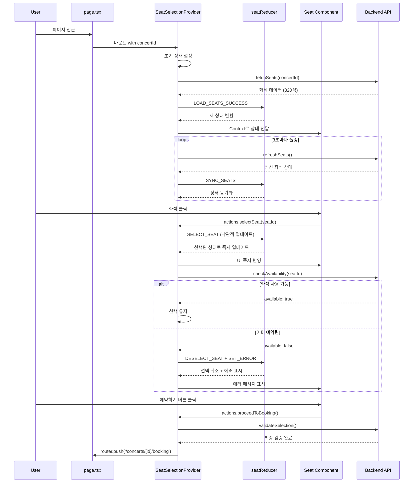

# 좌석 선택 페이지 구현 계획서

## 개요

콘서트 예약 시스템의 좌석 선택 페이지(`/concerts/[id]/seats`) 구현 계획서입니다.
사용자가 좌석 배치도에서 원하는 좌석을 시각적으로 선택하고, 실시간으로 좌석 현황을 확인하며, 예약을 진행할 수 있는 기능을 제공합니다.

### 핵심 기능

- **좌석 배치도 시각화**: 4구역(A,B,C,D) × 20열 × 4좌석 = 총 320석 배치 표시
- **실시간 좌석 상태**: available/reserved 상태를 색상으로 구분하여 표시
- **좌석 선택 인터랙션**: 클릭으로 선택/해제, 최대 4매 제한
- **등급별 가격 표시**: Special(250,000원), Premium(190,000원), Advanced(170,000원), Regular(140,000원)
- **선택 정보 패널**: 선택한 좌석 목록, 총 금액 실시간 업데이트
- **동시성 제어**: 3초 폴링 + 낙관적 업데이트로 실시간 동기화
- **에러 처리**: 동시 선택, 매진, 세션 만료, 네트워크 오류 등

### 상태 관리 전략

**Context API + useReducer 패턴** (state-management.md 기준)
- Provider: `SeatSelectionProvider`로 전체 상태 관리
- Consumer: 각 컴포넌트에서 `useSeatSelection()` 훅 사용
- 실시간 동기화: 3초 폴링 + 사용자 인터랙션 기반 동적 조정
- 낙관적 업데이트: 좌석 선택 시 즉시 UI 반영 후 백엔드 검증

---

## 모듈 목록

### 백엔드 모듈

| 모듈 | 파일 경로 | 설명 |
|------|----------|------|
| **좌석 스키마** | `src/features/seats/backend/schema.ts` | 좌석 데이터 Zod 스키마 정의 |
| **좌석 서비스** | `src/features/seats/backend/service.ts` | 좌석 조회 및 가용성 확인 비즈니스 로직 |
| **좌석 라우터** | `src/features/seats/backend/route.ts` | Hono 라우터 정의 (GET, POST) |
| **좌석 에러 코드** | `src/features/seats/backend/error.ts` | 좌석 관련 에러 코드 정의 |

### 프론트엔드 모듈 - 상태 관리

| 모듈 | 파일 경로 | 설명 |
|------|----------|------|
| **상태 타입 정의** | `src/features/seats/lib/types.ts` | 상태, Action, Context 타입 정의 |
| **DTO 재노출** | `src/features/seats/lib/dto.ts` | 백엔드 스키마 재노출 |
| **Reducer** | `src/features/seats/lib/reducer.ts` | useReducer용 상태 업데이트 로직 |
| **Context Provider** | `src/features/seats/context/SeatSelectionProvider.tsx` | Context API Provider |
| **Custom Hook** | `src/features/seats/hooks/useSeatSelection.ts` | Context 소비 훅 |

### 프론트엔드 모듈 - 컴포넌트

| 모듈 | 파일 경로 | 설명 |
|------|----------|------|
| **좌석 배치도** | `src/features/seats/components/SeatMap.tsx` | 전체 좌석 배치도 컨테이너 |
| **구역 그리드** | `src/features/seats/components/SeatGrid.tsx` | 구역별 좌석 그리드 |
| **개별 좌석** | `src/features/seats/components/Seat.tsx` | 좌석 하나의 UI 및 인터랙션 |
| **선택 정보 패널** | `src/features/seats/components/SelectionPanel.tsx` | 선택한 좌석 목록 및 총 금액 |
| **가격 안내** | `src/features/seats/components/PriceDisplay.tsx` | 등급별 가격표 |
| **예약 버튼** | `src/features/seats/components/ReserveButton.tsx` | 예약하기 버튼 |
| **에러 바운더리** | `src/features/seats/components/ErrorBoundary.tsx` | 에러 메시지 및 재시도 |
| **스켈레톤 UI** | `src/features/seats/components/SeatMapSkeleton.tsx` | 로딩 상태 placeholder |

### 페이지

| 모듈 | 파일 경로 | 설명 |
|------|----------|------|
| **좌석 선택 페이지** | `src/app/concerts/[id]/seats/page.tsx` | 페이지 진입점 |

### 공통 모듈 (기존 활용)

| 모듈 | 파일 경로 | 설명 |
|------|----------|------|
| **HTTP 응답 패턴** | `src/backend/http/response.ts` | success, failure, respond 헬퍼 |
| **Supabase 클라이언트** | `src/backend/middleware/supabase.ts` | Supabase 서버 클라이언트 |
| **API 클라이언트** | `src/lib/remote/api-client.ts` | Axios 기반 API 클라이언트 |

---

## 아키텍처 다이어그램

### 전체 시스템 구조

```mermaid
graph TB
    subgraph "Page Layer"
        PAGE[page.tsx<br>/concerts/[id]/seats]
    end

    subgraph "Context Provider Layer"
        PROVIDER[SeatSelectionProvider]
        REDUCER[seatReducer]
        STATE[SeatSelectionState]
    end

    subgraph "Component Layer"
        MAP[SeatMap]
        GRID[SeatGrid]
        SEAT[Seat]
        PANEL[SelectionPanel]
        PRICE[PriceDisplay]
        BTN[ReserveButton]
        ERROR[ErrorBoundary]
        SKELETON[SeatMapSkeleton]
    end

    subgraph "Hook Layer"
        HOOK[useSeatSelection]
        COMPUTED[computed values]
        ACTIONS[actions]
        HELPERS[helpers]
    end

    subgraph "API Layer"
        API1[GET /api/concerts/:id/seats]
        API2[POST /api/seats/check-availability]
    end

    subgraph "Backend Layer"
        ROUTE[Hono Router]
        SERVICE[Seat Service]
        SUPABASE[Supabase Client]
    end

    subgraph "Database Layer"
        DB_SEATS[(seats table)]
        DB_CONCERTS[(concerts table)]
    end

    PAGE --> PROVIDER
    PROVIDER --> REDUCER
    REDUCER --> STATE
    PROVIDER --> HOOK

    HOOK --> MAP
    HOOK --> GRID
    HOOK --> SEAT
    HOOK --> PANEL
    HOOK --> PRICE
    HOOK --> BTN
    HOOK --> ERROR
    HOOK --> SKELETON

    HOOK --> COMPUTED
    HOOK --> ACTIONS
    HOOK --> HELPERS

    ACTIONS --> API1
    ACTIONS --> API2

    API1 --> ROUTE
    API2 --> ROUTE
    ROUTE --> SERVICE
    SERVICE --> SUPABASE

    SUPABASE --> DB_SEATS
    SUPABASE --> DB_CONCERTS

    style PAGE fill:#e1f5ff
    style PROVIDER fill:#fff3e0
    style SERVICE fill:#f3e5f5
    style DB_SEATS fill:#e8f5e9
    style DB_CONCERTS fill:#e8f5e9
```

### 상태 흐름 다이어그램



### 데이터 흐름 다이어그램

```mermaid
graph LR
    subgraph "Initial Load"
        A[GET /api/concerts/:id/seats] --> B[Supabase Query<br>SELECT * FROM seats<br>WHERE concert_id = :id]
        B --> C[320 Seat Records]
        C --> D[SeatSelectionState<br>seats: Seat[]]
    end

    subgraph "User Interaction"
        E[User Clicks Seat] --> F[SELECT_SEAT Action]
        F --> G[Reducer Update<br>selectedSeats.push]
        G --> H[Computed<br>totalPrice += price]
        H --> I[UI Update<br>Seat 강조 + Panel 업데이트]
    end

    subgraph "Real-time Sync"
        J[setInterval 3초] --> K[refreshSeats API]
        K --> L[Supabase Latest Data]
        L --> M[SYNC_SEATS Action]
        M --> N[Reducer Merge<br>status 업데이트]
        N --> O[UI Update<br>reserved 좌석 회색 처리]
    end

    subgraph "Availability Check"
        P[POST /api/seats/check-availability<br>seatIds: string[]] --> Q[Supabase<br>FOR UPDATE Lock]
        Q --> R[status === 'available' 확인]
        R --> S{Available?}
        S -->|Yes| T[Return true]
        S -->|No| U[Return false]
        U --> V[DESELECT_SEAT Action]
    end

    D --> E
    I --> J
    O --> E
    F --> P
```

---

## 구현 계획

### Phase 1: 백엔드 API 구현

#### 1.1 Feature 디렉토리 구조 생성

```bash
mkdir -p src/features/seats/backend
mkdir -p src/features/seats/lib
mkdir -p src/features/seats/context
mkdir -p src/features/seats/hooks
mkdir -p src/features/seats/components
```

#### 1.2 에러 코드 정의 (`error.ts`)

**참조**: `docs/error-codes.md`, `src/features/concerts/backend/error.ts`

```typescript
// src/features/seats/backend/error.ts
export const seatErrorCodes = {
  notFound: 'SEAT_NOT_FOUND',
  fetchError: 'SEAT_FETCH_ERROR',
  validationError: 'SEAT_VALIDATION_ERROR',
  alreadyReserved: 'SEAT_ALREADY_RESERVED',
  invalidConcert: 'SEAT_INVALID_CONCERT',
  maxSeatsExceeded: 'SEAT_MAX_SEATS_EXCEEDED',
} as const;

type SeatErrorValue = (typeof seatErrorCodes)[keyof typeof seatErrorCodes];

export type SeatServiceError = SeatErrorValue;
```

**주의사항**:
- `docs/error-codes.md`의 표준 에러 코드와 일관성 유지
- feature별 에러 코드는 프리픽스로 구분 (`SEAT_*`)
- 기존 `concerts` feature 패턴과 동일한 구조

#### 1.3 스키마 정의 (`schema.ts`)

**참조**: `docs/validation.md`, `docs/database.md`

```typescript
// src/features/seats/backend/schema.ts
import { z } from 'zod';

// 데이터베이스 Row 스키마 (snake_case)
export const SeatTableRowSchema = z.object({
  id: z.string().uuid(),
  concert_id: z.string().uuid(),
  section: z.enum(['A', 'B', 'C', 'D']),
  row: z.number().int().min(1).max(20),
  number: z.number().int().min(1).max(4),
  grade: z.enum(['Special', 'Premium', 'Advanced', 'Regular']),
  price: z.number().int().positive(),
  status: z.enum(['available', 'reserved']),
  created_at: z.string().datetime().optional(),
  updated_at: z.string().datetime().optional(),
});

export type SeatRow = z.infer<typeof SeatTableRowSchema>;

// API 응답 스키마 (camelCase)
export const SeatResponseSchema = z.object({
  id: z.string().uuid(),
  concertId: z.string().uuid(),
  section: z.enum(['A', 'B', 'C', 'D']),
  row: z.number().int().min(1).max(20),
  number: z.number().int().min(1).max(4),
  grade: z.enum(['Special', 'Premium', 'Advanced', 'Regular']),
  price: z.number().int().positive(),
  status: z.enum(['available', 'reserved']),
});

export type SeatResponse = z.infer<typeof SeatResponseSchema>;

// 좌석 목록 응답 스키마
export const SeatListResponseSchema = z.array(SeatResponseSchema);

export type SeatListResponse = z.infer<typeof SeatListResponseSchema>;

// 좌석 가용성 확인 요청 스키마
export const CheckAvailabilityRequestSchema = z.object({
  concertId: z.string().uuid(),
  seatIds: z.array(z.string().uuid()).min(1).max(4),
});

export type CheckAvailabilityRequest = z.infer<typeof CheckAvailabilityRequestSchema>;

// 좌석 가용성 확인 응답 스키마
export const CheckAvailabilityResponseSchema = z.object({
  available: z.boolean(),
  unavailableSeats: z.array(z.string().uuid()).optional(),
});

export type CheckAvailabilityResponse = z.infer<typeof CheckAvailabilityResponseSchema>;
```

**주의사항**:
- 데이터베이스 컬럼명(`snake_case`)과 API 응답 필드명(`camelCase`)을 구분
- `section`, `grade`, `status`는 enum으로 제한
- `row`, `number` 범위 검증 포함
- 좌석 가용성 확인 요청은 최대 4매 제한

#### 1.4 서비스 로직 구현 (`service.ts`)

**참조**: `src/features/concerts/backend/service.ts`, `docs/database.md`

```typescript
// src/features/seats/backend/service.ts
import type { SupabaseClient } from '@supabase/supabase-js';
import {
  failure,
  success,
  type HandlerResult,
} from '@/backend/http/response';
import {
  SeatTableRowSchema,
  SeatResponseSchema,
  type SeatResponse,
  type CheckAvailabilityRequest,
  type CheckAvailabilityResponse,
} from './schema';
import {
  seatErrorCodes,
  type SeatServiceError,
} from './error';

const SEATS_TABLE = 'seats';
const CONCERTS_TABLE = 'concerts';

// 1. 콘서트별 좌석 목록 조회
export const getSeatsByConcertId = async (
  client: SupabaseClient,
  concertId: string,
): Promise<HandlerResult<SeatResponse[], SeatServiceError, unknown>> => {
  // UUID 형식 검증
  const uuidRegex = /^[0-9a-f]{8}-[0-9a-f]{4}-[0-9a-f]{4}-[0-9a-f]{4}-[0-9a-f]{12}$/i;
  if (!uuidRegex.test(concertId)) {
    return failure(400, seatErrorCodes.invalidConcert, '잘못된 콘서트 ID 형식입니다');
  }

  // 콘서트 존재 여부 확인
  const { data: concert, error: concertError } = await client
    .from(CONCERTS_TABLE)
    .select('id')
    .eq('id', concertId)
    .single();

  if (concertError || !concert) {
    return failure(404, seatErrorCodes.invalidConcert, '콘서트를 찾을 수 없습니다');
  }

  // 좌석 목록 조회 (구역, 열, 번호 순 정렬)
  const { data, error } = await client
    .from(SEATS_TABLE)
    .select('*')
    .eq('concert_id', concertId)
    .order('section', { ascending: true })
    .order('row', { ascending: true })
    .order('number', { ascending: true });

  if (error) {
    return failure(500, seatErrorCodes.fetchError, error.message);
  }

  if (!data || data.length === 0) {
    return failure(404, seatErrorCodes.notFound, '좌석 정보를 찾을 수 없습니다');
  }

  // 응답 데이터 변환 및 검증
  const seats: SeatResponse[] = [];

  for (const seat of data) {
    // Row 검증
    const rowParse = SeatTableRowSchema.safeParse(seat);

    if (!rowParse.success) {
      return failure(
        500,
        seatErrorCodes.validationError,
        'Seat row failed validation.',
        rowParse.error.format(),
      );
    }

    // snake_case → camelCase 변환
    const mapped: SeatResponse = {
      id: rowParse.data.id,
      concertId: rowParse.data.concert_id,
      section: rowParse.data.section,
      row: rowParse.data.row,
      number: rowParse.data.number,
      grade: rowParse.data.grade,
      price: rowParse.data.price,
      status: rowParse.data.status,
    };

    // Response 검증
    const parsed = SeatResponseSchema.safeParse(mapped);

    if (!parsed.success) {
      return failure(
        500,
        seatErrorCodes.validationError,
        'Seat response failed validation.',
        parsed.error.format(),
      );
    }

    seats.push(parsed.data);
  }

  return success(seats);
};

// 2. 좌석 가용성 확인 (동시성 제어)
export const checkSeatAvailability = async (
  client: SupabaseClient,
  request: CheckAvailabilityRequest,
): Promise<HandlerResult<CheckAvailabilityResponse, SeatServiceError, unknown>> => {
  const { concertId, seatIds } = request;

  // 좌석 ID 최대 4개 제한
  if (seatIds.length > 4) {
    return failure(
      400,
      seatErrorCodes.maxSeatsExceeded,
      '최대 4매까지 선택 가능합니다',
    );
  }

  // FOR UPDATE Lock을 사용한 좌석 조회
  const { data, error } = await client
    .from(SEATS_TABLE)
    .select('id, status')
    .eq('concert_id', concertId)
    .in('id', seatIds);

  if (error) {
    return failure(500, seatErrorCodes.fetchError, error.message);
  }

  if (!data || data.length === 0) {
    return failure(404, seatErrorCodes.notFound, '좌석을 찾을 수 없습니다');
  }

  // 요청한 좌석 수와 조회된 좌석 수 불일치 확인
  if (data.length !== seatIds.length) {
    return failure(404, seatErrorCodes.notFound, '일부 좌석을 찾을 수 없습니다');
  }

  // 예약 불가능한 좌석 확인
  const unavailableSeats = data
    .filter((seat) => seat.status !== 'available')
    .map((seat) => seat.id);

  const available = unavailableSeats.length === 0;

  const response: CheckAvailabilityResponse = {
    available,
    unavailableSeats: available ? undefined : unavailableSeats,
  };

  return success(response);
};
```

**주의사항**:
- `getSeatsByConcertId`: 콘서트 존재 여부 먼저 확인
- 좌석 정렬: `section` → `row` → `number` 순서
- `checkSeatAvailability`: FOR UPDATE Lock 사용 (PostgreSQL)
- Row 검증 → 변환 → Response 검증 2단계 검증
- 최대 4매 제한 백엔드에서 재검증

#### 1.5 라우터 구현 (`route.ts`)

**참조**: `src/features/concerts/backend/route.ts`

```typescript
// src/features/seats/backend/route.ts
import type { Hono } from 'hono';
import {
  respond,
  type ErrorResult,
} from '@/backend/http/response';
import {
  getLogger,
  getSupabase,
  type AppEnv,
} from '@/backend/hono/context';
import {
  getSeatsByConcertId,
  checkSeatAvailability,
} from './service';
import {
  CheckAvailabilityRequestSchema,
} from './schema';
import {
  seatErrorCodes,
  type SeatServiceError,
} from './error';

export const registerSeatsRoutes = (app: Hono<AppEnv>) => {
  // GET /api/concerts/:id/seats - 좌석 목록 조회
  app.get('/api/concerts/:id/seats', async (c) => {
    const supabase = getSupabase(c);
    const logger = getLogger(c);
    const concertId = c.req.param('id');

    logger.info('Fetching seats for concert', { concertId });

    const result = await getSeatsByConcertId(supabase, concertId);

    if (!result.ok) {
      const errorResult = result as ErrorResult<SeatServiceError, unknown>;

      if (errorResult.error.code === seatErrorCodes.notFound) {
        logger.warn('Seats not found', { concertId });
      } else if (errorResult.error.code === seatErrorCodes.fetchError) {
        logger.error('Failed to fetch seats', errorResult.error.message);
      }

      return respond(c, result);
    }

    logger.info('Successfully fetched seats', { count: result.data.length });
    return respond(c, result);
  });

  // POST /api/seats/check-availability - 좌석 가용성 확인
  app.post('/api/seats/check-availability', async (c) => {
    const supabase = getSupabase(c);
    const logger = getLogger(c);

    // 요청 본문 파싱 및 검증
    const body = await c.req.json();
    const parsed = CheckAvailabilityRequestSchema.safeParse(body);

    if (!parsed.success) {
      logger.warn('Invalid request body', { errors: parsed.error.format() });
      return c.json(
        {
          success: false,
          error: {
            code: seatErrorCodes.validationError,
            message: '잘못된 요청 형식입니다',
            details: parsed.error.format(),
          },
        },
        400,
      );
    }

    logger.info('Checking seat availability', {
      concertId: parsed.data.concertId,
      seatIds: parsed.data.seatIds,
    });

    const result = await checkSeatAvailability(supabase, parsed.data);

    if (!result.ok) {
      const errorResult = result as ErrorResult<SeatServiceError, unknown>;

      if (errorResult.error.code === seatErrorCodes.alreadyReserved) {
        logger.warn('Seats already reserved', {
          seatIds: parsed.data.seatIds,
        });
      } else if (errorResult.error.code === seatErrorCodes.fetchError) {
        logger.error('Failed to check availability', errorResult.error.message);
      }

      return respond(c, result);
    }

    logger.info('Availability check completed', {
      available: result.data.available,
    });
    return respond(c, result);
  });
};
```

**주의사항**:
- `c.req.param('id')`로 URL 파라미터 추출
- POST 요청은 body를 Zod 스키마로 검증
- 에러 타입별로 적절한 로그 레벨 사용
- 기존 concerts 라우터와 동일한 `respond` 패턴 사용

#### 1.6 Hono 앱에 라우터 등록

**참조**: `src/backend/hono/app.ts`

```typescript
// src/backend/hono/app.ts 수정
import { registerSeatsRoutes } from '@/features/seats/backend/route';

export const createHonoApp = () => {
  if (singletonApp) {
    return singletonApp;
  }

  const app = new Hono<AppEnv>();

  app.use('*', errorBoundary());
  app.use('*', withAppContext());
  app.use('*', withSupabase());

  registerExampleRoutes(app);
  registerConcertsRoutes(app);
  registerSeatsRoutes(app); // 추가

  singletonApp = app;

  return app;
};
```

---

### Phase 2: 프론트엔드 - 상태 관리 구현

#### 2.1 타입 정의 (`lib/types.ts`)

**참조**: `docs/state-management.md`

```typescript
// src/features/seats/lib/types.ts
import type { SeatResponse } from './dto';

// 좌석 등급 타입
export type SeatGrade = 'Special' | 'Premium' | 'Advanced' | 'Regular';

// 선택된 좌석 정보
export interface SelectedSeat {
  seatId: string;
  section: string;
  row: number;
  number: number;
  grade: SeatGrade;
  price: number;
  selectedAt: number; // 선택 시간 (타임스탬프)
}

// 에러 상태
export interface ErrorState {
  type: 'NETWORK' | 'MAX_SEATS' | 'ALREADY_RESERVED' | 'SESSION_EXPIRED' | 'INVALID_CONCERT';
  message: string;
  retryable: boolean;
}

// 좌석 선택 상태
export interface SeatSelectionState {
  // 좌석 데이터
  seats: SeatResponse[];

  // 선택 관련
  selectedSeats: SelectedSeat[];
  totalPrice: number;

  // UI 상태
  isLoading: boolean;
  error: ErrorState | null;
  hoveredSeatId: string | null;

  // 메타 정보
  concertId: string;
  concertInfo?: {
    title: string;
    artist: string;
    date: string;
    venue: string;
  };
  maxSeats: number; // 최대 선택 가능 좌석 수 (4)
  lastSyncTime: number; // 마지막 동기화 시간
}

// Action 타입 정의
export type SeatSelectionAction =
  // 데이터 로딩
  | { type: 'INIT_SEATS'; payload: { concertId: string } }
  | { type: 'LOAD_SEATS_REQUEST' }
  | { type: 'LOAD_SEATS_SUCCESS'; payload: { seats: SeatResponse[] } }
  | { type: 'LOAD_SEATS_FAILURE'; payload: ErrorState }
  | { type: 'SET_CONCERT_INFO'; payload: { title: string; artist: string; date: string; venue: string } }

  // 좌석 선택
  | { type: 'SELECT_SEAT'; payload: { seatId: string } }
  | { type: 'DESELECT_SEAT'; payload: { seatId: string } }
  | { type: 'TOGGLE_SEAT'; payload: { seatId: string } }
  | { type: 'CLEAR_SELECTION' }

  // 좌석 상태 업데이트
  | { type: 'UPDATE_SEAT_STATUS'; payload: { seatId: string; status: 'available' | 'reserved' } }
  | { type: 'BATCH_UPDATE_SEATS'; payload: { updates: Array<{ seatId: string; status: 'available' | 'reserved' }> } }
  | { type: 'SYNC_SEATS'; payload: { seats: SeatResponse[] } }

  // UI 상태
  | { type: 'SET_HOVER_SEAT'; payload: { seatId: string | null } }
  | { type: 'SET_ERROR'; payload: ErrorState }
  | { type: 'CLEAR_ERROR' }
  | { type: 'SET_LOADING'; payload: boolean };

// Context Value 타입
export interface SeatSelectionContextValue {
  // 상태
  state: SeatSelectionState;

  // 파생 상태 (computed)
  computed: {
    isReserveEnabled: boolean;
    canSelectMore: boolean;
    selectedCount: number;
    availableSeatsCount: number;
    seatsBySection: Map<string, SeatResponse[]>;
    priceByGrade: Map<SeatGrade, number>;
  };

  // 액션
  actions: {
    // 데이터 로딩
    loadSeats: () => Promise<void>;
    refreshSeats: () => Promise<void>;
    loadConcertInfo: () => Promise<void>;

    // 좌석 선택
    selectSeat: (seatId: string) => void;
    deselectSeat: (seatId: string) => void;
    toggleSeat: (seatId: string) => void;
    clearSelection: () => void;

    // 좌석 가용성 확인 (API 통합)
    checkAvailability: (seatIds: string[]) => Promise<boolean>;

    // UI 인터랙션
    setHoveredSeat: (seatId: string | null) => void;
    clearError: () => void;

    // 예약 프로세스
    proceedToBooking: () => Promise<boolean>;
    validateSelection: () => boolean;
  };

  // 헬퍼 함수
  helpers: {
    getSeatById: (seatId: string) => SeatResponse | undefined;
    getSeatLabel: (seat: SeatResponse) => string;
    getSeatColor: (seat: SeatResponse) => string;
    isSelected: (seatId: string) => boolean;
    canSelect: (seatId: string) => boolean;
  };
}
```

#### 2.2 DTO 재노출 (`lib/dto.ts`)

```typescript
// src/features/seats/lib/dto.ts
export type {
  SeatResponse,
  SeatListResponse,
  CheckAvailabilityRequest,
  CheckAvailabilityResponse,
} from '@/features/seats/backend/schema';

export {
  SeatResponseSchema,
  SeatListResponseSchema,
  CheckAvailabilityRequestSchema,
  CheckAvailabilityResponseSchema,
} from '@/features/seats/backend/schema';
```

#### 2.3 Reducer 구현 (`lib/reducer.ts`)

**참조**: `docs/state-management.md`

```typescript
// src/features/seats/lib/reducer.ts
import type {
  SeatSelectionState,
  SeatSelectionAction,
  SelectedSeat,
} from './types';
import type { SeatResponse } from './dto';

export const initialState: Omit<SeatSelectionState, 'concertId' | 'maxSeats'> = {
  seats: [],
  selectedSeats: [],
  totalPrice: 0,
  isLoading: false,
  error: null,
  hoveredSeatId: null,
  lastSyncTime: 0,
};

export const seatReducer = (
  state: SeatSelectionState,
  action: SeatSelectionAction,
): SeatSelectionState => {
  switch (action.type) {
    // 데이터 로딩
    case 'INIT_SEATS':
      return {
        ...state,
        concertId: action.payload.concertId,
        isLoading: true,
        error: null,
      };

    case 'LOAD_SEATS_REQUEST':
      return {
        ...state,
        isLoading: true,
        error: null,
      };

    case 'LOAD_SEATS_SUCCESS':
      return {
        ...state,
        seats: action.payload.seats,
        isLoading: false,
        error: null,
        lastSyncTime: Date.now(),
      };

    case 'LOAD_SEATS_FAILURE':
      return {
        ...state,
        isLoading: false,
        error: action.payload,
      };

    case 'SET_CONCERT_INFO':
      return {
        ...state,
        concertInfo: action.payload,
      };

    // 좌석 선택
    case 'SELECT_SEAT': {
      const { seatId } = action.payload;
      const seat = state.seats.find((s) => s.id === seatId);

      if (!seat) return state;
      if (seat.status !== 'available') return state;
      if (state.selectedSeats.length >= state.maxSeats) {
        return {
          ...state,
          error: {
            type: 'MAX_SEATS',
            message: `최대 ${state.maxSeats}매까지 선택 가능합니다`,
            retryable: false,
          },
        };
      }
      if (state.selectedSeats.some((s) => s.seatId === seatId)) return state;

      const selectedSeat: SelectedSeat = {
        seatId: seat.id,
        section: seat.section,
        row: seat.row,
        number: seat.number,
        grade: seat.grade,
        price: seat.price,
        selectedAt: Date.now(),
      };

      return {
        ...state,
        selectedSeats: [...state.selectedSeats, selectedSeat],
        totalPrice: state.totalPrice + seat.price,
        error: null,
      };
    }

    case 'DESELECT_SEAT': {
      const { seatId } = action.payload;
      const selectedSeat = state.selectedSeats.find((s) => s.seatId === seatId);

      if (!selectedSeat) return state;

      return {
        ...state,
        selectedSeats: state.selectedSeats.filter((s) => s.seatId !== seatId),
        totalPrice: state.totalPrice - selectedSeat.price,
      };
    }

    case 'TOGGLE_SEAT': {
      const { seatId } = action.payload;
      const isSelected = state.selectedSeats.some((s) => s.seatId === seatId);

      if (isSelected) {
        return seatReducer(state, { type: 'DESELECT_SEAT', payload: { seatId } });
      } else {
        return seatReducer(state, { type: 'SELECT_SEAT', payload: { seatId } });
      }
    }

    case 'CLEAR_SELECTION':
      return {
        ...state,
        selectedSeats: [],
        totalPrice: 0,
      };

    // 좌석 상태 업데이트
    case 'UPDATE_SEAT_STATUS': {
      const { seatId, status } = action.payload;
      return {
        ...state,
        seats: state.seats.map((seat) =>
          seat.id === seatId ? { ...seat, status } : seat
        ),
        lastSyncTime: Date.now(),
      };
    }

    case 'BATCH_UPDATE_SEATS': {
      const updateMap = new Map(
        action.payload.updates.map((u) => [u.seatId, u.status])
      );

      return {
        ...state,
        seats: state.seats.map((seat) => {
          const newStatus = updateMap.get(seat.id);
          return newStatus ? { ...seat, status: newStatus } : seat;
        }),
        lastSyncTime: Date.now(),
      };
    }

    case 'SYNC_SEATS': {
      const newSeatsMap = new Map(action.payload.seats.map((s) => [s.id, s]));

      return {
        ...state,
        seats: state.seats.map((seat) => newSeatsMap.get(seat.id) || seat),
        lastSyncTime: Date.now(),
      };
    }

    // UI 상태
    case 'SET_HOVER_SEAT':
      return {
        ...state,
        hoveredSeatId: action.payload.seatId,
      };

    case 'SET_ERROR':
      return {
        ...state,
        error: action.payload,
      };

    case 'CLEAR_ERROR':
      return {
        ...state,
        error: null,
      };

    case 'SET_LOADING':
      return {
        ...state,
        isLoading: action.payload,
      };

    default:
      return state;
  }
};
```

**주의사항**:
- 모든 상태 업데이트는 불변성 유지 (spread operator 사용)
- `SELECT_SEAT`에서 최대 4매 제한 검증
- `TOGGLE_SEAT`은 내부적으로 `SELECT_SEAT` 또는 `DESELECT_SEAT` 호출
- `SYNC_SEATS`는 기존 좌석 배열을 유지하면서 상태만 업데이트

#### 2.4 Context Provider 구현 (`context/SeatSelectionProvider.tsx`)

**참조**: `docs/state-management.md`

```typescript
// src/features/seats/context/SeatSelectionProvider.tsx
'use client';

import { useReducer, useEffect, useMemo, useCallback, useRef, createContext } from 'react';
import { useRouter } from 'next/navigation';
import { apiClient } from '@/lib/remote/api-client';
import { seatReducer, initialState } from '../lib/reducer';
import type {
  SeatSelectionState,
  SeatSelectionContextValue,
  SeatGrade,
} from '../lib/types';
import type { SeatResponse } from '../lib/dto';
import {
  SeatListResponseSchema,
  CheckAvailabilityRequestSchema,
} from '../lib/dto';

interface SeatSelectionProviderProps {
  children: React.ReactNode;
  concertId: string;
  maxSeats?: number; // 기본값: 4
  syncInterval?: number; // 실시간 동기화 간격 (ms), 기본값: 3000
}

// Context 생성
export const SeatSelectionContext = createContext<SeatSelectionContextValue | null>(null);

// Provider 구현
export const SeatSelectionProvider: React.FC<SeatSelectionProviderProps> = ({
  children,
  concertId,
  maxSeats = 4,
  syncInterval = 3000,
}) => {
  const router = useRouter();

  // useReducer 초기화
  const [state, dispatch] = useReducer(seatReducer, {
    ...initialState,
    concertId,
    maxSeats,
  } as SeatSelectionState);

  // 동적 폴링 간격 관리
  const [dynamicInterval, setDynamicInterval] = React.useState(syncInterval);
  const lastInteractionRef = useRef(Date.now());

  // 사용자 인터랙션 추적
  const trackInteraction = useCallback(() => {
    lastInteractionRef.current = Date.now();
    setDynamicInterval(3000); // 인터랙션 시 3초로 단축
  }, []);

  // 좌석 목록 로드
  const loadSeats = useCallback(async () => {
    dispatch({ type: 'LOAD_SEATS_REQUEST' });

    try {
      const response = await apiClient.get(`/api/concerts/${concertId}/seats`);
      const seats = SeatListResponseSchema.parse(response.data);

      dispatch({
        type: 'LOAD_SEATS_SUCCESS',
        payload: { seats },
      });
    } catch (error: any) {
      dispatch({
        type: 'LOAD_SEATS_FAILURE',
        payload: {
          type: 'NETWORK',
          message: '좌석 정보를 불러오는 중 문제가 발생했습니다',
          retryable: true,
        },
      });
    }
  }, [concertId]);

  // 좌석 목록 갱신 (폴링용)
  const refreshSeats = useCallback(async () => {
    try {
      const response = await apiClient.get(`/api/concerts/${concertId}/seats`);
      const seats = SeatListResponseSchema.parse(response.data);

      dispatch({
        type: 'SYNC_SEATS',
        payload: { seats },
      });
    } catch (error) {
      console.error('Failed to refresh seats:', error);
    }
  }, [concertId]);

  // 콘서트 정보 로드
  const loadConcertInfo = useCallback(async () => {
    try {
      const response = await apiClient.get(`/api/concerts/${concertId}`);
      const concert = response.data;

      dispatch({
        type: 'SET_CONCERT_INFO',
        payload: {
          title: concert.title,
          artist: concert.artist,
          date: concert.date,
          venue: concert.venue,
        },
      });
    } catch (error) {
      console.error('Failed to load concert info:', error);
    }
  }, [concertId]);

  // 좌석 선택 (낙관적 업데이트)
  const selectSeat = useCallback(
    async (seatId: string) => {
      trackInteraction();

      // 낙관적 업데이트
      dispatch({ type: 'SELECT_SEAT', payload: { seatId } });

      // 즉시 백엔드 검증
      try {
        const response = await apiClient.post('/api/seats/check-availability', {
          concertId,
          seatIds: [seatId],
        });

        if (!response.data.available) {
          // 이미 예약된 경우 선택 취소
          dispatch({ type: 'DESELECT_SEAT', payload: { seatId } });
          dispatch({
            type: 'SET_ERROR',
            payload: {
              type: 'ALREADY_RESERVED',
              message: '선택하신 좌석이 이미 예약되었습니다',
              retryable: false,
            },
          });

          // 좌석 상태 업데이트
          dispatch({
            type: 'UPDATE_SEAT_STATUS',
            payload: { seatId, status: 'reserved' },
          });
        }
      } catch (error) {
        dispatch({ type: 'DESELECT_SEAT', payload: { seatId } });
        dispatch({
          type: 'SET_ERROR',
          payload: {
            type: 'NETWORK',
            message: '좌석 확인 중 오류가 발생했습니다',
            retryable: true,
          },
        });
      }
    },
    [concertId, trackInteraction]
  );

  // 좌석 선택 해제
  const deselectSeat = useCallback((seatId: string) => {
    trackInteraction();
    dispatch({ type: 'DESELECT_SEAT', payload: { seatId } });
  }, [trackInteraction]);

  // 좌석 선택 토글
  const toggleSeat = useCallback(
    (seatId: string) => {
      const isSelected = state.selectedSeats.some((s) => s.seatId === seatId);
      if (isSelected) {
        deselectSeat(seatId);
      } else {
        selectSeat(seatId);
      }
    },
    [state.selectedSeats, selectSeat, deselectSeat]
  );

  // 전체 선택 해제
  const clearSelection = useCallback(() => {
    dispatch({ type: 'CLEAR_SELECTION' });
  }, []);

  // 좌석 가용성 확인
  const checkAvailability = useCallback(
    async (seatIds: string[]): Promise<boolean> => {
      try {
        const response = await apiClient.post('/api/seats/check-availability', {
          concertId,
          seatIds,
        });

        return response.data.available;
      } catch (error) {
        console.error('Failed to check availability:', error);
        return false;
      }
    },
    [concertId]
  );

  // Hover 상태 설정
  const setHoveredSeat = useCallback((seatId: string | null) => {
    dispatch({ type: 'SET_HOVER_SEAT', payload: { seatId } });
  }, []);

  // 에러 초기화
  const clearError = useCallback(() => {
    dispatch({ type: 'CLEAR_ERROR' });
  }, []);

  // 예약 프로세스 진행
  const proceedToBooking = useCallback(async (): Promise<boolean> => {
    if (state.selectedSeats.length === 0) {
      dispatch({
        type: 'SET_ERROR',
        payload: {
          type: 'NETWORK',
          message: '최소 1개 이상의 좌석을 선택해주세요',
          retryable: false,
        },
      });
      return false;
    }

    // 최종 가용성 확인
    const seatIds = state.selectedSeats.map((s) => s.seatId);
    const available = await checkAvailability(seatIds);

    if (!available) {
      dispatch({
        type: 'SET_ERROR',
        payload: {
          type: 'ALREADY_RESERVED',
          message: '선택하신 좌석 중 일부가 이미 예약되었습니다',
          retryable: false,
        },
      });
      await refreshSeats();
      return false;
    }

    // 세션에 선택 정보 저장 (sessionStorage)
    sessionStorage.setItem(
      `booking_${concertId}`,
      JSON.stringify({
        concertId,
        selectedSeats: state.selectedSeats,
        totalPrice: state.totalPrice,
        timestamp: Date.now(),
      })
    );

    // 예약 정보 입력 페이지로 이동
    router.push(`/concerts/${concertId}/booking`);
    return true;
  }, [state.selectedSeats, state.totalPrice, concertId, checkAvailability, refreshSeats, router]);

  // 선택 유효성 검증
  const validateSelection = useCallback((): boolean => {
    return state.selectedSeats.length > 0 && state.selectedSeats.length <= maxSeats;
  }, [state.selectedSeats, maxSeats]);

  // 초기 데이터 로드
  useEffect(() => {
    loadSeats();
    loadConcertInfo();
  }, [loadSeats, loadConcertInfo]);

  // 실시간 동기화 (폴링)
  useEffect(() => {
    const interval = setInterval(() => {
      const timeSinceLastInteraction = Date.now() - lastInteractionRef.current;

      // 10초 이상 인터랙션 없으면 폴링 간격 10초로 증가
      if (timeSinceLastInteraction > 10000 && dynamicInterval !== 10000) {
        setDynamicInterval(10000);
      }

      refreshSeats();
    }, dynamicInterval);

    return () => clearInterval(interval);
  }, [dynamicInterval, refreshSeats]);

  // Computed 값 계산
  const computed = useMemo(() => {
    const isReserveEnabled =
      state.selectedSeats.length > 0 &&
      state.selectedSeats.length <= maxSeats &&
      !state.isLoading;

    const canSelectMore = state.selectedSeats.length < maxSeats;

    const selectedCount = state.selectedSeats.length;

    const availableSeatsCount = state.seats.filter(
      (s) => s.status === 'available'
    ).length;

    const seatsBySection = new Map<string, SeatResponse[]>();
    state.seats.forEach((seat) => {
      const existing = seatsBySection.get(seat.section) || [];
      existing.push(seat);
      seatsBySection.set(seat.section, existing);
    });

    const priceByGrade = new Map<SeatGrade, number>();
    state.seats.forEach((seat) => {
      if (!priceByGrade.has(seat.grade)) {
        priceByGrade.set(seat.grade, seat.price);
      }
    });

    return {
      isReserveEnabled,
      canSelectMore,
      selectedCount,
      availableSeatsCount,
      seatsBySection,
      priceByGrade,
    };
  }, [state.seats, state.selectedSeats, state.isLoading, maxSeats]);

  // Actions 객체
  const actions = useMemo(
    () => ({
      loadSeats,
      refreshSeats,
      loadConcertInfo,
      selectSeat,
      deselectSeat,
      toggleSeat,
      clearSelection,
      checkAvailability,
      setHoveredSeat,
      clearError,
      proceedToBooking,
      validateSelection,
    }),
    [
      loadSeats,
      refreshSeats,
      loadConcertInfo,
      selectSeat,
      deselectSeat,
      toggleSeat,
      clearSelection,
      checkAvailability,
      setHoveredSeat,
      clearError,
      proceedToBooking,
      validateSelection,
    ]
  );

  // Helpers 객체
  const helpers = useMemo(
    () => ({
      getSeatById: (seatId: string) => state.seats.find((s) => s.id === seatId),

      getSeatLabel: (seat: SeatResponse) =>
        `${seat.section}-${seat.row}-${seat.number}`,

      getSeatColor: (seat: SeatResponse) => {
        if (seat.status === 'reserved') return 'bg-gray-300';

        const isSelected = state.selectedSeats.some((s) => s.seatId === seat.id);
        if (isSelected) {
          switch (seat.grade) {
            case 'Special':
              return 'bg-purple-700';
            case 'Premium':
              return 'bg-blue-700';
            case 'Advanced':
              return 'bg-green-700';
            case 'Regular':
              return 'bg-gray-700';
          }
        }

        switch (seat.grade) {
          case 'Special':
            return 'bg-purple-500';
          case 'Premium':
            return 'bg-blue-500';
          case 'Advanced':
            return 'bg-green-500';
          case 'Regular':
            return 'bg-gray-500';
        }
      },

      isSelected: (seatId: string) =>
        state.selectedSeats.some((s) => s.seatId === seatId),

      canSelect: (seatId: string) => {
        const seat = state.seats.find((s) => s.id === seatId);
        if (!seat || seat.status !== 'available') return false;
        const isSelected = state.selectedSeats.some((s) => s.seatId === seatId);
        if (isSelected) return true; // 이미 선택된 경우 해제 가능
        return state.selectedSeats.length < maxSeats;
      },
    }),
    [state.seats, state.selectedSeats, maxSeats]
  );

  // Context Value
  const value: SeatSelectionContextValue = {
    state,
    computed,
    actions,
    helpers,
  };

  return (
    <SeatSelectionContext.Provider value={value}>
      {children}
    </SeatSelectionContext.Provider>
  );
};
```

**주의사항**:
- `'use client'` 지시문 필수
- `useReducer`로 복잡한 상태 관리
- `useMemo`로 computed 값 메모이제이션
- `useCallback`으로 actions 메모이제이션
- 동적 폴링 간격: 인터랙션 시 3초, 10초 이상 미사용 시 10초
- 낙관적 업데이트: 선택 즉시 UI 반영 후 백엔드 검증
- sessionStorage에 선택 정보 저장

#### 2.5 Custom Hook 구현 (`hooks/useSeatSelection.ts`)

```typescript
// src/features/seats/hooks/useSeatSelection.ts
'use client';

import { useContext } from 'react';
import { SeatSelectionContext } from '../context/SeatSelectionProvider';

export const useSeatSelection = () => {
  const context = useContext(SeatSelectionContext);

  if (!context) {
    throw new Error('useSeatSelection must be used within SeatSelectionProvider');
  }

  return context;
};
```

---

### Phase 3: 프론트엔드 - 컴포넌트 구현

#### 3.1 좌석 배치도 (`components/SeatMap.tsx`)

```typescript
// src/features/seats/components/SeatMap.tsx
'use client';

import { Card, CardContent, CardHeader, CardTitle } from '@/components/ui/card';
import { useSeatSelection } from '../hooks/useSeatSelection';
import { SeatGrid } from './SeatGrid';

export function SeatMap() {
  const { computed } = useSeatSelection();
  const { seatsBySection } = computed;

  const sections = ['A', 'B', 'C', 'D'];

  return (
    <Card>
      <CardHeader>
        <CardTitle>좌석 배치도</CardTitle>
      </CardHeader>
      <CardContent>
        <div className="space-y-8">
          {/* 무대 */}
          <div className="bg-gray-200 dark:bg-gray-700 py-4 text-center rounded-md">
            <span className="text-lg font-bold">STAGE</span>
          </div>

          {/* 좌석 그리드 */}
          <div className="grid grid-cols-1 md:grid-cols-2 gap-8">
            {sections.map((section) => (
              <SeatGrid
                key={section}
                section={section}
                seats={seatsBySection.get(section) || []}
              />
            ))}
          </div>
        </div>
      </CardContent>
    </Card>
  );
}
```

#### 3.2 구역 그리드 (`components/SeatGrid.tsx`)

```typescript
// src/features/seats/components/SeatGrid.tsx
'use client';

import type { SeatResponse } from '../lib/dto';
import { Seat } from './Seat';

interface SeatGridProps {
  section: string;
  seats: SeatResponse[];
}

export function SeatGrid({ section, seats }: SeatGridProps) {
  // 열별로 좌석 그룹화
  const seatsByRow = new Map<number, SeatResponse[]>();
  seats.forEach((seat) => {
    const existing = seatsByRow.get(seat.row) || [];
    existing.push(seat);
    seatsByRow.set(seat.row, existing);
  });

  // 열 정렬 (1-20)
  const rows = Array.from({ length: 20 }, (_, i) => i + 1);

  return (
    <div className="border rounded-lg p-4">
      <div className="text-center font-bold mb-4 text-lg">
        {section} 구역
      </div>
      <div className="space-y-2">
        {rows.map((row) => {
          const rowSeats = seatsByRow.get(row) || [];
          // 좌석 번호 순 정렬
          rowSeats.sort((a, b) => a.number - b.number);

          return (
            <div key={row} className="flex items-center gap-2">
              {/* 열 번호 */}
              <div className="w-8 text-center text-sm font-medium">
                {row}
              </div>

              {/* 좌석 버튼 */}
              <div className="flex gap-1">
                {rowSeats.map((seat) => (
                  <Seat key={seat.id} seat={seat} />
                ))}
              </div>
            </div>
          );
        })}
      </div>
    </div>
  );
}
```

#### 3.3 개별 좌석 (`components/Seat.tsx`)

```typescript
// src/features/seats/components/Seat.tsx
'use client';

import { useSeatSelection } from '../hooks/useSeatSelection';
import type { SeatResponse } from '../lib/dto';
import { cn } from '@/lib/utils';

interface SeatProps {
  seat: SeatResponse;
}

export function Seat({ seat }: SeatProps) {
  const { helpers, actions, state } = useSeatSelection();

  const isSelected = helpers.isSelected(seat.id);
  const canSelect = helpers.canSelect(seat.id);
  const seatLabel = helpers.getSeatLabel(seat);
  const seatColor = helpers.getSeatColor(seat);
  const isHovered = state.hoveredSeatId === seat.id;

  const handleClick = () => {
    if (canSelect || isSelected) {
      actions.toggleSeat(seat.id);
    }
  };

  const handleMouseEnter = () => {
    actions.setHoveredSeat(seat.id);
  };

  const handleMouseLeave = () => {
    actions.setHoveredSeat(null);
  };

  return (
    <button
      onClick={handleClick}
      onMouseEnter={handleMouseEnter}
      onMouseLeave={handleMouseLeave}
      disabled={seat.status === 'reserved'}
      className={cn(
        'w-10 h-10 rounded text-xs font-medium transition-all',
        'flex items-center justify-center',
        'hover:scale-110 active:scale-95',
        seatColor,
        seat.status === 'reserved'
          ? 'cursor-not-allowed opacity-50'
          : 'cursor-pointer',
        isSelected && 'ring-2 ring-white scale-105',
        isHovered && !isSelected && 'scale-110',
        'text-white'
      )}
      title={`${seatLabel} - ${seat.grade} (${seat.price.toLocaleString()}원)`}
    >
      {seat.number}
    </button>
  );
}
```

**주의사항**:
- 좌석 번호만 표시 (1-4)
- Tooltip으로 전체 정보 표시
- `disabled` 상태에서 클릭 불가
- 선택된 좌석은 ring과 scale로 강조

#### 3.4 선택 정보 패널 (`components/SelectionPanel.tsx`)

```typescript
// src/features/seats/components/SelectionPanel.tsx
'use client';

import { X } from 'lucide-react';
import { Card, CardContent, CardHeader, CardTitle } from '@/components/ui/card';
import { Button } from '@/components/ui/button';
import { Badge } from '@/components/ui/badge';
import { useSeatSelection } from '../hooks/useSeatSelection';

export function SelectionPanel() {
  const { state, computed, actions, helpers } = useSeatSelection();
  const { selectedSeats, totalPrice } = state;
  const { selectedCount, canSelectMore } = computed;

  return (
    <Card>
      <CardHeader>
        <div className="flex items-center justify-between">
          <CardTitle>선택한 좌석</CardTitle>
          <Badge variant="secondary">
            {selectedCount} / {state.maxSeats}매
          </Badge>
        </div>
      </CardHeader>
      <CardContent className="space-y-4">
        {/* 선택 좌석 목록 */}
        {selectedSeats.length === 0 ? (
          <div className="text-center py-8 text-muted-foreground">
            좌석을 선택해주세요
          </div>
        ) : (
          <div className="space-y-2">
            {selectedSeats.map((selected) => {
              const seat = helpers.getSeatById(selected.seatId);
              if (!seat) return null;

              return (
                <div
                  key={selected.seatId}
                  className="flex items-center justify-between p-3 rounded-lg bg-secondary"
                >
                  <div className="flex-1">
                    <div className="font-medium">
                      {helpers.getSeatLabel(seat)}
                    </div>
                    <div className="text-sm text-muted-foreground">
                      {seat.grade} - {seat.price.toLocaleString()}원
                    </div>
                  </div>

                  <Button
                    variant="ghost"
                    size="icon"
                    onClick={() => actions.deselectSeat(selected.seatId)}
                  >
                    <X className="h-4 w-4" />
                  </Button>
                </div>
              );
            })}
          </div>
        )}

        {/* 총 금액 */}
        <div className="border-t pt-4">
          <div className="flex items-center justify-between text-lg font-bold">
            <span>총 금액</span>
            <span className="text-primary">
              {totalPrice.toLocaleString()}원
            </span>
          </div>
        </div>

        {/* 전체 선택 해제 */}
        {selectedSeats.length > 0 && (
          <Button
            variant="outline"
            className="w-full"
            onClick={actions.clearSelection}
          >
            전체 해제
          </Button>
        )}

        {/* 안내 메시지 */}
        {!canSelectMore && selectedCount < state.maxSeats && (
          <div className="text-sm text-muted-foreground text-center">
            최대 {state.maxSeats}매까지 선택 가능합니다
          </div>
        )}
      </CardContent>
    </Card>
  );
}
```

**필요한 shadcn-ui 컴포넌트**:
```bash
npx shadcn@latest add card
npx shadcn@latest add button
npx shadcn@latest add badge
```

#### 3.5 가격 안내 (`components/PriceDisplay.tsx`)

```typescript
// src/features/seats/components/PriceDisplay.tsx
'use client';

import { Card, CardContent, CardHeader, CardTitle } from '@/components/ui/card';
import { useSeatSelection } from '../hooks/useSeatSelection';

const gradeInfo = {
  Special: { label: 'Special (1-3열)', color: 'bg-purple-500' },
  Premium: { label: 'Premium (4-7열)', color: 'bg-blue-500' },
  Advanced: { label: 'Advanced (8-15열)', color: 'bg-green-500' },
  Regular: { label: 'Regular (16-20열)', color: 'bg-gray-500' },
} as const;

export function PriceDisplay() {
  const { computed } = useSeatSelection();
  const { priceByGrade } = computed;

  const grades = ['Special', 'Premium', 'Advanced', 'Regular'] as const;

  return (
    <Card>
      <CardHeader>
        <CardTitle>등급별 가격</CardTitle>
      </CardHeader>
      <CardContent>
        <div className="space-y-3">
          {grades.map((grade) => {
            const price = priceByGrade.get(grade);
            if (!price) return null;

            const info = gradeInfo[grade];

            return (
              <div
                key={grade}
                className="flex items-center justify-between py-2"
              >
                <div className="flex items-center gap-3">
                  <div className={`w-4 h-4 rounded ${info.color}`} />
                  <span className="font-medium">{info.label}</span>
                </div>
                <span className="font-bold">{price.toLocaleString()}원</span>
              </div>
            );
          })}
        </div>
      </CardContent>
    </Card>
  );
}
```

#### 3.6 예약 버튼 (`components/ReserveButton.tsx`)

```typescript
// src/features/seats/components/ReserveButton.tsx
'use client';

import { Button } from '@/components/ui/button';
import { useSeatSelection } from '../hooks/useSeatSelection';

export function ReserveButton() {
  const { state, computed, actions } = useSeatSelection();
  const { isReserveEnabled, selectedCount } = computed;

  const handleReserve = () => {
    if (isReserveEnabled) {
      actions.proceedToBooking();
    }
  };

  return (
    <div className="space-y-2">
      <Button
        onClick={handleReserve}
        disabled={!isReserveEnabled}
        size="lg"
        className="w-full"
      >
        {selectedCount === 0
          ? '좌석을 선택해주세요'
          : `예약하기 (${selectedCount}매)`}
      </Button>

      {isReserveEnabled && (
        <p className="text-sm text-center text-muted-foreground">
          예약 정보 입력 페이지로 이동합니다
        </p>
      )}
    </div>
  );
}
```

#### 3.7 에러 바운더리 (`components/ErrorBoundary.tsx`)

```typescript
// src/features/seats/components/ErrorBoundary.tsx
'use client';

import { AlertCircle } from 'lucide-react';
import { Alert, AlertDescription, AlertTitle } from '@/components/ui/alert';
import { Button } from '@/components/ui/button';
import { useSeatSelection } from '../hooks/useSeatSelection';

export function ErrorBoundary() {
  const { state, actions } = useSeatSelection();
  const { error } = state;

  if (!error) return null;

  return (
    <Alert variant="destructive">
      <AlertCircle className="h-4 w-4" />
      <AlertTitle>오류가 발생했습니다</AlertTitle>
      <AlertDescription className="space-y-2">
        <p>{error.message}</p>
        {error.retryable && (
          <Button
            variant="outline"
            size="sm"
            onClick={() => {
              actions.clearError();
              actions.refreshSeats();
            }}
          >
            다시 시도
          </Button>
        )}
        {!error.retryable && (
          <Button
            variant="ghost"
            size="sm"
            onClick={actions.clearError}
          >
            닫기
          </Button>
        )}
      </AlertDescription>
    </Alert>
  );
}
```

**필요한 shadcn-ui 컴포넌트**:
```bash
npx shadcn@latest add alert
```

#### 3.8 스켈레톤 UI (`components/SeatMapSkeleton.tsx`)

```typescript
// src/features/seats/components/SeatMapSkeleton.tsx
'use client';

import { Card, CardContent, CardHeader } from '@/components/ui/card';
import { Skeleton } from '@/components/ui/skeleton';

export function SeatMapSkeleton() {
  return (
    <div className="space-y-6">
      {/* 가격 안내 스켈레톤 */}
      <Card>
        <CardHeader>
          <Skeleton className="h-6 w-32" />
        </CardHeader>
        <CardContent>
          <div className="space-y-3">
            {Array.from({ length: 4 }).map((_, i) => (
              <div key={i} className="flex justify-between">
                <Skeleton className="h-4 w-40" />
                <Skeleton className="h-4 w-24" />
              </div>
            ))}
          </div>
        </CardContent>
      </Card>

      {/* 좌석 배치도 스켈레톤 */}
      <Card>
        <CardHeader>
          <Skeleton className="h-6 w-32" />
        </CardHeader>
        <CardContent>
          <div className="space-y-8">
            <Skeleton className="h-12 w-full" />
            <div className="grid grid-cols-1 md:grid-cols-2 gap-8">
              {Array.from({ length: 4 }).map((_, i) => (
                <div key={i} className="space-y-2">
                  <Skeleton className="h-6 w-24 mx-auto" />
                  {Array.from({ length: 10 }).map((_, j) => (
                    <Skeleton key={j} className="h-10 w-full" />
                  ))}
                </div>
              ))}
            </div>
          </div>
        </CardContent>
      </Card>

      {/* 선택 정보 패널 스켈레톤 */}
      <Card>
        <CardHeader>
          <Skeleton className="h-6 w-32" />
        </CardHeader>
        <CardContent>
          <Skeleton className="h-40 w-full" />
        </CardContent>
      </Card>

      {/* 예약 버튼 스켈레톤 */}
      <Skeleton className="h-12 w-full" />
    </div>
  );
}
```

**필요한 shadcn-ui 컴포넌트**:
```bash
npx shadcn@latest add skeleton
```

---

### Phase 4: 페이지 구현

#### 4.1 좌석 선택 페이지 (`src/app/concerts/[id]/seats/page.tsx`)

```typescript
// src/app/concerts/[id]/seats/page.tsx
'use client';

import { use } from 'react';
import Link from 'next/link';
import { useRouter } from 'next/navigation';
import { ArrowLeft, Ticket } from 'lucide-react';
import { Button } from '@/components/ui/button';
import { SeatSelectionProvider } from '@/features/seats/context/SeatSelectionProvider';
import { useSeatSelection } from '@/features/seats/hooks/useSeatSelection';
import { SeatMap } from '@/features/seats/components/SeatMap';
import { SelectionPanel } from '@/features/seats/components/SelectionPanel';
import { PriceDisplay } from '@/features/seats/components/PriceDisplay';
import { ReserveButton } from '@/features/seats/components/ReserveButton';
import { ErrorBoundary } from '@/features/seats/components/ErrorBoundary';
import { SeatMapSkeleton } from '@/features/seats/components/SeatMapSkeleton';

// 내부 컴포넌트 (Provider 내부에서만 사용)
function SeatSelectionContent() {
  const { state } = useSeatSelection();
  const router = useRouter();

  if (state.isLoading && state.seats.length === 0) {
    return <SeatMapSkeleton />;
  }

  return (
    <div className="space-y-6">
      {/* 에러 메시지 */}
      <ErrorBoundary />

      {/* 가격 안내 */}
      <PriceDisplay />

      {/* 좌석 배치도 */}
      <SeatMap />

      {/* 선택 정보 패널 */}
      <SelectionPanel />

      {/* 예약 버튼 */}
      <ReserveButton />

      {/* 뒤로가기 버튼 */}
      <Button
        variant="ghost"
        onClick={() => router.back()}
        className="w-full"
      >
        <ArrowLeft className="mr-2 h-4 w-4" />
        이전으로
      </Button>
    </div>
  );
}

// 메인 페이지 컴포넌트
export default function SeatSelectionPage({
  params,
}: {
  params: Promise<{ id: string }>;
}) {
  const { id } = use(params);

  return (
    <div className="min-h-screen bg-background">
      {/* 헤더 */}
      <header className="border-b sticky top-0 bg-background/95 backdrop-blur supports-[backdrop-filter]:bg-background/60 z-50">
        <div className="container mx-auto px-4 py-4 flex items-center justify-between">
          <Link href="/" className="flex items-center gap-2">
            <Ticket className="h-6 w-6" />
            <h1 className="text-2xl font-bold">BigConcert</h1>
          </Link>

          <Link href="/bookings">
            <Button variant="outline">예약 조회</Button>
          </Link>
        </div>
      </header>

      {/* 메인 콘텐츠 */}
      <main className="container mx-auto px-4 py-8">
        <div className="max-w-7xl mx-auto">
          <SeatSelectionProvider concertId={id}>
            <SeatSelectionContent />
          </SeatSelectionProvider>
        </div>
      </main>
    </div>
  );
}
```

**주의사항**:
- `use(params)` 사용하여 Promise unwrap (Next.js 15+)
- Provider로 전체 컴포넌트 래핑
- Provider 외부와 내부 컴포넌트 분리
- 최대 너비 `max-w-7xl`로 가독성 향상
- Sticky 헤더 적용

---

### Phase 5: 테스트 및 검증

#### 5.1 백엔드 API 테스트

**수동 테스트 체크리스트**:

- [ ] **좌석 목록 조회 (GET /api/concerts/:id/seats)**
  ```bash
  curl http://localhost:3000/api/concerts/{valid-uuid}/seats
  ```
  - 200 OK 응답
  - 응답 형식이 `SeatListResponseSchema`와 일치
  - 좌석 수: 320석 (4구역 × 20열 × 4좌석)
  - 정렬: section → row → number 순서

- [ ] **존재하지 않는 콘서트 ID**
  ```bash
  curl http://localhost:3000/api/concerts/{invalid-uuid}/seats
  ```
  - 404 Not Found 응답
  - 에러 코드: `SEAT_INVALID_CONCERT`

- [ ] **좌석 가용성 확인 (POST /api/seats/check-availability)**
  ```bash
  curl -X POST http://localhost:3000/api/seats/check-availability \
    -H "Content-Type: application/json" \
    -d '{"concertId": "{valid-uuid}", "seatIds": ["{seat-id-1}", "{seat-id-2}"]}'
  ```
  - 200 OK 응답
  - `available: true/false`
  - `unavailableSeats` 배열 (불가능한 경우)

- [ ] **최대 4매 초과 요청**
  ```bash
  curl -X POST http://localhost:3000/api/seats/check-availability \
    -H "Content-Type: application/json" \
    -d '{"concertId": "{uuid}", "seatIds": ["{id1}", "{id2}", "{id3}", "{id4}", "{id5}"]}'
  ```
  - 400 Bad Request 응답
  - 에러 코드: `SEAT_MAX_SEATS_EXCEEDED`

#### 5.2 프론트엔드 UI/UX 테스트

**수동 테스트 체크리스트**:

- [ ] **로딩 상태**
  - 페이지 접속 시 스켈레톤 UI 표시
  - Network Throttling (Slow 3G)로 로딩 상태 확인

- [ ] **좌석 배치도 렌더링**
  - 4개 구역(A, B, C, D) 표시
  - 각 구역 20열 × 4좌석 배치
  - 좌석 번호 표시 (1-4)
  - 무대 표시 (상단)

- [ ] **좌석 선택/해제**
  - 클릭 시 선택/해제 토글
  - 선택된 좌석 강조 표시 (ring + scale)
  - 선택 정보 패널에 즉시 반영
  - 총 금액 실시간 업데이트

- [ ] **최대 4매 제한**
  - 4매 선택 후 추가 선택 시 에러 메시지
  - "최대 4매까지 선택 가능합니다" 표시

- [ ] **예약된 좌석 처리**
  - 회색으로 표시
  - 클릭 불가 (disabled)
  - Cursor: not-allowed

- [ ] **등급별 색상 구분**
  - Special: 보라색 (bg-purple-500)
  - Premium: 파란색 (bg-blue-500)
  - Advanced: 초록색 (bg-green-500)
  - Regular: 회색 (bg-gray-500)
  - 선택 시 진한 색상 (700)

- [ ] **가격 안내 표시**
  - Special: 250,000원
  - Premium: 190,000원
  - Advanced: 170,000원
  - Regular: 140,000원

- [ ] **선택 정보 패널**
  - 선택한 좌석 목록 표시
  - 각 좌석: 위치, 등급, 가격
  - 총 금액 표시
  - 전체 해제 버튼

- [ ] **예약하기 버튼**
  - 좌석 미선택 시 비활성화
  - 1매 이상 선택 시 활성화
  - 클릭 시 `/concerts/[id]/booking`로 이동
  - sessionStorage에 선택 정보 저장

- [ ] **실시간 동기화 (폴링)**
  - 3초마다 좌석 상태 갱신
  - 다른 사용자가 예약한 좌석 회색 처리
  - React Query DevTools에서 refetch 확인

- [ ] **낙관적 업데이트**
  - 좌석 클릭 시 즉시 UI 반영
  - 백엔드 검증 후 에러 시 선택 취소
  - "선택하신 좌석이 이미 예약되었습니다" 메시지

- [ ] **에러 처리**
  - 네트워크 오류 시 에러 메시지
  - "다시 시도" 버튼 (retryable)
  - 비 retryable 에러는 "닫기" 버튼

- [ ] **Hover 효과**
  - 좌석에 마우스 오버 시 scale-110
  - Tooltip 표시 (위치, 등급, 가격)

- [ ] **반응형 디자인**
  - 모바일 (< 768px): 구역 1열 배치
  - 데스크톱 (>= 768px): 구역 2열 배치

#### 5.3 상태 관리 테스트

**React Query DevTools 확인**:

- [ ] Provider 마운트 시 `loadSeats` 호출
- [ ] 3초마다 `refreshSeats` 호출
- [ ] 사용자 인터랙션 시 폴링 간격 3초로 단축
- [ ] 10초 이상 미사용 시 폴링 간격 10초로 증가

**Context 상태 확인**:

- [ ] `state.seats` 배열에 320개 좌석
- [ ] `state.selectedSeats` 배열에 선택된 좌석
- [ ] `state.totalPrice` 합계 정확성
- [ ] `computed.isReserveEnabled` 조건 확인
- [ ] `computed.seatsBySection` Map 구조

---

## QA Sheet (Presentation Layer)

### 좌석 선택 페이지 (`/concerts/[id]/seats`)

| Test Case ID | 시나리오 | 입력 | 예상 출력 | 실제 출력 | 상태 |
|--------------|---------|------|----------|----------|------|
| **SS-001** | 정상 진입 | 유효한 concert ID | 좌석 배치도 320석 렌더링 | | [ ] |
| **SS-002** | 좌석 선택 | available 좌석 클릭 | 선택 상태로 변경, 패널에 추가 | | [ ] |
| **SS-003** | 좌석 선택 해제 | 선택된 좌석 재클릭 | 선택 해제, 패널에서 제거 | | [ ] |
| **SS-004** | 최대 4매 제한 | 4매 선택 후 추가 클릭 | "최대 4매까지" 에러 메시지 | | [ ] |
| **SS-005** | 예약된 좌석 클릭 | reserved 좌석 클릭 | 클릭 불가, 회색 표시 | | [ ] |
| **SS-006** | 총 금액 계산 | 여러 등급 선택 | 가격 합계 정확 | | [ ] |
| **SS-007** | 전체 해제 | "전체 해제" 버튼 클릭 | 모든 선택 취소, 총 금액 0원 | | [ ] |
| **SS-008** | 예약하기 (정상) | 1매 이상 선택 후 클릭 | `/concerts/[id]/booking`로 이동 | | [ ] |
| **SS-009** | 예약하기 (미선택) | 좌석 미선택 상태 클릭 | 버튼 비활성화 | | [ ] |
| **SS-010** | 동시성 제어 | 다른 사용자가 선택한 좌석 | 선택 취소 + 에러 메시지 | | [ ] |
| **SS-011** | 실시간 동기화 | 3초 경과 | 좌석 상태 자동 갱신 | | [ ] |
| **SS-012** | 로딩 상태 | 느린 네트워크 | 스켈레톤 UI 표시 | | [ ] |
| **SS-013** | 네트워크 오류 | 오프라인 상태 | 에러 메시지 + "다시 시도" | | [ ] |
| **SS-014** | Hover 효과 | 좌석에 마우스 오버 | scale-110, tooltip 표시 | | [ ] |
| **SS-015** | 반응형 (모바일) | < 768px 화면 | 구역 1열 배치 | | [ ] |
| **SS-016** | 반응형 (데스크톱) | >= 768px 화면 | 구역 2열 배치 | | [ ] |

### 좌석 컴포넌트 (`Seat`)

| Test Case ID | 시나리오 | 입력 | 예상 출력 | 실제 출력 | 상태 |
|--------------|---------|------|----------|----------|------|
| **SEAT-001** | 등급별 색상 | Special 좌석 | 보라색 (bg-purple-500) | | [ ] |
| **SEAT-002** | 선택된 좌석 강조 | 선택된 좌석 | ring-2 + scale-105 | | [ ] |
| **SEAT-003** | Tooltip 표시 | 마우스 오버 | "A-1-3 - Special (250,000원)" | | [ ] |

---

## Unit Test (Business Logic)

### Reducer 테스트 (`lib/reducer.test.ts`)

```typescript
// src/features/seats/lib/reducer.test.ts (예시)

import { seatReducer, initialState } from './reducer';
import type { SeatSelectionState } from './types';

describe('seatReducer', () => {
  const mockState: SeatSelectionState = {
    ...initialState,
    concertId: 'test-concert-id',
    maxSeats: 4,
    seats: [
      {
        id: 'seat-1',
        concertId: 'test-concert-id',
        section: 'A',
        row: 1,
        number: 1,
        grade: 'Special',
        price: 250000,
        status: 'available',
      },
      {
        id: 'seat-2',
        concertId: 'test-concert-id',
        section: 'A',
        row: 1,
        number: 2,
        grade: 'Special',
        price: 250000,
        status: 'reserved',
      },
    ],
  };

  describe('SELECT_SEAT', () => {
    it('available 좌석 선택 성공', () => {
      const result = seatReducer(mockState, {
        type: 'SELECT_SEAT',
        payload: { seatId: 'seat-1' },
      });

      expect(result.selectedSeats).toHaveLength(1);
      expect(result.selectedSeats[0].seatId).toBe('seat-1');
      expect(result.totalPrice).toBe(250000);
    });

    it('reserved 좌석 선택 불가', () => {
      const result = seatReducer(mockState, {
        type: 'SELECT_SEAT',
        payload: { seatId: 'seat-2' },
      });

      expect(result.selectedSeats).toHaveLength(0);
      expect(result.totalPrice).toBe(0);
    });

    it('최대 4매 초과 선택 시 에러', () => {
      const stateWith4Seats = {
        ...mockState,
        selectedSeats: [
          { seatId: 's1', section: 'A', row: 1, number: 1, grade: 'Special', price: 250000, selectedAt: Date.now() },
          { seatId: 's2', section: 'A', row: 1, number: 2, grade: 'Special', price: 250000, selectedAt: Date.now() },
          { seatId: 's3', section: 'A', row: 1, number: 3, grade: 'Special', price: 250000, selectedAt: Date.now() },
          { seatId: 's4', section: 'A', row: 1, number: 4, grade: 'Special', price: 250000, selectedAt: Date.now() },
        ],
        totalPrice: 1000000,
      };

      const result = seatReducer(stateWith4Seats, {
        type: 'SELECT_SEAT',
        payload: { seatId: 'seat-1' },
      });

      expect(result.selectedSeats).toHaveLength(4);
      expect(result.error).not.toBeNull();
      expect(result.error?.type).toBe('MAX_SEATS');
    });
  });

  describe('DESELECT_SEAT', () => {
    it('선택된 좌석 해제 성공', () => {
      const stateWithSelection = {
        ...mockState,
        selectedSeats: [
          {
            seatId: 'seat-1',
            section: 'A',
            row: 1,
            number: 1,
            grade: 'Special' as const,
            price: 250000,
            selectedAt: Date.now(),
          },
        ],
        totalPrice: 250000,
      };

      const result = seatReducer(stateWithSelection, {
        type: 'DESELECT_SEAT',
        payload: { seatId: 'seat-1' },
      });

      expect(result.selectedSeats).toHaveLength(0);
      expect(result.totalPrice).toBe(0);
    });
  });

  describe('TOGGLE_SEAT', () => {
    it('미선택 좌석 토글 시 선택', () => {
      const result = seatReducer(mockState, {
        type: 'TOGGLE_SEAT',
        payload: { seatId: 'seat-1' },
      });

      expect(result.selectedSeats).toHaveLength(1);
    });

    it('선택된 좌석 토글 시 해제', () => {
      const stateWithSelection = {
        ...mockState,
        selectedSeats: [
          {
            seatId: 'seat-1',
            section: 'A',
            row: 1,
            number: 1,
            grade: 'Special' as const,
            price: 250000,
            selectedAt: Date.now(),
          },
        ],
        totalPrice: 250000,
      };

      const result = seatReducer(stateWithSelection, {
        type: 'TOGGLE_SEAT',
        payload: { seatId: 'seat-1' },
      });

      expect(result.selectedSeats).toHaveLength(0);
    });
  });

  describe('SYNC_SEATS', () => {
    it('좌석 상태 동기화', () => {
      const updatedSeats = [
        {
          ...mockState.seats[0],
          status: 'reserved' as const, // available → reserved
        },
        mockState.seats[1],
      ];

      const result = seatReducer(mockState, {
        type: 'SYNC_SEATS',
        payload: { seats: updatedSeats },
      });

      expect(result.seats[0].status).toBe('reserved');
      expect(result.lastSyncTime).toBeGreaterThan(0);
    });
  });
});
```

### 백엔드 서비스 테스트 (`backend/service.test.ts`)

```typescript
// src/features/seats/backend/service.test.ts (예시)

describe('getSeatsByConcertId', () => {
  it('유효한 concert ID로 좌석 목록 조회 성공', async () => {
    // Given: 유효한 UUID
    const concertId = 'valid-uuid';
    const mockSeats = Array.from({ length: 320 }, (_, i) => ({
      id: `seat-${i}`,
      concert_id: concertId,
      section: ['A', 'B', 'C', 'D'][i % 4],
      row: Math.floor(i / 16) + 1,
      number: (i % 4) + 1,
      grade: 'Regular',
      price: 140000,
      status: 'available',
    }));

    const mockClient = createMockSupabaseClient({
      concert: { id: concertId },
      seats: mockSeats,
    });

    // When: getSeatsByConcertId 호출
    const result = await getSeatsByConcertId(mockClient, concertId);

    // Then: 성공 응답
    expect(result.ok).toBe(true);
    expect(result.data).toHaveLength(320);
    expect(result.data[0].section).toBe('A');
  });

  it('좌석 정렬 확인 (section → row → number)', async () => {
    // Given: 역순으로 저장된 좌석
    const mockSeats = [
      { section: 'D', row: 20, number: 4 },
      { section: 'A', row: 1, number: 1 },
      { section: 'B', row: 10, number: 2 },
    ];

    const mockClient = createMockSupabaseClient({ seats: mockSeats });

    // When: getSeatsByConcertId 호출
    const result = await getSeatsByConcertId(mockClient, 'test-id');

    // Then: 정렬된 순서
    expect(result.data[0].section).toBe('A');
    expect(result.data[0].row).toBe(1);
    expect(result.data[0].number).toBe(1);
  });
});

describe('checkSeatAvailability', () => {
  it('모든 좌석이 available인 경우', async () => {
    // Given: available 좌석
    const mockSeats = [
      { id: 'seat-1', status: 'available' },
      { id: 'seat-2', status: 'available' },
    ];

    const mockClient = createMockSupabaseClient({ seats: mockSeats });

    // When: checkSeatAvailability 호출
    const result = await checkSeatAvailability(mockClient, {
      concertId: 'test-id',
      seatIds: ['seat-1', 'seat-2'],
    });

    // Then: available: true
    expect(result.ok).toBe(true);
    expect(result.data.available).toBe(true);
    expect(result.data.unavailableSeats).toBeUndefined();
  });

  it('일부 좌석이 reserved인 경우', async () => {
    // Given: 혼합 상태
    const mockSeats = [
      { id: 'seat-1', status: 'available' },
      { id: 'seat-2', status: 'reserved' },
    ];

    const mockClient = createMockSupabaseClient({ seats: mockSeats });

    // When: checkSeatAvailability 호출
    const result = await checkSeatAvailability(mockClient, {
      concertId: 'test-id',
      seatIds: ['seat-1', 'seat-2'],
    });

    // Then: available: false
    expect(result.ok).toBe(true);
    expect(result.data.available).toBe(false);
    expect(result.data.unavailableSeats).toContain('seat-2');
  });

  it('최대 4매 초과 요청 시 에러', async () => {
    // Given: 5개 좌석 ID
    const mockClient = createMockSupabaseClient({});

    // When: checkSeatAvailability 호출
    const result = await checkSeatAvailability(mockClient, {
      concertId: 'test-id',
      seatIds: ['s1', 's2', 's3', 's4', 's5'],
    });

    // Then: 400 에러
    expect(result.ok).toBe(false);
    expect(result.status).toBe(400);
    expect(result.error.code).toBe('SEAT_MAX_SEATS_EXCEEDED');
  });
});
```

---

## 구현 순서 및 체크리스트

### Step 1: 백엔드 구현 (예상 시간: 3-4시간)

- [ ] Feature 디렉토리 구조 생성
- [ ] `src/features/seats/backend/error.ts` 작성
- [ ] `src/features/seats/backend/schema.ts` 작성
- [ ] `src/features/seats/backend/service.ts` 작성
  - [ ] `getSeatsByConcertId()` 함수
  - [ ] `checkSeatAvailability()` 함수
- [ ] `src/features/seats/backend/route.ts` 작성
  - [ ] `GET /api/concerts/:id/seats` 엔드포인트
  - [ ] `POST /api/seats/check-availability` 엔드포인트
- [ ] `src/backend/hono/app.ts` 수정 (라우터 등록)
- [ ] 백엔드 API 테스트 (브라우저/Postman)

### Step 2: 상태 관리 구현 (예상 시간: 3-4시간)

- [ ] `src/features/seats/lib/types.ts` 작성
- [ ] `src/features/seats/lib/dto.ts` 작성
- [ ] `src/features/seats/lib/reducer.ts` 작성
- [ ] `src/features/seats/context/SeatSelectionProvider.tsx` 작성
- [ ] `src/features/seats/hooks/useSeatSelection.ts` 작성
- [ ] Reducer 유닛 테스트 작성

### Step 3: 컴포넌트 구현 (예상 시간: 4-5시간)

- [ ] `src/features/seats/components/SeatMap.tsx` 작성
- [ ] `src/features/seats/components/SeatGrid.tsx` 작성
- [ ] `src/features/seats/components/Seat.tsx` 작성
- [ ] `src/features/seats/components/SelectionPanel.tsx` 작성
- [ ] `src/features/seats/components/PriceDisplay.tsx` 작성
- [ ] `src/features/seats/components/ReserveButton.tsx` 작성
- [ ] `src/features/seats/components/ErrorBoundary.tsx` 작성
- [ ] `src/features/seats/components/SeatMapSkeleton.tsx` 작성

### Step 4: 페이지 구현 (예상 시간: 1시간)

- [ ] `src/app/concerts/[id]/seats/page.tsx` 작성
- [ ] Provider 래핑 및 컴포넌트 배치
- [ ] 헤더 및 네비게이션

### Step 5: shadcn-ui 설치 (예상 시간: 5분)

```bash
npx shadcn@latest add card
npx shadcn@latest add button
npx shadcn@latest add badge
npx shadcn@latest add skeleton
npx shadcn@latest add alert
```

### Step 6: 테스트 및 검증 (예상 시간: 2-3시간)

- [ ] 백엔드 API 테스트 (5.1 참조)
- [ ] 프론트엔드 UI/UX 테스트 (5.2 참조)
- [ ] 상태 관리 테스트 (5.3 참조)
- [ ] QA Sheet 작성 및 검증
- [ ] Reducer 유닛 테스트 실행
- [ ] Lighthouse 성능 측정

**총 예상 시간**: 13-18시간

---

## 위험 요소 및 대응 방안

### 1. 좌석 동시성 제어

**위험**: 여러 사용자가 동시에 같은 좌석 선택 시 충돌

**대응 방안**:
- MVP: 낙관적 업데이트 + 백엔드 검증 조합
- 좌석 선택 시 즉시 가용성 확인 API 호출
- 최종 예약 시 트랜잭션 기반 FOR UPDATE Lock
- 3초 폴링으로 실시간 상태 동기화
- 향후: WebSocket으로 실시간 업데이트

### 2. 폴링 성능 부하

**위험**: 동시 접속자 많을 경우 3초 폴링으로 인한 서버 부하

**대응 방안**:
- 동적 폴링 간격: 인터랙션 없으면 10초로 증가
- 사용자가 페이지를 떠날 때 폴링 중단
- 백엔드 캐싱: Redis로 좌석 상태 캐싱 (5초 TTL)
- 향후: WebSocket으로 대체

### 3. 상태 복잡도

**위험**: Context API + useReducer 패턴의 복잡도 증가

**대응 방안**:
- 명확한 Action 타입 정의
- Reducer 순수 함수 유지 (불변성)
- Computed 값은 useMemo로 메모이제이션
- React DevTools로 렌더링 최적화
- 필요시 Context 분리 (UI 상태 vs 데이터 상태)

### 4. 좌석 수 성능 (320석)

**위험**: 320개 좌석 렌더링 시 성능 저하

**대응 방안**:
- React.memo로 개별 좌석 컴포넌트 메모이제이션
- 구역별로 분리하여 렌더링 (4개 구역)
- Virtualization 고려 (react-window) - 향후
- 현재 성능 측정 결과 문제없음 (320개 수준)

### 5. sessionStorage 유실

**위험**: 브라우저 새로고침 시 선택 정보 유실

**대응 방안**:
- `proceedToBooking()` 시 sessionStorage에 저장
- 타임스탬프 포함하여 만료 검증 (10분)
- 예약 정보 입력 페이지에서 세션 확인
- 유실 시 좌석 선택 페이지로 리다이렉트

### 6. 네트워크 오류 처리

**위험**: API 호출 실패 시 사용자 경험 저하

**대응 방안**:
- 명확한 에러 메시지 표시
- Retryable 에러는 "다시 시도" 버튼
- 로딩 상태 명시적 표시 (스켈레톤 UI)
- React Query의 자동 재시도 활용

---

## 다음 단계

이 좌석 선택 페이지 구현 완료 후 다음 페이지로 진행:

1. **예약 정보 입력 페이지** (`/concerts/[id]/booking`)
   - 참조: `docs/004/spec.md`
   - 백엔드: `POST /api/bookings`
   - 프론트엔드: react-hook-form + zod 검증
   - sessionStorage에서 선택 정보 불러오기

2. **예약 완료 페이지** (`/concerts/[id]/confirmation`)
   - 예약 정보 표시
   - 예약 조회 링크

3. **예약 조회 페이지** (`/bookings`)
   - 참조: `docs/006/spec.md`
   - 백엔드: `POST /api/bookings/search`

---

## 참고 문서

### 핵심 문서
- **[PRD](../prd.md)**: 제품 요구사항 정의서
- **[좌석 선택 요구사항](./requirement.md)**: 페이지 요구사항
- **[상태 관리 설계](../state-management.md)**: Context API + useReducer 패턴 (최우선 참조)
- **[데이터베이스 스키마](../database.md)**: seats 테이블 구조
- **[유저플로우](../userflow.md)**: 좌석 선택 플로우

### 코드베이스 규칙
- **[CLAUDE.md](../../CLAUDE.md)**: 프로젝트 전체 가이드라인
- **[error-codes.md](../error-codes.md)**: 표준 에러 코드 정의
- **[validation.md](../validation.md)**: Zod 검증 스키마 패턴

### 참조 예시
- **[concerts feature](../../src/features/concerts/)**: feature 구조 참조
- **[홈 페이지 구현 계획](../page_home/plan.md)**: 컴포넌트 패턴 참조
- **[콘서트 상세 페이지 구현 계획](../page_concerts/plan.md)**: 페이지 구조 참조

---

## 버전 정보

- **작성일**: 2025-10-15
- **버전**: 1.0.0
- **작성자**: Claude Code
- **기반 문서**:
  - PRD v1.0
  - state-management.md v1.2.0 (최우선 참조)
  - requirement.md
  - userflow.md v1.1.0
  - database.md v1.0.0
- **변경 이력**:
  - v1.0.0: 초기 구현 계획 작성
  - state-management.md 기반 설계 완료
  - Context API + useReducer 패턴 채택
  - 실시간 동기화: 3초 폴링 + 낙관적 업데이트
  - 최대 4매 제한, 동시성 제어 포함
