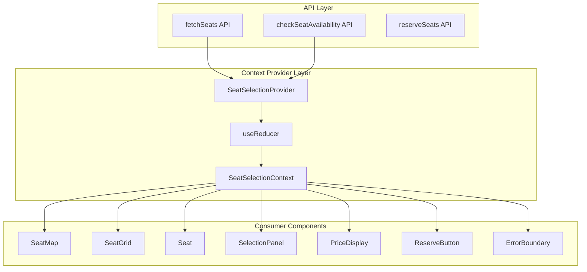
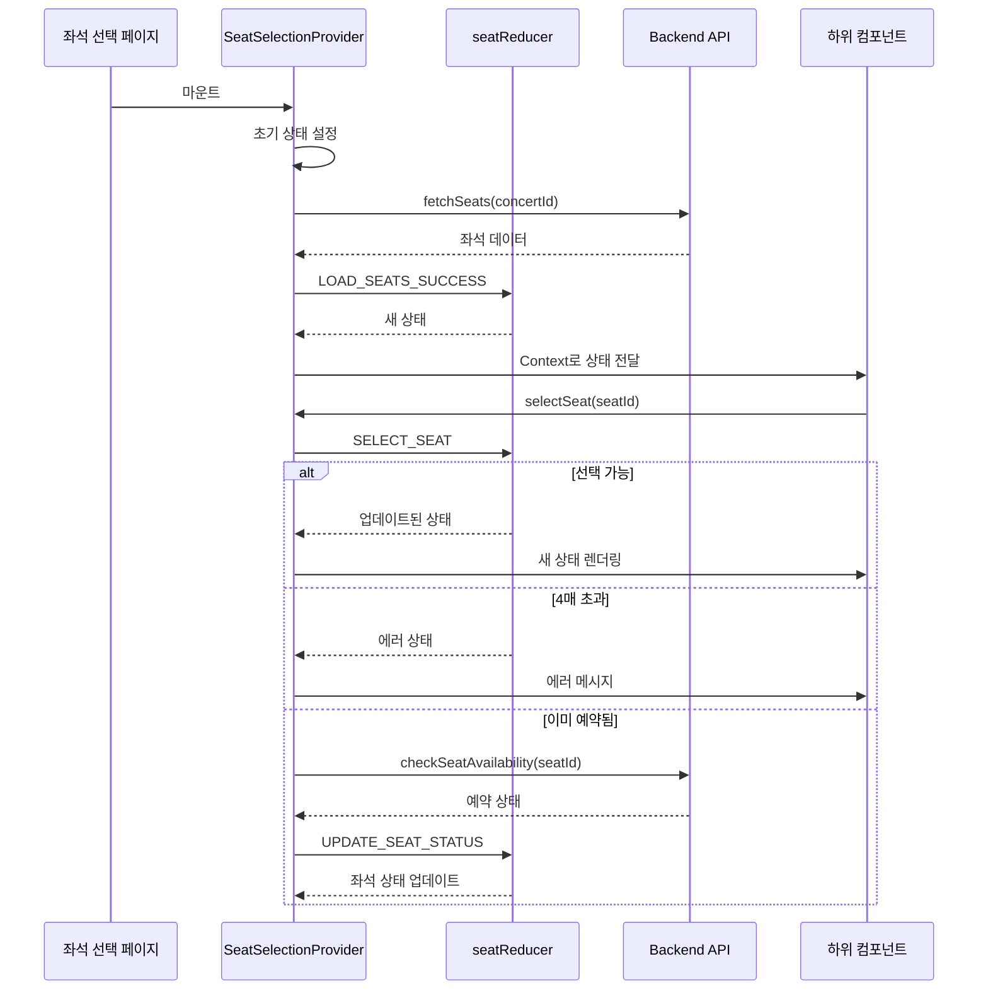

# 좌석 선택 상태 관리 설계서

## 📋 개요

콘서트 좌석 선택 페이지의 상태 관리를 Context API + useReducer 패턴으로 구현하기 위한 설계 문서입니다.

## 🏗️ 아키텍처 개요



## 🔄 데이터 흐름 시각화



## 📦 상태 인터페이스

### Core State

```typescript
interface SeatSelectionState {
  // 좌석 데이터
  seats: Seat[];

  // 선택 관련
  selectedSeats: SelectedSeat[];
  totalPrice: number;

  // UI 상태
  isLoading: boolean;
  error: ErrorState | null;
  hoveredSeatId: string | null;

  // 메타 정보
  concertId: string;
  concertInfo?: {
    title: string;
    artist: string;
    date: string;
    venue: string;
  };
  maxSeats: number; // 최대 선택 가능 좌석 수 (4)
  lastSyncTime: number; // 마지막 동기화 시간
}

interface Seat {
  id: string;
  concertId: string;
  section: 'A' | 'B' | 'C' | 'D';
  row: number; // 1-20
  number: number; // 1-4
  grade: SeatGrade;
  price: number;
  status: 'available' | 'reserved';
}

interface SelectedSeat {
  seatId: string;
  section: string;
  row: number;
  number: number;
  grade: SeatGrade;
  price: number;
  selectedAt: number; // 선택 시간 (타임스탬프)
}

type SeatGrade = 'Special' | 'Premium' | 'Advanced' | 'Regular';

interface ErrorState {
  type: 'NETWORK' | 'MAX_SEATS' | 'ALREADY_RESERVED' | 'SESSION_EXPIRED' | 'INVALID_CONCERT';
  message: string;
  retryable: boolean;
}
```

## 🎯 Action 타입 정의

```typescript
type SeatSelectionAction =
  // 데이터 로딩
  | { type: 'INIT_SEATS'; payload: { concertId: string } }
  | { type: 'LOAD_SEATS_REQUEST' }
  | { type: 'LOAD_SEATS_SUCCESS'; payload: { seats: Seat[] } }
  | { type: 'LOAD_SEATS_FAILURE'; payload: ErrorState }
  | { type: 'SET_CONCERT_INFO'; payload: { title: string; artist: string; date: string; venue: string } }

  // 좌석 선택
  | { type: 'SELECT_SEAT'; payload: { seatId: string } }
  | { type: 'DESELECT_SEAT'; payload: { seatId: string } }
  | { type: 'TOGGLE_SEAT'; payload: { seatId: string } }
  | { type: 'CLEAR_SELECTION' }

  // 좌석 상태 업데이트
  | { type: 'UPDATE_SEAT_STATUS'; payload: { seatId: string; status: 'available' | 'reserved' } }
  | { type: 'BATCH_UPDATE_SEATS'; payload: { updates: Array<{ seatId: string; status: 'available' | 'reserved' }> } }
  | { type: 'SYNC_SEATS'; payload: { seats: Seat[] } }

  // UI 상태
  | { type: 'SET_HOVER_SEAT'; payload: { seatId: string | null } }
  | { type: 'SET_ERROR'; payload: ErrorState }
  | { type: 'CLEAR_ERROR' }
  | { type: 'SET_LOADING'; payload: boolean };
```

## 🔌 Context API 인터페이스

### Context Value

```typescript
interface SeatSelectionContextValue {
  // 상태
  state: SeatSelectionState;

  // 파생 상태 (computed)
  computed: {
    isReserveEnabled: boolean;
    canSelectMore: boolean;
    selectedCount: number;
    availableSeatsCount: number;
    seatsBySection: Map<string, Seat[]>;
    priceByGrade: Map<SeatGrade, number>;
  };

  // 액션
  actions: {
    // 데이터 로딩
    loadSeats: () => Promise<void>;
    refreshSeats: () => Promise<void>;
    loadConcertInfo: () => Promise<void>;

    // 좌석 선택
    selectSeat: (seatId: string) => void;
    deselectSeat: (seatId: string) => void;
    toggleSeat: (seatId: string) => void;
    clearSelection: () => void;

    // 좌석 가용성 확인 (API 통합)
    checkAvailability: (seatIds: string[]) => Promise<boolean>;

    // UI 인터랙션
    setHoveredSeat: (seatId: string | null) => void;
    clearError: () => void;

    // 예약 프로세스
    proceedToBooking: () => Promise<boolean>;
    validateSelection: () => boolean;
  };

  // 헬퍼 함수
  helpers: {
    getSeatById: (seatId: string) => Seat | undefined;
    getSeatLabel: (seat: Seat) => string;
    getSeatColor: (seat: Seat) => string;
    isSelected: (seatId: string) => boolean;
    canSelect: (seatId: string) => boolean;
  };
}
```

## 🧩 컴포넌트별 필요 데이터 매핑

### 1. SeatMap (좌석 배치도 전체)
```typescript
{
  // 필요한 state
  seats: state.seats,
  hoveredSeatId: state.hoveredSeatId,

  // 필요한 computed
  seatsBySection: computed.seatsBySection,

  // 필요한 actions
  setHoveredSeat: actions.setHoveredSeat
}
```

### 2. Seat (개별 좌석)
```typescript
{
  // 필요한 state
  seat: props.seat, // 부모로부터 전달

  // 필요한 computed
  isSelected: helpers.isSelected(seat.id),
  canSelect: helpers.canSelect(seat.id),

  // 필요한 actions
  toggleSeat: actions.toggleSeat,
  setHoveredSeat: actions.setHoveredSeat,

  // 필요한 helpers
  getSeatLabel: helpers.getSeatLabel,
  getSeatColor: helpers.getSeatColor
}
```

### 3. SelectionPanel (선택 정보 패널)
```typescript
{
  // 필요한 state
  selectedSeats: state.selectedSeats,
  totalPrice: state.totalPrice,

  // 필요한 computed
  selectedCount: computed.selectedCount,
  canSelectMore: computed.canSelectMore,

  // 필요한 actions
  deselectSeat: actions.deselectSeat,
  clearSelection: actions.clearSelection
}
```

### 4. PriceDisplay (가격 안내)
```typescript
{
  // 필요한 state
  totalPrice: state.totalPrice,

  // 필요한 computed
  priceByGrade: computed.priceByGrade
}
```

### 5. ReserveButton (예약 버튼)
```typescript
{
  // 필요한 state
  isLoading: state.isLoading,

  // 필요한 computed
  isReserveEnabled: computed.isReserveEnabled,
  selectedCount: computed.selectedCount,

  // 필요한 actions
  proceedToBooking: actions.proceedToBooking,
  validateSelection: actions.validateSelection
}
```

### 6. ErrorBoundary (에러 처리)
```typescript
{
  // 필요한 state
  error: state.error,

  // 필요한 actions
  clearError: actions.clearError,
  refreshSeats: actions.refreshSeats
}
```

## 🔐 Provider 구조

```typescript
'use client';

import { useReducer, useEffect, useMemo, useCallback, createContext, useContext } from 'react';
import { useQuery } from '@tanstack/react-query';
import { apiClient } from '@/lib/remote/api-client';

interface SeatSelectionProviderProps {
  children: React.ReactNode;
  concertId: string;
  maxSeats?: number; // 기본값: 4
  syncInterval?: number; // 실시간 동기화 간격 (ms), 기본값: 10000
}

// Context 생성
const SeatSelectionContext = createContext<SeatSelectionContextValue | null>(null);

// Provider 내부 구조
export const SeatSelectionProvider: React.FC<SeatSelectionProviderProps> = ({
  children,
  concertId,
  maxSeats = 4,
  syncInterval = 3000 // 기본 3초로 변경
}) => {
  // 1. useReducer 초기화
  // 2. useEffect로 초기 데이터 로드
  // 3. useEffect로 실시간 동기화 설정 (사용자 인터랙션 기반 동적 조정)
  // 4. useMemo로 computed 값 계산
  // 5. useCallback으로 actions 메모이제이션
  // 6. Context.Provider로 값 제공
};

// Hook for consuming context
export const useSeatSelection = () => {
  const context = useContext(SeatSelectionContext);
  if (!context) {
    throw new Error('useSeatSelection must be used within SeatSelectionProvider');
  }
  return context;
};
```

## 🎨 사용 예시

```typescript
// 페이지 레벨 (app/concerts/[id]/seats/page.tsx)
'use client';

import { use } from 'react';

export default function SeatSelectionPage({
  params
}: {
  params: Promise<{ id: string }>
}) {
  const resolvedParams = use(params);

  return (
    <SeatSelectionProvider concertId={resolvedParams.id}>
      <div className="seat-selection-container">
        <PriceDisplay />
        <SeatMap />
        <SelectionPanel />
        <ReserveButton />
        <ErrorBoundary />
      </div>
    </SeatSelectionProvider>
  );
}

// 컴포넌트 레벨 (features/seats/components/Seat.tsx)
'use client';

function SeatComponent({ seat }: { seat: Seat }) {
  const { helpers, actions } = useSeatSelection();

  const isSelected = helpers.isSelected(seat.id);
  const canSelect = helpers.canSelect(seat.id);
  const label = helpers.getSeatLabel(seat);

  const handleClick = () => {
    if (canSelect) {
      actions.toggleSeat(seat.id);
    }
  };

  return (
    <button
      onClick={handleClick}
      className={getSeatClassName(seat, isSelected)}
      disabled={seat.status === 'reserved'}
    >
      {label}
    </button>
  );
}
```

## 📊 성능 최적화 전략

1. **메모이제이션**
   - computed 값들은 useMemo로 메모이제이션
   - actions는 useCallback으로 메모이제이션
   - 컴포넌트는 React.memo로 래핑

2. **선택적 구독**
   - 컴포넌트별로 필요한 데이터만 구독
   - 별도의 작은 Context로 분리 고려

3. **배치 업데이트**
   - 여러 좌석 상태 변경시 BATCH_UPDATE_SEATS 사용
   - React 18의 자동 배칭 활용

4. **실시간 동기화**
   - 폴링 대신 WebSocket 고려
   - 사용자 인터랙션 중에는 동기화 일시 중지
   - 낙관적 업데이트(Optimistic Update) 적용

## 🚨 에러 처리 전략

1. **사용자 친화적 메시지**
   - 에러 타입별 구체적인 안내 메시지
   - 재시도 가능 여부 표시

2. **자동 복구**
   - 네트워크 에러시 자동 재시도 (최대 3회)
   - 세션 만료시 자동 갱신 시도

3. **폴백 UI**
   - 로딩 중 스켈레톤 UI
   - 에러시 적절한 폴백 컴포넌트

## 📝 추가 고려사항

1. **접근성**
   - 키보드 네비게이션 지원
   - 스크린 리더 지원 (ARIA 레이블)

2. **모바일 대응**
   - 터치 이벤트 처리
   - 반응형 레이아웃

3. **테스트**
   - Reducer 단위 테스트
   - Context Provider 통합 테스트
   - 컴포넌트 렌더링 테스트

4. **확장성**
   - 다른 예약 시스템으로 확장 가능한 구조
   - 플러그인 가능한 검증 로직

## 🔗 API 통합 가이드

### API 엔드포인트 매핑
```typescript
// @/lib/remote/api-client 사용
import { apiClient } from '@/lib/remote/api-client';

// 백엔드 라우터는 src/features/seats/backend/route.ts에 정의
// 스키마는 src/features/seats/backend/schema.ts에 정의
// DTO는 src/features/seats/lib/dto.ts에서 재노출
// 백엔드는 success/failure/respond 패턴 사용 (src/backend/http/response.ts)

const loadSeats = async (concertId: string) => {
  const response = await apiClient.get(`/api/concerts/${concertId}/seats`);
  return response.data; // success 응답의 data 필드
};

const checkAvailability = async (concertId: string, seatIds: string[]) => {
  const response = await apiClient.post('/api/seats/availability', {
    concertId,
    seatIds
  });
  return response.data.available;
};

const loadConcertInfo = async (concertId: string) => {
  const response = await apiClient.get(`/api/concerts/${concertId}`);
  return response.data;
};
```

### 실시간 동기화 전략
```typescript
// MVP: 3초 간격 폴링 + 사용자 인터랙션 기반 동적 조정
const [dynamicInterval, setDynamicInterval] = useState(3000);
const lastInteractionRef = useRef(Date.now());

// 사용자 인터랙션 추적
const trackInteraction = useCallback(() => {
  lastInteractionRef.current = Date.now();
  setDynamicInterval(3000); // 인터랙션 시 3초로 단축
}, []);

// 좌석 선택 시 즉시 가용성 체크
const selectSeat = useCallback(async (seatId: string) => {
  trackInteraction();

  // 낙관적 업데이트
  dispatch({ type: 'SELECT_SEAT', payload: { seatId } });

  // 즉시 백엔드 검증
  try {
    const response = await apiClient.post('/api/seats/check-availability', {
      concertId,
      seatIds: [seatId]
    });

    if (!response.data.available) {
      dispatch({ type: 'DESELECT_SEAT', payload: { seatId } });
      dispatch({ type: 'SET_ERROR', payload: {
        type: 'ALREADY_RESERVED',
        message: '선택하신 좌석이 이미 예약되었습니다'
      }});
    }
  } catch (error) {
    dispatch({ type: 'DESELECT_SEAT', payload: { seatId } });
  }
}, [concertId]);

useEffect(() => {
  const interval = setInterval(() => {
    const timeSinceLastInteraction = Date.now() - lastInteractionRef.current;

    // 10초 이상 인터랙션 없으면 폴링 간격 10초로 증가
    if (timeSinceLastInteraction > 10000 && dynamicInterval !== 10000) {
      setDynamicInterval(10000);
    }

    refreshSeats();
  }, dynamicInterval);

  return () => clearInterval(interval);
}, [dynamicInterval]);
```

## 🎯 기술 스택 선택 근거

### Context API + useReducer 선택 이유
1. **MVP 복잡도에 적합**: 좌석 선택 페이지 하나의 복잡한 상태 관리에 충분
2. **React 내장**: 추가 의존성 없이 바로 구현 가능
3. **타입 안정성**: TypeScript와 자연스러운 통합
4. **디버깅 용이성**: Redux DevTools 연동 가능


## 📋 버전 정보
- 작성일: 2025-10-15
- 버전: 1.2.0
- 기반 문서: PRD v1.0, spec(usecase 003) v1.0.0, .ruler/AGENTS.md
- 주요 변경사항:
  - MVP 수준에 맞춘 동시성 제어 단순화
  - API 통합 가이드 추가
  - 프로젝트 규칙(.ruler/AGENTS.md) 준수
  - "use client" 지시문 및 Promise params 처리 추가
  - 백엔드 레이어 구조 참조 명시